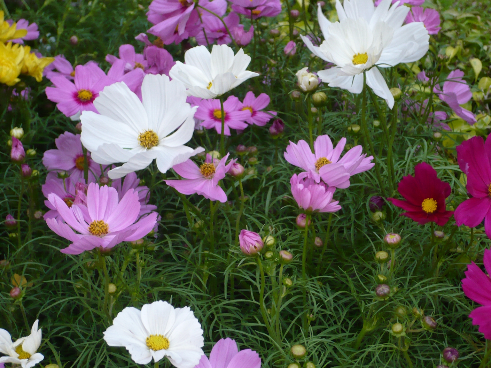

# Cosmos Flower

## General Information
**Generic name:** Cosmos bipinnatus
**Sri Lankan name:** Atapethiya
**Scientific name:** Cosmos bipinnatus
**Plant family:** Asteraceae
**Edible parts:** Flowers and leaves can be used in salads.
**Nutrition value:** <update>High in vitamin C, calcium, iron, magnesium, phosphorus, potassium, sodium, zinc, dietary fiber, folate, niacin, pantothenic acid, pyridoxine, riboflavin, thiamine, vitamin A, vitamin B6, vitamin E, and vitamin K.</update>
**Companion plants:**
- Tomatoes
- Legumes
- Cucumbers
- Squash
  
**Non-companion plants**
- Fennel
- Sage

## Description:
Cosmos are sun-loving plants with a long flowering season. These flowers come in different colours of pale pastels and whites through bright pink, crimson, orange, and other colours. They are ideal for flower beds filling the yard with open-faced blooms that can go on for months and months. There are several varieties of cosmos.<update>In Sri Lanka, cosmos are popular in home gardens and as ornamental plants in public spaces, adding vibrant colours to the tropical landscape.</update>

## Planting requirements
**Planting season:** <update>Year-round in most parts of Sri Lanka, but best planted at the beginning of the monsoon season (May-June or October-November)</update>

### Planting conditions:
| Propagation | Propagate from seeds |
|----|----|
| Planting method | Prepare the seed bed area by removing clumps of soil to achieve a crumbly texture. Sow seeds lightly, spaced about 2-3in (5-8 cm) apart |
| Soil | Prefers well-drained light soil and does not require any special soil preparation <update>Common in Sri Lankan red and brown soils</update> |
| Water | Can tolerate dry soil but prefers moist soil |
| Light | Requires full sunshine |
| Fertiliser / Mulch | <update>Apply compost or well-rotted manure before planting</update> |

### Growing conditions:
| **Temperatures** | <update>Thrives in Sri Lanka's tropical climate with temperatures between 20°C to 32°C</update> |
|----|----|
| Soil | Better to mulch the garden for moisture retention |
| Water | Water regularly, but do not over water <update>Reduce watering during monsoon seasons</update> |
| Pruning | <update>Pinch off the growing tips when plants are about 20 cm tall to encourage bushiness</update> |
| Weed control | Keep the area weed free |

## Harvesting:
Cut the flowers anytime after blooming when the petals are open. <update>In Sri Lanka, cosmos can be harvested year-round with peak blooming periods during the drier months.</update>

## Curing:
Not specified

## Storage
<update>Cut flowers can be kept in water for up to a week. For seed storage, dry the seed heads thoroughly and store in a cool, dry place.</update>

## Protecting your plants
### Pest control
**Pest type:** Cosmos suffer from a few pest problems. However, can be attacked by Stem canker, Powdery Mildew, grey mold, Aphids <update>, and Thrips</update>

**Symptoms:** <update>Wilting, discoloured leaves, stunted growth, and deformed flowers</update>

**Control method:** Use neem oil, insecticidal soap or petroleum-based insecticides. <update>In Sri Lanka, traditional methods like using neem leaf extracts or tobacco leaf solutions are also effective.</update>

### Disease Control
<update>Fungal diseases can be common in humid conditions. Ensure good air circulation and avoid overhead watering. Remove and destroy infected plants promptly.</update>

## Difficulty Rating
### Low country wet zone (Difficulty: 4/10)
**Explanation:** Cosmos prefer well-drained light soil and full sunshine. They can tolerate dry soil but prefer moist soil.
**Challenges/Adaptations:**
- Ensure proper drainage to prevent waterlogging.
<update>- Use raised beds or add sand to improve drainage in heavy clay soils.</update>

### Low country dry zone (Difficulty: 5/10)
**Explanation:** Cosmos require a soil temperature between 60 to 70°F (16 to 21°C) for germination. They can tolerate dry soil but prefer moist soil.
**Challenges/Adaptations:**
- Provide adequate watering during dry periods.
<update>- Use mulch to retain soil moisture and reduce water evaporation.</update>

### Mid country (Difficulty: 4/10)
**Explanation:** Cosmos are relatively easy to grow and maintain. They require full sunshine and well-drained light soil.
**Challenges/Adaptations:**
- Ensure proper drainage to prevent waterlogging.
<update>- Protect from strong winds that can damage tall plants.</update>

### Up country (Difficulty: 5/10)
**Explanation:** Cosmos can tolerate cooler temperatures but prefer warmer conditions for optimal growth. They require full sunshine and well-drained light soil.
**Challenges/Adaptations:**
- Provide protection from frost during cooler periods.
<update>- Plant in sheltered locations to protect from cold winds.</update>

## References for this entry
### Content Sources:
- <https://www.gardeningknowhow.com/ornamental/flowers/cosmos/growing-cosmos.htm>
- <https://www.almanac.com/plant/cosmos>
<update>
- Department of Agriculture, Sri Lanka
- Royal Botanic Gardens, Peradeniya
</update>

### Image Sources: (In order of appearance)
- <https://commons.wikimedia.org/wiki/File:Cosmos_bipinnatus_-_NCC_Plant4Life.jpg>
