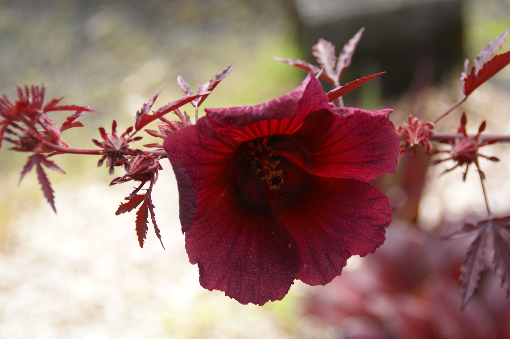

# Cranberry Hibiscus

## General Information
**Generic name:** Cranberry Hibiscus, African rosemallow
**Sri Lankan name:** <update>Kuruluthuda</update>
**Scientific name:** Hibiscus acetosella
**Plant family:** Malvaceae
**Edible parts:** Leaves and the Flower
**Nutrition value:** <update>High in vitamin C, antioxidants, and minerals like calcium and iron.</update>
**Companion plants:**
- Mulberry
- Cinnamon
- Camellia
- Lemongrass
<update>
- Coconut
- Mango
- Papaya
- Banana
</update>
**Non-companion plants**
  <update>
- Tomatoes </update>

## Description:
Cranberry hibiscus plants are multi-stemmed shrubs that grow from 3 to 6 feet (1-2 m.) in height with green/red to burgundy serrated leaves. The foliage looks much like that of Japanese maple.

## Planting requirements
**Planting season:** <update>Year-round in Sri Lanka</update>

### Planting conditions:
| **Propagation** | Seeds |
|----|----|
| Planting method | Plant the seeds in soil that stay moist and don't let the soil dry. Plant the soil in a depth of 0.5-1cm (0.25-0.5 inch) but cover lightly and don't push |
| Soil | Grows in a variety of soil but requires well drained soil. Needs a pH balance of 6.0-7.0 |
| Water | Keep soil moist but not wet. <update>Requires regular watering during dry seasons in Sri Lanka</update> |
| Light | Requires full sunshine but also grows in light shade |

### Growing conditions:

| **Temperatures** | <update>Grows well in Sri Lankan temperatures ranging from 20-35°C</update> |
|----|----|
| Soil | Mix the soil with compost, humus or organic matter and mulch to cover the soil to keep it moist and weed free |
| Water | <update>Requires moderate levels of water. Increase watering during dry seasons</update> |
| Pruning | Prune in <update>early dry season to encourage bushy growth</update>
| Weed control | Mulch around the base of plants to suppress weeds and retain moisture.

## Harvesting:
Harvesting young full grown leaves cut next to the stems or with all the stems.

## Curing: 
<update>Hang the flowers upside down in a well-ventilated area until completely dry.</update>

## Storage: 
<update>Store dried flowers in an airtight container away from light and heat. Leaves can be frozen for later use.</update>

## Protecting your plants
### Pest control
**Pest type:** Aphids, mealybugs, root nematodes, and thrips

**Symptoms:** <update>Curling leaves, yellowing leaves, sticky honeydew on leaves</update>

**Control method:** Spray neem oil, <update>introduce ladybugs as natural predators</update>, use organic pesticides

### Disease Control
**Disease type:** <update>Leaf spot, root rot</update>

**Symptoms:** <update>Brown or black spots on leaves, wilting, yellowing leaves</update>

**Management:** <update>Avoid overwatering, ensure good drainage, remove infected parts, apply copper-based fungicides if necessary</update>

## Difficulty Rating
### Low country wet zone (Difficulty: 5/10)
**Explanation:** <update>Thrives in warm, humid conditions but requires attention to prevent fungal diseases</update>

**Challenges/Adaptations:**
- <update>Ensure good drainage and air circulation to prevent fungal issues
- Use raised beds or mounds in areas prone to waterlogging</update>

### Low country dry zone (Difficulty: 6/10)
**Explanation:** <update>Requires regular watering during prolonged dry periods but generally well-suited to the climate</update>

**Challenges/Adaptations:**
- <update>Implement drip irrigation or water-conserving techniques
- Use heavy mulching to retain soil moisture</update>

### Mid country (Difficulty: 4/10)
**Explanation:** <update>Ideal growing conditions with moderate temperatures and rainfall</update>

**Challenges/Adaptations:**
- <update>Monitor for pests during rainy seasons
- Provide partial shade during exceptionally hot periods</update>

### Up country (Difficulty: 7/10)
**Explanation:** <update>Can be grown but may require protection from cooler temperatures and strong winds</update>

**Challenges/Adaptations:**
- <update>Use protective structures or grow near buildings for warmth
- Choose sheltered locations to protect from strong winds</update>

## References for this entry
### Content Sources:
- University of Florida IFAS Extension
<update>
- Department of Agriculture, Sri Lanka
- Royal Botanic Gardens, Peradeniya
</update>

### Image Sources: (In order of appearance)
- Wikimedia Commons