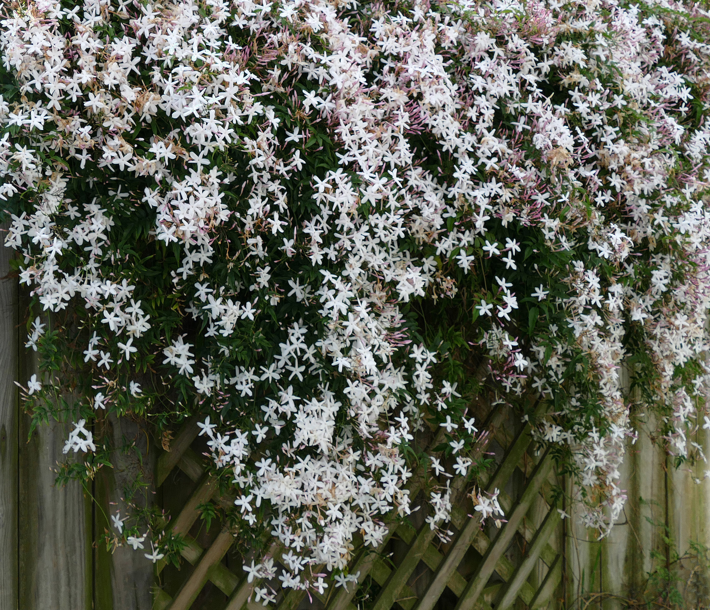

# Jasmine

    
## General Information
**Generic name:** Jasmine
**Sri Lankan name:** Pichcha, Gaeta pichcha
**Scientific name:** Jasminum spp.
**Plant family:** Oleaceae
**Edible parts:** N/A
**Companion plants:**
<update>
- Corn
- Beans
- Squash
**Non-companion plants:** <update>Tomatoes</update>

## Description:
Jasmine, (genus Jasminum), genus of about 200 species of fragrant-flowered shrubs and vines of the olive family (Oleaceae). The plants are native to tropical and to some temperate areas. Most true jasmines have climbing branches without tendrils. The white, yellow, or rarely pink flowers are tubular with a flaring, lobed, pinwheel-like form; some double-flowered varieties have been developed. <update>In Sri Lanka, jasmine is widely cultivated for its fragrant flowers, which are used in religious ceremonies, as ornamental plants, and in the perfume industry.</update>

## Planting requirements
- Dry zone, Temperate zone
**Planting season:** <update>Year-round in most parts of Sri Lanka, but best planted at the beginning of the rainy season (May-June or October-November)</update>

### Planting conditions:
| **Propagation** | Propagated through cuttings, layering, suckers, grafting, budding, tissue culture |
|----|----|
| Planting method | Plough the soil and bring the soil to a proper tilt stage and then dig pits the size of 30cmX30cmX30cm. Better to expose these pits for 2-3 weeks for sunlight to eliminate soil borne diseases and mites |
| Soil | Grows in a variety of soils. However, grows well in well drained loamy soil that is rich in organic matter with a pH between 6.5 and 7.5 |
| Water | Timely watering is important for good growth and production of flowers |
| Light | Requires 6 hours of direct sunlight |

### Growing conditions:

| **Temperatures** | Needs a soil temperature between 15° to 24°                                                                                                             |
|------------------|---------------------------------------------------------------------------------------------------------------------------------------------------------|
| Soil             | Keep the soil weed free and also if possible add mulch to prevent weed, soil erosion and retain water moisture                                          |
| Water            | Drip irrigation is preferred. First  irrigate the plant immediately after planting. Otherwise 4-5 days of irrigation depending on climate and soil type |
| Pruning          | Prune in late winter or early spring to encourage bushier growth and more flowers                                                                       |
| Weed control     | Handpick weeds regularly, especially during the first year                                                                                              |

## Harvesting:
Jasmine start flowering after 6 months of planting. Fully developed flower buds should be handpicked in the early morning and late evening and can last for up to two weeks if kept in a cool place.

## Curing: 
<update>Cut the stems at an angle, remove any leaves, and place them in water until the stems are no longer hollow</update>

## Storage: 
<update>Store in a cool, dry place away from direct sunlight. Flowers can be dried for later use or strung into garlands for immediate use in religious ceremonies or as decorations</update>

## Protecting your plants
### Pest control
**Pest type:** Red spider mites, Blood worm, blossom midge, <update>mealy bugs</update>
**Symptoms:** Spider mites cause speckled leaves and webbing; bloodworms cause wilting and yellowing leaves; blossom midges cause flower buds to drop; <update>mealy bugs appear as white, cottony masses on stems and leaves</update>
**Control method:** Spray water or insecticides and consider using organic pesticides like neem oil or insecticidal soap. <update>For mealy bugs, use a cotton swab dipped in alcohol to remove them</update>

### Disease Control
**Disease type:** <update>Fusarium wilt, powdery mildew, root rot</update>
**Symptoms:** <update>Fusarium wilt causes yellowing leaves and wilting; powdery mildew causes white patches on leaves; root rot causes stunted growth and wilting</update>
**Management:** <update> Avoid overhead watering, provide good air circulation, and use fungicides if necessary. For root rot, improve soil drainage and avoid overwatering</update>

## Difficulty Rating
### Low country wet zone (Difficulty: 6/10)
**Explanation:** Jasmine can be challenging in the wet zone due to high humidity and rainfall.
**Challenges/Adaptations:**
- Powdery mildew can be a problem; consider using sulfur or neem oil fungicides
<update>- Ensure good drainage to prevent root rot
- Use raised beds or mounds to improve soil drainage</update>

### Low country dry zone (Difficulty: 5/10)
**Explanation:** Jasmine prefers moderate water, so care must be taken not to overwater or underwater.
**Challenges/Adaptations:**
- Drought stress can occur; ensure consistent moisture
<update>- Use mulch to retain soil moisture
- Consider shade cloth during extreme heat</update>

### Mid country (Difficulty: 6/10)
**Explanation:** The mid-country's varied climate requires careful attention to watering and temperature.
**Challenges/Adaptations:**
- Fusarium wilt can be a problem; maintain good drainage and avoid overwatering
<update>- Monitor for sudden temperature changes and protect plants if necessary</update>

### Up country (Difficulty: 7/10)
**Explanation:** The cooler temperatures and higher altitudes of the up-country may limit Jasmine's growth.
**Challenges/Adaptations:**
- Jasmine may not flower as profusely; provide additional warmth during flowering season
<update>- Use greenhouses or plastic tunnels to extend the growing season
- Choose cold-hardy jasmine varieties when possible</update>