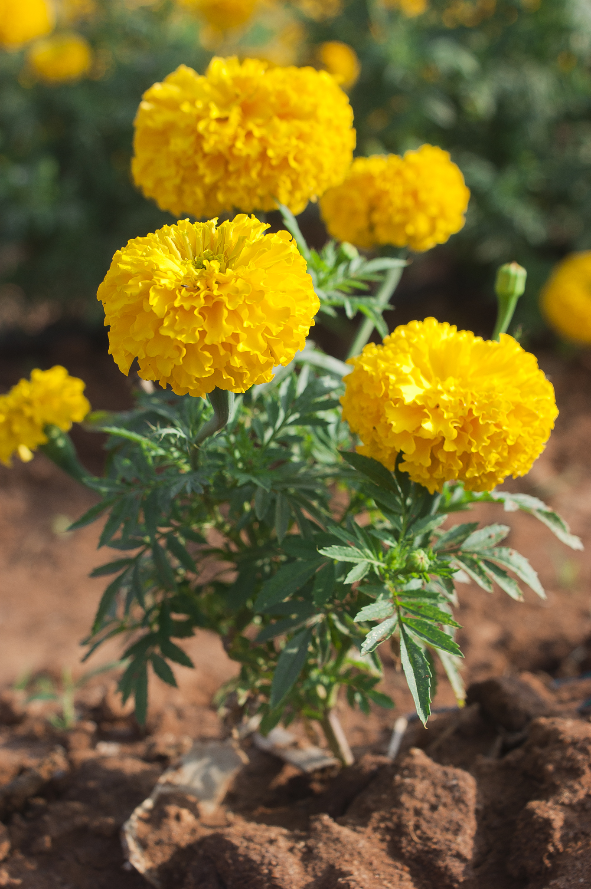

# Marigold

## General Information
**Generic name:** Marigold
**Sri Lankan name:** Dahas Pethiya
**Scientific name:** <update>Tagetes spp.<update>
**Plant family:** <update>Asteraceae</update>
**Edible parts:** N/A
**Companion plants:**
- Potatoes
- Tomatoes
- Cucumbers
- Strawberries
- Squash
- Zucchini
- Melons
- Corn
- Basil
- Peppers
<update>
- Okra
- Eggplant
- Chili
</update>
**Non-companion plants:**
- Beans
- Cabbage

## Description:
Marigolds are cheerful, brilliantly coloured annuals that are long-standing favourite summer flowers for borders and pots. Colours are mainly yellow and orange with some reds and creamy white. All marigolds are excellent for attracting pollinating insects. <update>In Sri Lanka, they are commonly used in religious ceremonies and as natural pest repellents in home gardens.</update>

## Planting requirements
**Planting season:** 
Spring/Summer/Autumn 
<update>Year-round in most parts of Sri Lanka, with best results during the dry season (May to September)</update>

### Planting conditions:
| **Propagation** | Moisten the soil, then sow seeds 1 inch apart and no more than 1 inch deep |
|----|----|
| Planting method | Requires reasonably fertile well drained soil with a pH between 6.0 to 7.5 |
| Soil | Water well after planting |
| Light | Requires full sunshine |

### Growing conditions:

| **Temperatures** | Prefers daytime temperatures of 21-30°C (70-86°F) and nighttime temperatures around 13°C (55°F). In Sri Lanka, this can be achieved in most regions during the dry season |
|----|----|
| Soil | Better to improve poor soil with well-rotted compost. Add a layer of mulch between plants to suppress weeds and keep soil moist, especially when plants are young |
| Water | Water pot-grown marigolds regularly about 1 inch of water per week |
| Pruning | N/A |
| Weed control | Remove weed |

## Harvesting:
Flower within a few weeks of sowing. Marigolds sprout within a week in warm weather and plants typically produce blooms in about 8 weeks. <update>In Sri Lanka's tropical climate, flowering may occur even faster, sometimes within 6-7 weeks.</update>

## Protecting your plants

### Pest control
**Pest type:** Spider mites, Aphids, Powdery mildew <update>, Thrips</update>
**Control method:** Spray insecticides, spray water and remove weed. Regularly monitor plants for signs of pests. Use organic or chemical sprays as needed. <update>In Sri Lanka, neem oil and garlic spray are popular organic pest control methods.</update>

## Difficulty Rating
### Low country wet zone (Difficulty: 3/10)
**Explanation:** Marigolds can tolerate some moisture but prefer well-drained soil. The warm and humid climate is suitable, but the high rainfall may lead to waterlogging.

**Challenges/Adaptations:**
- Ensure good drainage to prevent root rot.
- Provide adequate sunlight despite the tropical climate.
- Monitor plants for fungal diseases due to increased humidity.
<update>
- Consider raised beds or container gardening to improve drainage.
- Use organic fungicides like cinnamon powder or neem oil to prevent fungal infections.
</update>

### Low country dry zone (Difficulty: 2/10)
**Explanation:** Marigolds thrive in hot, sunny conditions with moderate watering. The dry season provides suitable temperatures and reduced rainfall.

**Challenges/Adaptations:**
- Keep soil consistently moist but not waterlogged.
- Protect plants from strong winds during the dry season.
<update>
- Use mulch to retain soil moisture and reduce water evaporation.
- Consider providing afternoon shade during extreme heat periods.
</update>

### Mid country (Difficulty: 3/10)
**Explanation:** Marigolds can tolerate cooler temperatures at night but prefer warmer days. The fluctuating temperatures and varying rainfall may pose challenges.

**Challenges/Adaptations:**
- Provide some shade during the hottest part of the day.
- Ensure consistent watering as temperatures fluctuate.
- Monitor plants for signs of stress due to temperature changes.
<update>
- Use terraced gardening techniques to manage water runoff in sloped areas.
- Consider companion planting with taller plants to provide natural shade.
</update>

### Up country (Difficulty: 4/10)
**Explanation:** Marigolds may struggle with cooler temperatures and shorter days in higher elevations. The lower rainfall is beneficial, but the cooler climate may limit growth.

**Challenges/Adaptations:**
- Provide additional warmth using black plastic mulch or row covers during cooler periods.
- Ensure plants receive adequate sunlight despite the cooler climate.
- Monitor plants for signs of stress due to cooler temperatures and shorter days.
<update>
- Choose varieties that are more tolerant to cooler temperatures, such as French marigolds.
- Consider greenhouse cultivation or use of polytunnels to extend the growing season.
</update>
