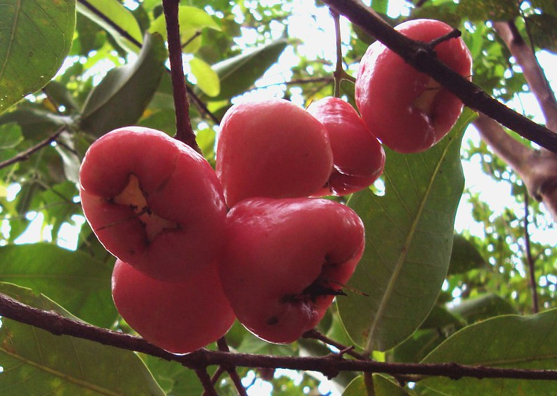

# Jambu

## General Information**
**Generic name:** Java Apple, Rose Apple, Wax Apple, Wax Jambu
**Sri Lankan name:** Jambu (Sinhala) | Navaṟpaḻam, Sampu Pallam (Tamil)

**Scientific name:** _Syzygium spp._
**Plant family:** _Myrtaceae_
**Edible parts:** Fruit
**Nutrition value:** low-calorie fruits rich in Vitamin C and Vitamin A, also contains Calcium and Potassium

**Companion plants:**
Not applicable

**Non-companion plants**
Not applicable

## Description:
_Syzygium samarangense_ is a tropical tree growing to 12 m (39 ft) tall, with evergreen leaves 10–25 cm (4–10 in) long and 5–10 cm (2–4 in) broad. The leaves are elliptical, but rounded at the base; they are aromatic when crushed. The trunk is relatively short, with a wide – yet open – crown starting low on the tree. The bark is pinkish-gray in color, and flakes readily.

The flowers are white to yellowish-white, 2.5 cm (1 in) diameter, with four petals and numerous stamens. They form in panicles of between three and 30 near branch tips. The resulting fruit is a bell-shaped, edible berry, with colors ranging from white, pale green, or green to red, purple, or crimson, to deep purple or even black. 

In Sri Lanka, Jambu species grow well under tropical or near-tropical climates. Red jambu grows well in the lowland and midland as well as the upland. It is found in almost every province of Sri Lanka under cool climate conditions. Jambu is not found in very low-temperature areas. Improved varieties of jambu can be grown well in wet, intermediate, and dry zone areas. Sand jambu is more popular in wet zone areas. Pini Jambu grows successfully in humid zone upland areas with hot humid environments.

## Planting requirements
**Planting season:** Best planted at the onset of the rainy seasons

### Planting conditions:
| Propagation | Direct seeding, budding, grafting |
|----|----|
| Planting method | For seedlings or grafted trees, dig a hole larger than the root ball, place the plant gently in the hole, and backfill with soil. Space trees 15-20 feet (4.5-6 meters) apart for optimal growth |
| Soil | Well-draining, loamy soil is required |
| Water | Water thoroughly directly after planting to ensure moisture reaches the roots. Water newly planted trees deeply and regularly to maintain soil moisture without waterlogging |
| Light | Choose a location with 6-8 hours of full sunlight daily and avoid shaded areas |
| Fertiliser / Mulch | Apply a balanced fertilizer once a year after the fruiting season |

### Growing conditions:
| Temperatures | Thrives in tropical climates and temperatures |
|----|----|
| Soil | Well-draining soil is required |
| Water | Must be watered regularly to maintain soil moisture, especially in dry conditions |
| Pruning | Prune annually after fruiting season to encourage new growth |
| Weed control | Keep the area around the tree weed-free to prevent competition for nutrients and water |

## Harvesting:
Trees planted through direct seeding will bear fruit in about 3 years. Budded or grafted trees may provide a harvest in one to one and a half years. Fruits are ready to pick when they turn their final color (red, purple, etc.) and yield slightly to gentle pressure.

## Curing:
Jambu does not require a curing stage.

## Storage:
Store fruits in the refrigerator for up to 2 weeks. Avoid storing alongside ethylene-producing fruits like apples or [bananas](https://lanka.wiki/fruit/bananas.html).

## Protecting your plants
### Pest control
**Pest type:** 
Jambu plants are not disease or pest-prone, however, occasional infestations are seen;
- Fruit fly in rata jambu
- Ants
- Psylid in pini jambu

**Symptoms:** 
- **Fruit fly:** cause small holes in the fruit
- **Ants:** Decreases quality of harvest
- **Psylid:** Creates blisters on leaves

**Control method:** 
- Use fly traps for fruit fly removal.
- Organic insecticides are effective at controlling pests. 

### Disease Control
**Disease type:** 
- Fruit Rot

**Symptoms:** 
- At early stages, water-soaked, small light purple spots appear on the fruit and spread irregularly across its surface.
- At later stages, Diseased fruit shrinks and develops dry rot.
  
**Management:** 
- Use appropriate levels of water
- Removing infected fruits and destroying
- Controlling fruit-feeding insects

## Difficulty Rating

### Low country wet zone (Difficulty: 2/10)
**Explanation:** Jambu trees thrive in the wet zone due to high rainfall and suitable temperatures.
**Challenges/Adaptations:**
- Monitor for fungal diseases due to high humidity.

### Low country dry zone (Difficulty: 5/10)
**Explanation:** Jambu trees can grow in the dry zone but require more watering and protection from strong winds.
**Challenges/Adaptations:**
-Implement drip irrigation and mulching to conserve soil moisture.

### Mid country (Difficulty: 4/10)
**Explanation:** Jambu trees grow well in the mid-country with moderate temperatures.
**Challenges/Adaptations:**
- Maintain proper irrigation for plant growth
  
### Up country (Difficulty: 6/10)
**Explanation:** Jambu trees can grow in the up-country but may require protection from strong winds.
**Challenges/Adaptations:**
- Use of windbreaks and frost protection measures are essential.

## References for this entry
### Sources:
- https://www.asiafarming.com/how-to-grow-java-apple-in-home-gardens-ultimate-guide-for-beginners
- https://agriculture.gov.vc/agriculture/images/stories/PDF_Documents/Wax-Apple.pdf
- https://www.growables.org/information/TropicalFruit/waxjambu.htm
- https://tastylandscape.com/2014/08/24/wax-jambu/
