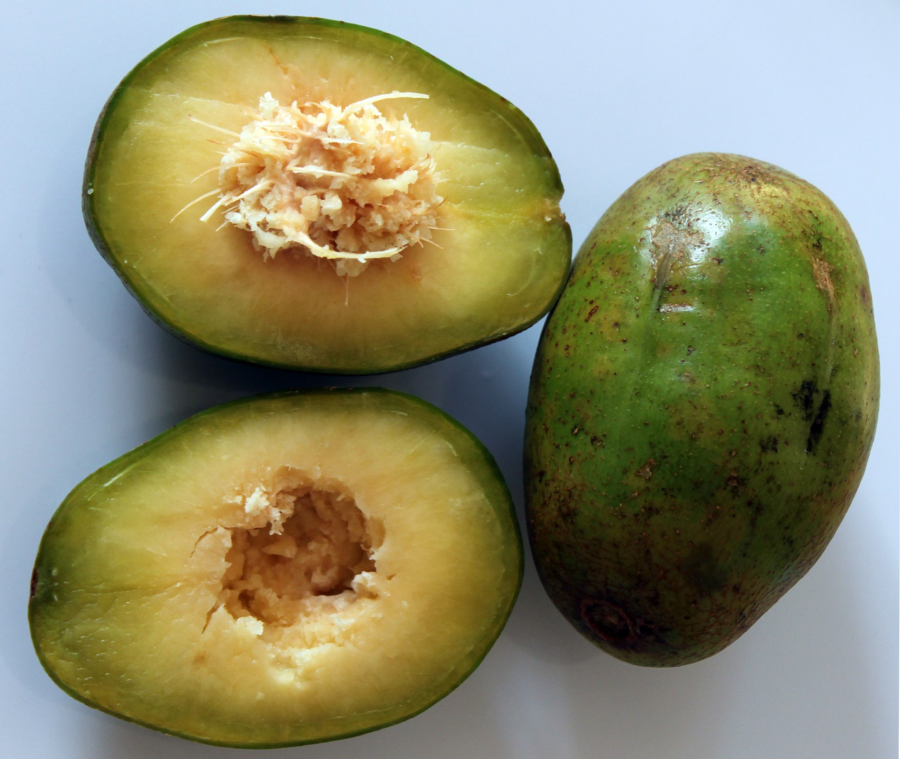

# Amberalla

## General Information
**Generic name:** Golden Apple, June plum
**Sri Lankan name:** Ambarella (Sinhala) | Ambralaṅkāy, Mārimāppaḻam (Tamil)
**Scientific name:** _Spondias dulcis_, _Spondias cytherea_
**Plant family:** _Anacardiaceae_
**Edible parts:** Fruit and the young leaves
**Nutrition value:** Rich in vitamins A and C, potassium, calcium, iron, and phosphorus

**Companion plants:**
- Pineapple
- Citrus Trees
- Papaya
- Banana Plants
- Taro

**Non-companion plants**
- Tomatoes (Nightshades)
- Peppers (Nightshades)
- Ferns (High-Moisture Plants)
- Herbs (Sun-Loving Plants)

## Description:
Ambarella, also known as Spondias dulcis, is a tropical fruit tree that thrives in warm, humid climates. In Sri Lanka, the cultivation of this versatile plant is gaining popularity due to its nutritional benefits and adaptability to local conditions.

The tree may grow up to 30 m tall but is more often 15 m tall in cultivation. The trunk is 60 cm across and can have buttresses. The bark is fairly smooth. The wood is soft and twigs break off easily. The leaf is made up of 4 - 12 pairs of leaflets which have fine teeth around the edge. The leaves are 20-30 cm long. This plant cannot tolerate cold weather but is versatile and easy to maintain in humid climates.

## Planting requirements
**Planting season:** May to August

### Planting conditions:
| Propagation | Seeds are most commonly used but propagation from tree cuttings are recommended as seed grown plants tend to give smaller and sour tasting fruit |
|----|----|
| Planting method | Can be grown in a container or on the ground. To plant in the ground, dig a hole three times as wide and just as deep as the root ball. Plant firmly in the ground and cover the top layer of soil with 2-3 inches of mulch. Do not plant in windy areas |
| Soil | Grows in any type of soil as long as they are well draining. Does not need high nutrition, though it grows well when fed properly. They grow well in acidic to slightly alkaline soils with a pH of 5.5-7.5.  |
| Water | Young plants should be watered more often than the older plants |
| Light | Requires full to partial sunshine (4-6 hours of sunlight each day) |

### Growing conditions:

| Temperatures | Grows best in humid tropical and subtropical climates |
|----|----|
| Soil | Cover the top layer of soil with mulch |
| Water | One to two times per week for the first few months. Then once a week during dry periods |
| Pruning | Young trees require regular pruning and thinning of flowers and fruits. The plant tends to overgrow these and as a result can become weak and stunted |
| Weed control | Mulching helps control weeds and retains soil moisture |

## Harvesting:
Can be picked when green or golden yellow.

## Curing:
Fruits can be eaten fresh off the tree. For storage, cure green fruits at room temperature for a week to allow them to ripen further.

## Storage
Ripe fruit cannot be stored over long periods of time but can be preserved as jam, chutney, sauce, etc.

## Protecting your plants
### Pest control
**Pest type:**
- **Caribbean fruit fly:** small and orange brown in colour 
- **Scale insects:** flat and round, red, brown or green coloured insects 
  
**Symptoms:**
- **Caribbean fruit fly:** Lays eggs in fruit resulting in little holes
- **Scale insects:** sticky honeydew on leaves that causes black sooty mold to cover the leaf
  
**Control method:** 
- **Caribbean fruit fly:** Bag the fruit on the tree for protection
- **Scale insects:** Spray oil

### Disease Control
**Disease type:** 
- **Root rot:** Occurs through overwatering and planting in soil that doesn't drain well
- **Fruit rot:** Caused by fruit flies wounding the fruit. 
  
**Symptoms:** 
- **Root rot:** Wilting
- **Fruit rot:** Dark spots on fruits
  
**Management:** 
- **Root rot:** Avoid overhead irrigation, follow proper planting instructions, and bag the fruits on the tree for extra protection.
- **Fruit rot:** Bag the fruits on the tree for extra protection.

## Difficulty Rating
### Low country wet zone (Difficulty: 8/10)
**Explanation:** Amberella can be challenging in the wet zone due to high rainfall and humidity, which can increase the risk of fungal diseases. 

**Challenges/Adaptations:**
- Regular pruning and fungicide applications may be necessary to manage diseases.

### Low country dry zone (Difficulty: 4/10)
**Explanation:** Amberella is more suited to the dry zone, where rainfall is lower and humidity is not as high. 

**Challenges/Adaptations:**
- Ensure consistent watering during dry periods.

### Mid country (Difficulty: 5/10)
**Explanation:** Amberella can be grown in the mid countries, but may require some care to manage diseases.

**Challenges/Adaptations:**
- Ensure adequate watering is provided
- Regular pruning and monitoring for pests and diseases is necessary.

### Up country (Difficulty: 7/10)
**Explanation:** Amberella may struggle in the upcountry due to cooler temperatures and shorter days, which can affect fruit production.

**Challenges/Adaptations:**
-  Provide protection from strong winds and ensure adequate sunlight.

## References for this entry
### Content Sources:
- [Wikipedia](https://en.wikipedia.org/wiki/Spondias_dulcis)
- Food Plant Solutions Rotary Action Group
- [tipstreeplanting.com](https://tipstreeplanting.com/ambarella-tree-care/)
- https://www.epicgardening.com/june-plum-tree/
- https://www.valaitamil.com/ambarella-tamil-dictionary203764.html
- https://epicureanearth.com/all-about-the-ambarella/
- https://www.epicgardening.com/june-plum-tree/
- https://en.wikipedia.org/wiki/Spondias_dulcis

### Image Sources: (In order of appearance)
