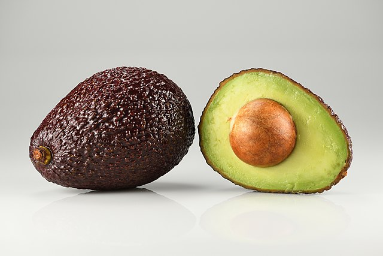

# Avocado

## General Information
**Generic name:** Avocado, Alligator Pear, Butter Fruit
**Sri Lankan name:** aligaṭapēra (Sinhala) | Veṇṇeyp paḻam (Tamil)
**Scientific name:** _Persea americana_
**Plant family:** _Lauraceae_
**Edible parts:** Fruit
**Nutrition value:** Vitamin C, E, K, and B6 as well as riboflavin, niacin, folate, pantothenic acid, magnesium, and potassium

**Companion plants:**
- Peanut
- Chilli
- Sesame
- Maize
- Papaya
- Pineapple
- Passionfruit
- Banana

**Non-companion plants:** Plants with deep roots may interfere with Avocado root growth

## Description:
The avocado is a medium-sized, evergreen tree in the laurel family (Lauraceae). Its fruit is botanically a large berry containing a single large seed. Avocado oil is used in cosmetics and soap making. Avocado leaves are used as a tea for medicinal purposes. Grows best in the wet zones in Sri Lanka up to 1500 meters above sea level. Requires annual rainfall of 1200-1300mm.  Sri Lanka has developed several local varieties adapted to specific regions. 

**Recommended Varieties:**
- Pollock: A West Indian variety that performs well in Sri Lanka's wet zones. It produces large, pear-shaped fruits with smooth, thin skin. The fruit remains green when ripe, weighs about 600 grams, and contains 3-8% fat.
- Grotferis: A hybrid of the Mexico and West Indian groups. Produces large fruits weighing about 600 grams. The fruit is oval-shaped and turns purple when ripe. Contains 5-10% fat.
- Peradeniya purple hybrid: A locally developed variety. Produces round, medium-sized fruits that turn purple when ripe. Average fruit weight is 300-350 grams.
- Ferte: A hybrid between Mexican and Guatemalan groups. Small to medium-sized fruits weighing 225-350 grams. Contains 18-26% fat and is popular in the European market.
- Simmonds: A West Indian variety producing large, oval fruits weighing about 450 grams. The skin turns yellowish-green when ripe.
- Tower-02: Produces round oblong fruits weighing about 375 grams. The skin remains green when ripe.
- Booth-07: A hybrid between Guatemalan and West Indian groups. High-yielding variety with green skin when ripe.
- Hass: Contains about 10% fat, with fruits weighing 275-375 grams. Has thick skin, is resistant to fruit fly damage, and has high demand in foreign markets.

## Planting requirements
**Planting season:** February to April

#### Flowering and pollination:
Avocado trees are divided into two main groups based on flower behavior:
- Type A: Female parts active in the morning, male parts active in the evening.
- Type B: Female parts active in the evening, male parts active the next morning.

For better fruit production, plant both types together to ensure cross-pollination.

### Planting conditions:
| Propagation | Grafting is recommended for consistent fruit output. Saplings should initially be planted in a nursery and transplanted to the field 4-6 months later |
|----|----|
| Planting method | Plants should be spaced at 6.5x8 or 8x8 meters |
| Soil | Well-draining deep loamy soil with a pH value of about 5.7 |
| Water | Keep soil moist but not waterlogged. Apply a layer of mulch to keep the soil from drying out |
| Light | Full or partial sunlight |

### Growing conditions:
| Temperatures | Under 30°C |
|----|----|
| Soil | Keep the soil well drained |
| Water | Requires a moderate and regular supply of water, but it doesn't tolerate waterlogged soil. When the top layer of soil seems dry, water with small amounts of water and do not overwater the plant. Wilting leaves may be a sign of both too much and too little water |
| Pruning | Occasionally prune the tree but take care not to cut off fruit-bearing twigs. Maintain height at about 4.5-5.5 meters for easier management and harvesting |
| Weeding | Periodically remove weeds between or surrounding trees |

## Harvesting:
Three to four years from a grafted tree. Avocado trees typically provide about 230-320 kilograms of fruit per year. Fruits mature in about 4-6 weeks after flowering but do not ripen on the tree. Harvest fruits with part of the stem attached to reduce chances of rotting. The fruits ripen at different times, so harvest them as they become ripe.

## Curing:
Allow the avocados to ripen off the tree for about a week before consuming.

## Storage:
Store ripe avocados in the refrigerator for up to three days. Unripe avocados can be stored at room temperature until ripe, then moved to the refrigerator.

## Protecting your plants
### Pest control
**Pest type:** 
- Branch Borer
- Fruit Fly

**Symptoms:** 
- **Branch Borer:** Causes severe damage to young nursery plants, resulting in plant death. Branches and shoots of growing trees may die.
  
- **Fruit Fly:**
  - Due to the laying of eggs, the fruits show spots on the surface.
  - The infested fruits show an irregular shape, and then fall off.
  - When the fruit ripens, the larva develops and eats the flesh.
  - Scabs are formed at the damaged areas of the fruit and the harvest is wasted due to rotting in the fruit.

**Control method:** 
- **Branch Borer:**
  - Cut and burn dead parts of mature trees.
  - Use neem oil as an organic insecticide.
  - Apply an insecticide such as prozal to nursery plant pots.
  
- **Fruit Fly:**
  - Setting pheromone traps for male flies.
  - Collect and destroy infested fruits.
  - Apply paper covering at the tender stage.

### Disease Control
**Disease type:**
- Root rot
- Anthracnose
- Fruit rot

**Symptoms:**
- **Root rot:** Caused by soil-borne fungus Phytoptera cinnamomum. Damages new roots, potentially killing the plant when severe. More prevalent in poorly drained soils.
  
- **Anthracnose:**
  - Causes fruit and leaf damage under hot, humid conditions.
  - 1/2 inch circular spots appear on fruit, with sunken centers and cracks.
  - Purple spores in spots during wet weather.
    
- **Fruit rot:** Affects fruits after harvest. Outer bark and pith of harvested fruits begin to rot near the stalk.
  
**Management:**
- **Root rot:**
  - Improve soil drainage
  - Apply soil fungicide to the area around the tree.
  - Add soil to plant roots, mulch, and improve sanitation
    
- **Anthracnose:** Apply copper-containing fungicide several times from fruit set.
  
- **Fruit rot:**
  - Pick fruit with stalk attached, soak in suitable fungicide before storage.
  - Prune trees and remove dead branches.
  - Improve field sanitation by destroying fallen, diseased fruits.

## Difficulty Rating
### Low country wet zone (Difficulty: 4/10)
**Explanation:** Avocado trees grow best in the wet zones in Sri Lanka with an annual rainfall of 1200-1300mm. However, they require well-draining soil to prevent waterlogging.

**Challenges/Adaptations:**
- Requires well-draining deep loamy soil with a pH value of about 5.7
- Regular pruning and pest/disease management

### Low country dry zone (Difficulty: 6/10)
**Explanation:** Avocado trees can tolerate some drought but require regular watering for optimal growth in the dry zones.

**Challenges/Adaptations:**
- Requires well-draining deep loamy soil with a pH value of about 5.7
- Regular watering to prevent wilting leaves

### Mid country (Difficulty: 7/10)
**Explanation:** Avocado trees can grow in the mid countries but require more care due to varying temperatures and rainfall.

**Challenges/Adaptations:**
- Requires well-draining deep loamy soil with a pH value of about 5.7
- Regular pruning, pest/disease management, and watering during dry periods

### Up country (Difficulty: 9/10)
**Explanation:** Avocado trees may struggle in the up countries due to cold temperatures.

**Challenges/Adaptations:**
- Requires well-draining deep loamy soil with a pH value of about 5.7
- Protect from frost using methods such as mulching or covering young trees during cold periods
- Regular pruning, pest/disease management, and watering during dry periods

## References for this entry
### Content Sources:
- https://doa.gov.lk/fruit-crops-avacado-s/
- https://www.epicgardening.com/avocado-trees/
- [Medical News Today](https://www.medicalnewstoday.com/articles/321543#eight-benefits-for-the-skin)
- [Eating well](https://www.eatingwell.com/article/7825925/how-to-store-avocados/#:~:text=It's%20best%20to%20refrigerate%20an,produce%20drawer%20in%20the%20refrigerator.)
- https://ta.wikipedia.org/wiki/%E0%AE%86%E0%AE%A9%E0%AF%88%E0%AE%95%E0%AF%8D%E0%AE%95%E0%AF%8A%E0%AE%AF%E0%AF%8D%E0%AE%AF%E0%AE%BE

### Image Sources: (In order of appearance)
- 
