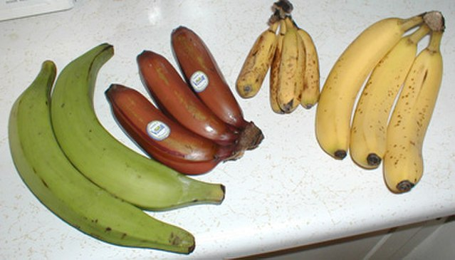

# Bananas

## General Information
**Generic name:** Banana
**Sri Lankan name:** Kehel (Sinhala), Vāḻaipalam (Tamil)
**Scientific name:** Genus *Musa* - numerous varieties
**Plant family:** Musaceae
**Edible parts:** Fruit and the flower. The central pith of the false stem and the underground rhizome are also sometimes eaten.
<update>
**Nutrition value:** Rich in potassium, vitamin C, vitamin B6, and dietary fiber. They also contain small amounts of other vitamins and minerals.
</update>
**Companion plants:**
- Sweet potatoes
- Lemongrass
- Comfrey
- Taro

**Non-companion plants:** Corn, Tomatoes

## Description:
Bananas can be classed into diploid, triploid, and tetraploid kinds with various amounts of the A or B parents. They grow 2-9 m high. They are large non-woody herbs with broad long leaves. Most kinds have several suckers. Bananas grow a soft firm false stem from an underground corm. The fruiting stalk eventually emerges from the top of this false stem and normally curves over pointing towards the ground.

## Planting requirements
- Ideal for warm and humid climates
**Planting season:** February - March, October - November

### Planting conditions:
| **Propagation** | Suckers are usually put 30 cm deep |
|----|----|
| Planting method | Suckers are usually put 30 cm deep |
| Soil | Requires a soil pH between 4.5-7.5. A fertile soil with adequate moisture is ideal |
| Water | Bananas require large amount of water for healthy growth. Needs a moist soil that drains well |
| Light | Requires full sunlight |

### Growing conditions:

| **Temperatures** | Best temperature to grow bananas is 27°C - 38°C |
|----|----|
| Soil | Bananas are heavy feeders and therefore respond well for manure.  |
| Water | Require watering every day but avoid waterlogging. Watering from a garden hose or drip irrigation is best |
| Pruning | Prune the plant after harvesting to encourage new growth.
| Weed control | Keep the area around the plants weed-free to prevent competition for nutrients and water.

## Harvesting:
Time to maturity varies from 6 to 18 months depending on variety and altitude.
<update>
## Curing: 
Bananas are cured after harvesting by hanging them in a dark, humid place for about a week to allow the flavors to develop.

## Storage: 
Store bananas at room temperature away from direct sunlight. They can also be frozen or dried for later use.
</update>
## Protecting your plants
### Pest control
**Pest type:** Nematodes, Weevils, Thrips, Scarring beetle, Sap-sucking insects
<update>
**Symptoms:** Wilting leaves, yellowing leaves, holes in leaves and fruits
</update>

**Control method:** Use insecticides, remove affected plant, remove weeds, spray soapy water, release lady bird beetles and lace wings in the field which are very active aphid feeders

<update>
### Disease Control
**Disease type:** Black Sigatoka, Bunchy Top Virus

**Symptoms:** Black spots on leaves, yellowing of leaves, stunted growth

**Management:** Regularly monitor plants for signs of disease. Remove infected leaves and plants. Use fungicides to control Black Sigatoka.
</update>

## Difficulty Rating
### Low country wet zone (Difficulty: 6/10)
**Explanation:** Bananas grow well in the warm, humid conditions of the low country wet zone.
**Challenges/Adaptations:**
- Requires regular watering to prevent wilting
- Susceptible to Black Sigatoka disease

### Low country dry zone (Difficulty: 7/10)
**Explanation:** Bananas can be grown in the low country dry zone with adequate irrigation.
**Challenges/Adaptations:**
- Requires more watering than other plants due to high transpiration rate
- Needs protection from strong winds

### Mid country (Difficulty: 5/10)
**Explanation:** The moderate climate of the mid country is suitable for banana cultivation.
**Challenges/Adaptations:**
- Requires regular pruning to encourage fruit production
- Susceptible to pests and diseases

### Up country (Difficulty: 8/10)
**Explanation:** Bananas can be grown in the up country with careful management of temperature and water requirements.
**Challenges/Adaptations:**
- Requires protection from frost
- Needs regular watering to prevent wilting due to high altitude temperatures

## References for this entry
### Content Sources:
- [Wikipedia](https://en.wikipedia.org/wiki/Banana)
- [FAO](http://www.fao.org/3/a-i4127e.pdf)

### Image Sources: (In order of appearance)
- 