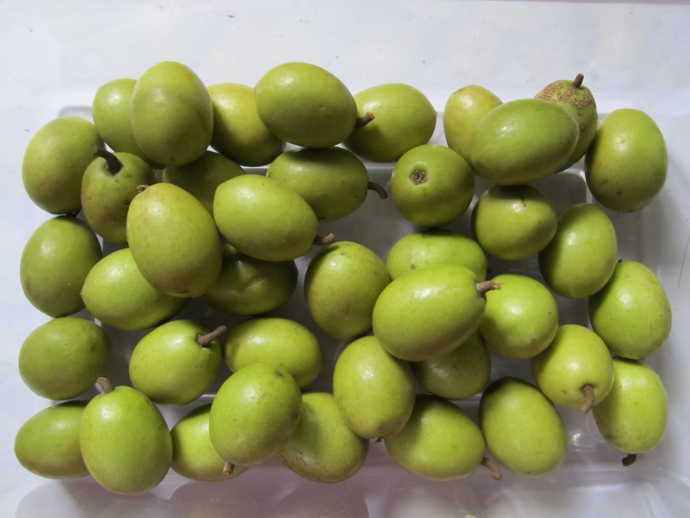

# Ceylon Olive / Veralu
 

## General Information
**Generic name: Ceylon Olive, Wild Olive**
**Sri Lankan name:** Veralu (Sinhala) 
**Scientific name:** Elaeocarpus serratus 
**Plant family:** 
**Edible parts:** Fruit
**Other uses:** Used in traditional South Asian medicines for various ailments
**Nutrition value:**

**Companion plants:** Not applicable

**Non-companion plants:** Not applicable

## Description
 Elaeocarpus serratus is a tropical flowering plant in the family Elaeocarpaceae. It is a medium to large tree, with white flowers. It has a disjunctive distribution, with the species occurring in Sri Lanka and southern India, and in Assam, Bangladesh and other parts in the north of the Indian subcontinent. The fruit is commonly eaten, and people also use the plant for ornamental, religious and folk-medicinal purposes. There are historical records of traditional-medicine use of the plant. \n  \n It is a medium-sized tree which bears smooth ovoid green fruits the size of about 2.5 cm long. Recommended varieties are local cultivars (round and oval fruits). It has a brown seed inside the fruit. The seed has a hard outer shell. The seeds are slow for germination and can take up to 2 years. The wood is whitish yellow.

## Planting requirements

**Planting season:** Tropical or subtropical climates are most suitable. 

### Planting conditions:
- Veralu is widespread throughout Sri Lanka but is more common in the wet zone and rarely found in dry regions. Flowering and fruiting occur in the dry season. Does not tolerate dry conditions and extreme cold

| Planting method | **Direct seeding is possible but seeds are slow to germinate. Germination can take between 3 to 9 months. Cuttings about 4-6 inches long should be planted in nurseries and allowed to take root and then transplanted. Grafting is the more successful method of producing veralu plants. For that, the wedge grafting method is more suitable.**  \n  \n **Pits should be prepared with a distance of 2-3 meters between the plants for transplatnting. Then the pits should be filled with a mixture made by mixing well-rotted dung or compost, topsoil and sand in equal quantities.**  |
|----|----|
| **Soil** | Well-draining soil is ideal |
| **Water** | Must be watered regularly to maintain soil moisture. Do not overwater |
| **Light** | Partial sunlight in early stages of growth |

 
### Growing conditions:
| Temperatures | NA |
|----|----|
| **Soil** |  Well-draining soil is ideal |
| **Water** | Water regularly but do not overwater. Use soil moisture as a guid. |
| **Propagation** | Direct seeding, budding, grafting. |

## Harvesting:
8-9 years for direct seeded trees. 3-4 years for budded and grafted trees. A tree can produce between 60 to 100 kilograms of fruit every year. 

## Curing:

## Storage

## Protecting your plants
### Pest Control
**Pest type:** Mature trees are not prone to pests; however, young saplings may attract leaf rollers.

**Symptoms:**
- **Leaf rollers:**

**Control method:**
- **Leaf rollers:** Organic insecticides are effective at controlling pests.

### Disease Control
**Disease type:** 

**Symptoms:**

**Management:**
