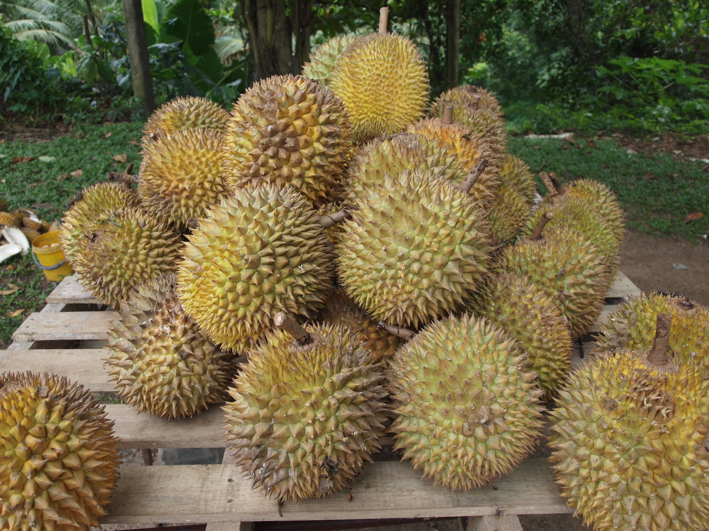

# Durian

## General Information
**Generic name:** Durio zibethinus
**Sri Lankan name:** Duriyan (Sinhala & Tamil)
**Scientific name:** _Durio zibethinus_
**Plant family:** _Malvaceae_
**Edible parts:** Fruit
**Nutrition value:** High in vitamins C and B, potassium, magnesium, and iron. It also contains healthy fats and dietary fiber.

**Companion plants:**
Not applicable

**Non-companion plants**
Not applicable

## Description:
The durian is the edible fruit of several tree species belonging to the genus Durio. Named in some regions as the "king of fruits", the durian is distinctive for its large size, strong odor, and thorn-covered rind. The fruit can grow as large as 30 centimeters long and 15 cm in diameter, and it typically weighs 1 to 3 kilograms. Its shape ranges from oblong to round, the colour of its husk green to brown, and its flesh pale yellow to red, depending on the species.

Varieties in Sri Lanka include Kasun, Ambatenna, Horana Gold, Horana Jumbo, and Gannoruwa Sweet.

## Planting requirements
**Planting season:** October to December (during the North-East monsoon)

### Planting conditions:
| Propagation | Direct seeding or grafting |
|----|----|
| Planting method | Durian can be planted through direct seeding and grafting. Direct seeding is not recommended for commercial use due to the length of time it takes for trees to grow and variations in fruit quality. |
| Soil | Rich, deep, well-drained sandy clay or clay loam (deep alluvial or loamy soil), high in organic matter, pH range of 6 - 7 |
| Water | Regular watering is essential, especially during dry periods. Irrigation may be necessary in areas with less than 1500mm annual rainfall.                                           |
| Light| Full sun to partial shade, with protection from strong winds |

### Growing conditions:
 Following planting, young durian trees should be provided with temporary shade and complete wind protection for the first year, as in a shade cloth nursery structure or equivalent. The structure of the young trees and their leaves is such that strong winds can twist the leaves right off, a setback from which they are unlikely to ever fully recover.

| Temperatures | Required hot temperatures, but may be grown in slightly cooler temperatures as well |
|----|----|
| Soil | Well-drained, fertile soil rich in organic matter. |
| Water |Regular watering is essential, especially during dry periods. Irrigation may be necessary in areas with less than 1500mm annual rainfall. |
| Pruning | Proper pruning of the durian tree is important to obtain a tree form that encourages early flowering and good yields. |
| Weed control | Regular weeding around the base of the tree |

## Harvesting:
Grafted trees start yielding fruits in 5-6 years. 10-40 fruits per tree in the first year of fruiting and up to 100 fruits per year after the 10th year of fruiting.

## Curing:
Durian does not require a curing stage

## Storage
Fermentation begins as soon as fruits fall from the tree, leading to spoilage within a few days. However, fruits that are harvested before ripening can remain fresh for over a week. They are deemed ripe when they release their distinctive aroma. To access the fruit, a sharp, pointed knife is used to cut along longitudinal markings, allowing the segments to split apart. 

Once opened, the fruit should be consumed right away; however, the flesh can be stored in a plastic container in the refrigerator for up to a week or in the freezer for several months without spoiling or altering its flavor.

## Protecting your plants
### Pest control
**Pest type:**
- Fruit spotting bug
- Green ants
- Meat ants

**Symptoms:** Holes in leaves or fruits, wilting leaves, fruit drop

**Control method:** Use of natural insecticides like neem oil.

### Disease Control
**Disease type:** 
- _Phytophthora palmivora_

**Symptoms:** 
- **_Phytophthora palmivora_:**
 - causes dark, reddish-brown, gummy spots on the bark.
 - Cankers (sores) can form on branches, causing them to die back. If they appear on the trunk or roots, the entire tree could be at risk.
 - Trees often lose leaves and show poor growth before dying.
 - Young plants can die if their roots or stems get infected.

**Management:** 
- **_Phytophthora palmivora_:**
 - Steps can be taken to eliminate a moist microclimate at the base of the tree which might support the growth of P. palmivora
 - Remove any branches starting to grow below about 1 meter in height.
 - Using disease-resistant varieties.

## Difficulty Rating
### Low country wet zone (Difficulty: 5/10)
**Explanation:** The wet zone provides ideal conditions for durian cultivation with high rainfall and suitable temperatures.
**Challenges/Adaptations:**
- Manage excess moisture to prevent fungal diseases.

### Low country dry zone (Difficulty: 8/10)
**Explanation:** The dry zone's low rainfall and high temperatures pose significant challenges for durian cultivation.
**Challenges/Adaptations:**
- Implement efficient irrigation systems and provide shade during extreme heat.

### Mid country (Difficulty: **6/10**)
**Explanation:** The midcountry offers moderate conditions but may require additional care during dry spells.
**Challenges/Adaptations:**
- Supplement rainfall with irrigation during dry periods.

### Up country (Difficulty: **7/10**)
**Explanation:** The cooler temperatures and potential frost in the up country can be challenging for durian trees.
**Challenges/Adaptations:**
- Choose cold-tolerant varieties and provide protection from strong winds.
