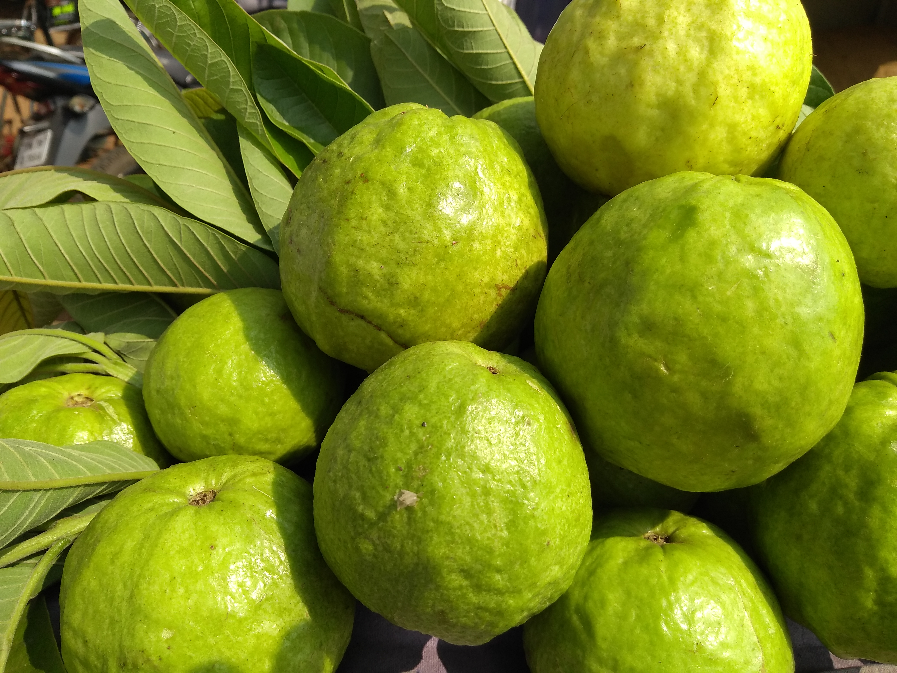

# Guava

    
## General Information
**Generic name:** Guava
**Sri Lankan name:** Pera (Sinhala), Koyyā (Tamil)
**Scientific name:** _Psidium guajava_
**Plant family:** _Myrtaceae_
**Edible parts:** Young leaves and the Fruit
**Nutrition value:** High in dietary fiber, vitamin C, potassium, and folate.
**Companion plants:**
- Citrus trees
- Chives
- Marigold
- Comfrey
- Borage
**Non-companion plants**
- Cucumber
- Eggplant
- Potato

## Description:
A small, shallow-rooted, evergreen tree or shrub, with smooth mottled bark, growing 8-10 m high. The fruit is rounded and 4 to 5 cm long. They are green but turn yellow when ripe. The outer covering is firm and encloses a pink or nearly white sweet-smelling edible pulp. This contains many seeds. In better selected varieties both the skin and the seeds are fully edible. Fruit varies from very acidic to very sweet. They grow wild and are also cultivated.

## Planting requirements
- Grows in humid and dry tropical climates
  
**Planting season:** Year-round, but preferably at the onset of rainy seasons

### Planting conditions:
| Propagation | Mostly grown from seeds or stem cuttings |
|----|----|
| Planting method | When planting a young tree, dig a hole that's at least twice the width of the root ball, wider if possible. |
| Soil | Prefers well-drained loamy soils with good organic matter. |
| Water | Requires frequent watering for the young plant until established. |
| Light | Requires 6 hours of full sunshine |

### Growing conditions:

| Temperatures | Requires temperatures near 30°C give best production |
|----|----|
| Soil | Add compost if desired. Mulch to a depth of 3"-4" around the tree, making sure to maintain at least a 4"-6" clear space around the trunk itself and keep the soil moist but not waterlogged. |
| Water | Requires moderate watering during dry spells and less during rainy seasons. |

## Harvesting:
Guava fruit ripens in its 2nd-4th year. Can pick the fruit when it's full-sized and has become slightly soft and aromatic. But it can be harvested prior to full ripeness as well and will continue to ripen off the tree.

## Curing:
No curing is required for guava fruits.

## Storage
Guavas can be stored at room temperature for up to 5 days or refrigerated for up to 2 weeks.

## Protecting your plants
### Pest control
**Pest type:**
- Fruit fly (_Bactocera spp._)
- Plant aphid (_Selenothrips rubrocinctus_)
- Leaf-eating beetles (_Mylocerus spp._ / _Phyllophaga spp._)
- Leaf-eating caterpillars (_Hyposidra talaca Wlk._)
- Nematodes (_Meloidogyne spp._)

**Symptoms:**
- **Fruit fly:** Larvae hatch from eggs laid in ripening fruit and eat the fleshy part, causing infection and rot.
- **Plant aphid:** Yellow spots on leaves, which then dry up completely. Can kill young plants.
- **Leaf-eating beetles:** Leaves eaten, especially at night.
- **Leaf-eating caterpillars:** Leaves eaten, slowing plant growth.
- **Nematodes:** Stunted growth, wilting despite watering, death of groups of plants, rotting of thin roots, purple spots on leaf edges.

**Control method:**
- **Fruit fly:** Cover developing fruit with paper bags, harvest slightly early, bury fallen fruits, and use methyl eugenol traps for males.
- **Plant aphid:** Use synthetic insecticides like profilin and imidacloprid for severe infestations.
- **Leaf-eating beetles:** Use contact insecticides like Fenthion for severe damage.
- **Leaf-eating caterpillars:** Cut and destroy affected branches, use insecticides like Atabron for severe damage.
- **Nematodes:** Apply carbofuran (10g for young trees, 20-30g for mature trees).

### Disease Control
**Disease type:**
- Tree dieback (_Fusarium oxysporum_ or _Macrophomina phaseolina_)
- Scab disease (_Pestalopsis psidii_)
- Anthracnose (_Colletotrichum gloeosporioides_)

**Symptoms:**
- **Tree dieback:** Lower branches die, leaves fall off, cracks in trunk and branches appear, and the tree gradually dies.
- **Scab disease:** Brown crusts on fruit, cracks develop, fruit turns black and rots quickly.
- **Anthracnose:** Circular brown spots on unripe fruits, infected fruits turn black, flowers and branches can be infected, and branches may fall from top to bottom.

**Management:**
- **Tree dieback:** Remove and burn diseased trees, improve drainage, and apply carbendazim to moist soil.
- **Scab disease:** Use recommended fertilizers, prune trees properly, and apply fungicides like Mancozeb or Daconil, followed by insecticides like Imidacloprid.
- **Anthracnose:** Proper tree pruning to allow sunlight, apply fungicides like Daconil and Mancozeb, careful fruit harvesting and packing.

## Difficulty Rating
### Low country wet zone (Difficulty: 5/10)
**Explanation:** Guava grows well in the low country wet zone due to adequate rainfall, but requires management to prevent fungal diseases.

**Challenges/Adaptations:**
- Maintain good air circulation around plants.
- Avoid overhead watering to prevent disease spread.

### Low country dry zone (Difficulty: 6/10)
**Explanation:** Guava can thrive in the dry zone with proper irrigation, but requires careful water management during dry spells.

**Challenges/Adaptations:**
- Ensure consistent watering during dry periods.
- Use mulching to conserve soil moisture.
- Apply balanced fertilizers regularly.

### Mid country (Difficulty: 4/10)
**Explanation:** Guava grows exceptionally well in the mid country of Sri Lanka due to favorable climate conditions.

**Challenges/Adaptations:**
- Monitor soil moisture levels and apply balanced fertilizers.
- Protect from strong winds, especially during the monsoon season.
- Maintain good air circulation to prevent disease buildup.

### Up country (Difficulty: 7/10)
**Explanation:** Guava can be challenging to grow in the upcountry due to cooler temperatures, but some varieties can adapt well.

**Challenges/Adaptations:**
- Choose cold-tolerant varieties suitable for up country conditions.
- Maintain good air circulation to prevent disease buildup.
- Apply balanced fertilizers regularly, but avoid overfertilizing as it can cause excessive vegetative growth at the expense of fruit production.
