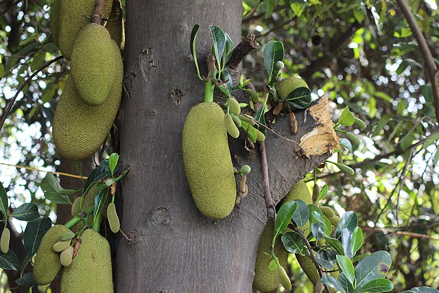

# Jackfruit

    
## General Information
**Generic name:** Jackfruit
**Sri Lankan name:** Kos (Sinhala) | Palāppaḻam (Tamil)
**Scientific name:** _Artocarpus heterophyllus_
**Plant family:** _Moraceae_
**Edible parts:** The arils (the sweet, raw fruit), seeds (boiled or roasted), young fruits (used in curries)
**Nutrition value:** High in dietary fiber, protein, vitamin C, and minerals like potassium and magnesium. It also contains antioxidants.

**Companion plants:**
Not applicable

**Non-companion plants**
Not applicable

## Description:
The jackfruit tree, also known by the common name jack tree, is a tropical fruit tree in the Moraceae family that is a relative of breadfruit, mulberry, and fig tree. Jackfruit leaves are dark green and glossy, and the trees are monoecious, meaning they have both male flowers and female flowers on the same tree. Jackfruit can be used to control soil erosion due to its extensive root system.

## Planting requirements
**Planting season:** Year-round in most parts of Sri Lanka, but preferably May-June or October-November

### Planting conditions:
| Propagation | Propagated by seed, grafting, cuttings |
|----|----|
| Planting method    | First choose a healthy nursery tree and select a site with full sunshine. Dig a hole 3 to 4 times the diameter and 3 times as deep as the container the jackfruit tree has come in. Remove the tree from the container and place it in the hole so that the top of the soil in the container is level with or slightly above the surrounding soil level |
| Soil | Requires well-drained sandy or loamy soils with a high PH level |
| Water | Need consistent moist soil |
| Light | Requires full sunshine (6 hours) |

### Growing conditions:
| Temperatures | Needs a temperature of 24–28°C |
|----|----|
| Soil | Trees grow best in well-drained soils |
| Water | Regular watering is needed for young plants. Needs regular watering when the conditions are dry |
| Pruning | Prune the tree if space is limited, removing dead or diseased branches and maintaining a balanced canopy |
| Weed control | Keep the area around the tree free of weeds to prevent competition for nutrients |

## Harvesting:
In Sri Lanka, jackfruits are harvested year-round, with peak seasons from May to September. They can be picked at an immature stage (unripe) for use in curries, or eaten fresh when picked at a mature stage and allowed to ripen. Look for a change in fruit color and a hollow sound when tapped to determine ripeness.

## Curing:
Ripe jackfruits can be cured by storing them at room temperature until the skin turns yellow. Unripe jackfruits should be cooked before consumption.

## Storage
In tropical climates, ripe jackfruits can be stored at room temperature for 3-4 days. For longer storage, cut the fruit into sections and refrigerate for up to a week. Unripe jackfruits can be stored at room temperature for up to a week or refrigerated for up to 3 months.

## Protecting your plants
### Pest control
**Pest type:**
- Shoot and fruit borer
- Mealy bug
- Bark-eating caterpillar
- Aphid

**Symptoms:**
- **Shoot and fruit borer:** Caterpillar bores into tender shoots and developing fruits. Causes about 30-40% damage in jackfruit from flower bud formation up to fruit ripening.
    
- **Mealy bug:** Adult bugs covered with whitish powder, colonizing bark of tree trunks, young shoots, and panicles. Nymphs settle on inflorescence causing flower drop, affecting fruit set. Excretion of honeydew, facilitating the development of sooty mold.
  
- **Bark-eating caterpillar:** Larvae nibble the bark and bore into it. Disturbs sap flow, resulting in poor growth and less fruiting. Silk webs with excreta and chewed wood particles visible on the bark.
  
- **Aphid:** Nymphs and adults suck sap from leaves, buds, and pods. Curling of infested leaves. Plants may wither and die in advanced stages. Plants remain stunted. Sooty molds grow on the honeydew excreted by the insects.

**Control method:**
- **Shoot and fruit borer:** Use natural enemies such as parasitoids like Bracon sp., Chelonus sp., Systasis sp.
  
- **Mealy bug:** Encourage natural predators such as Menochilus sexmaculatus, Rodolia fumida, Cryptolaemus montrozieri.

**General pest control practices:**
- Maintain proper field sanitation
- Introduce natural predators of pests

### Disease Control
**Disease type:**
- Soft rot or fruit rot
- Dieback
- Leaf spot
- Rust
- Pink disease

**Symptoms:**
- **Soft rot or fruit rot:** Young fruits and male inflorescences are badly attacked. Greyish fungal growth appears, gradually becoming denser and black. Affected fruits fall off early.

- **Dieback:** Discolouration and darkening of bark from the tip. Twigs wither, leaves turn brown with rolled margins. Branches die, shrivel, and fall. Possible gum exudation from affected branches.

- **Leaf spot:** Dark brick red spots on both leaf surfaces, turning greyish with dark pin-headed fruiting bodies upon maturity.

- **Rust:** Small, yellowish spots on the upper leaf surface, turning reddish-brown. The lower surface shows reddish-brown, slightly raised lesions. Heavily infected leaves turn yellow or brown and drop prematurely.

- **Pink disease:** Pinkish powdery coating on the stem. Young woody branches lose leaves and show dieback symptoms. Pink encrustation on the lower shaded side.

**Management:**
- **Soft rot or fruit rot:** Avoid warm, humid, rainy conditions. Control wind, rain, and insects that can spread the fungus.

- **Dieback:** Maintain relative humidity below 80% and temperatures outside the 25-31°C range. Prune and destroy infected twigs.

- **Leaf spot:** Keep temperature below 25°C and relative humidity below 95%. Remove and destroy old leaves where the fungus overwinters.

- **Rust:** Remove and destroy fallen leaves to reduce teliospore survival. Implement measures to reduce the wind-borne spread of uredospores. Avoid conditions with temperatures between 25.5 to 30.5°C and relative humidity of 86-92%.

- **Pink disease:** Improve air circulation and reduce humidity in the orchard. Prune and destroy affected branches.

**General management practices:**
- Practice good orchard sanitation
- Ensure proper spacing between trees for adequate air circulation
- Use disease-resistant varieties when available
- Apply appropriate fungicides as per local agricultural guidelines if necessary
- Avoid overhead irrigation to reduce leaf wetness duration

## Difficulty Rating
### Low country wet zone (Difficulty: 2/10)
**Explanation:** Jackfruit trees thrive in the wet zone due to abundant rainfall and suitable temperatures.
**Challenges/Adaptations:**
- **Pests:** Aphids, and mealybugs are common. Regular monitoring is needed.
- **Diseases:** Higher humidity can increase the risk of fungal diseases. Ensure good air circulation.

### Low country dry zone (Difficulty: 7/10)
**Explanation:** Jackfruit trees can tolerate drought conditions but require more watering during dry spells.
**Challenges/Adaptations:**
- **Drought:** Trees may drop leaves and fruits during severe droughts. Regular watering is crucial.
- **Mulching:** Apply thick mulch to conserve soil moisture and reduce water stress.

### Mid country (Difficulty: 4/10)
**Explanation:** Jackfruit trees grow well in the mid-country with regular watering and pest management.
**Challenges/Adaptations:**
- **Pests:** Similar to wet zone, but cooler temperatures may slow down pest reproduction.
- **Soil:** Ensure good drainage on sloped terrain to prevent waterlogging.

### Up country (Difficulty: 8/10)
**Explanation:** Jackfruit trees can tolerate cooler climates but require more care in terms of watering and protection from frost.
**Challenges/Adaptations:**
- **Frost:** Young plants should be protected during frost periods. Mature trees are somewhat frost-tolerant.
- **Growth rate:** Slower growth and fruit development due to cooler temperatures. Choose cold-hardy varieties.

## References for this entry
### Sources:

### Image Sources: (In order of appearance)
