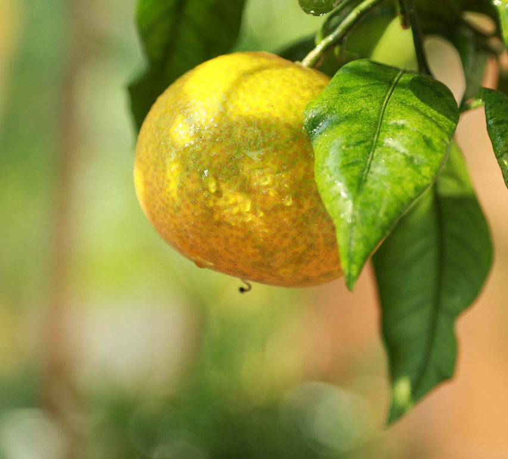

# Mandarin Orange

## General Information
**Generic name:** Mandarin Orange
**Sri Lankan names:** Jamanaran (Sinhala) | Narangam (Tamil)
**Scientific name:** _Citrus reticulata_
**Plant family:** _Rutaceae_
**Edible parts:** Fruit
**Nutrition value:** Rich in vitamin C. And 100g contains 53 calories on average

**Companion plants:**
- Marigold
- Flowers
- Basil
- Mint
- Curry leaves
- Lemongrass
- Legumes

**Non-companion plants:**

- Avoid planting near potatoes, carrots and other deep-rooted plants tubers or root vegetables
- Space the mandarin orange plants so that they don't compete with each other
- Avoid planting herbs with shallow roots close to the base of the mandarin orange

## Description:

A popular citrus fruit cultivated in various regions of Sri Lanka, including the low country, mid-country, and up-country zones. This versatile fruit tree produces round to oval fruits with easy-to-peel skin and sweet, juicy segments that can be eaten fresh or used for juice production. Mandarin orange trees typically yield about 60 kg of fruit per year, with harvests spread throughout the year.

Mandarine fruit is also used for juices and seasonings. Essential oils from the peel are used in aromatherapy. Limomene, its most active ingredient, functions as a natural insect repellent, as well as an anti-bacterial solution

Recommended Varieties:
- Juicy: This variety produced by the Horana Fruit Crops Research and Development Institute is recommended for cultivation in the low country region of Sri Lanka. It can be used for fresh fruit and juice production. It bears large fruits weighing between 100-130 grams with light orange color.
- Madhu: A mature tree grows about 2-2.5 meters tall with a sprawling canopy. Leaves may be light green or yellowish. The tree is thornless. The fruit is round or oval with slightly protruding ends. Fruits are seedless or may have 1-2 seeds. The juice is light yellow or light orange. Unripe fruit is dark green and may turn light green or yellowish green when ripe. Suitable for Uva and Central Provinces (Middle Zone).
- Yellow Jamanaran: There are three varieties - Horana Ehimi 1, 2, and 3. They have yellowish bark, are seedless, and easy to peel. Average fruit weight ranges from 85-120 grams. Trees reach about 1.3-1.5 m height at 4 years with a leaf canopy spread of 1.5-2 m. Fruiting occurs in August-September and March-June. Brix values range from 11.4-12.5. Suitable for Uva and Central Provinces (Middle Zone).
- Jamanarang-Ind: Grows 2-2.5 meters tall in 4 years with a leaf canopy spread of 2-3 m. Average fruit weight is about 90-120 grams. The bark peels off easily. The flesh is bright orange when ripe. There are about 2-8 seeds per fruit. It has a sweet taste. Suitable for the low country wet zone.
- Rahangala Varana: The fruit has a flat dome shape. The juice is yellowish orange. The bark peels off easily. Suitable for Uva and Central Provinces.
- Bibile Sweet: A variety developed by the Department of Agriculture, well-suited for the dry and intermediate zones of Sri Lanka. It produces medium-sized fruits with a sweet flavor and few seeds.
  
## Planting requirements
**Planting season:** February to March for the wet zone, July to August for the dry zone

### Planting conditions:
| Propagation | Mandarins can be grown either from seed or from root stock/transplant. Grafting/Transplanting: Cut off the shoots below the graft junction, to prevent the formation of host plants |
|----|----|
| Planting method |  Germinate the plants indoors in a pot. Aerate and thin the soil upto 5-10cm in depth. Create a small hole approx 5cm in depth, then plant. For a root stock, fold the roots horizontally and place the plant in the hole and tighten the soil. Once it sprouts, move to an outdoor location with the soil prepared as per the section below |
| Soil | Prepare pits for planting at intervals of 3.5 – 4.0 meters. Each pit should be 75 X 75X 75 cm (width, length, height) in size. When digging pits, topsoil and subsoil should be piled separately. Expose the pits to sunlight for a few days. Pits should be filled with a mixture of well-digested organic matter and topsoil in a ratio of 1:1. Mark the center of each pit with a wedge. Ensure soil pH is around 5-6 for optimal growth. In areas with heavy clay soil, add sand and organic matter to improve drainage |
| Water | Water regularly, about once a week.|
| Light | It is important to provide shade to the plant for about 1-2 weeks. After this, the plant will require a lot of sunlight. |

### Growing conditions:

| Temperatures | Recommended 25-32℃. Avoid temperatures below 10℃. In up-country areas, provide protection during colder months. |
|----|----|
| Soil | A loose, well-drained loamy soil rich in organic matter is ideal for cultivation. Also, the absence of gravel or hard soil in the soil up to a depth of about two meters is essential for the success of cultivation. The ideal soil pH for this crop is around 5-6. If the pH value is lower or higher than this, the cultivation is likely to be weakened due to toxicity and deficiencies of various elements |
| Water | Water well once a week, or when the top 2-3 cm of the soil has become dry. Avoid overwatering to prevent root rot. In dry zones, consider mulching to retain soil moisture. During dry spells, increase watering frequency, especially for young trees |
| Pruning | Flowering of trees is stimulated during one or two months of the year or when there is a short dry season |
| Weed control | Weeding can enhance tree health and fruit production while minimizing competition for nutrients from unwanted plants |

## Harvesting:
After about 2-3 years, the fruiting of the plant starts. Flowering usually occurs in late January to early February. This situation varies depending on the prevailing rainfall pattern. If there is too much fruiting, the fruits should be thinned by removing too large and too small fruits in clusters. When harvesting, the fruit stem should be as short as possible and not crushed. Harvest fruits at the correct ripening stage or the taste and quality may decrease. Fruits are ready to harvest when they turn yellowish-green to orange. In Sri Lanka, main harvesting seasons are typically from August to October and February to April, depending on the region.

## Curing:
Mandarin does not require a curing stage.

## Storage
Store fruits in a cool, dry place for up to 2 weeks. Avoid storing in plastic bags as it promotes rotting. For longer storage, keep in a well-ventilated area at temperatures between 8-10°C. In humid conditions, use newspaper to wrap individual fruits to prevent moisture accumulation.

## Protecting your plants
### Pest control
**Pest type:**
- Citrus Butterfly (Papilio demoleus)
- Leaf Miner (Phyllocnistis citrella)
- Black Aphids (Toxoptera aurantii)
- Scale Insects
- Fruit Fly (Bactrocera kandiensis)

**Symptoms:**
- **Citrus Butterfly:** Caterpillars eat young leaves and shoots
- **Leaf Miner:** Silver streaks on young leaves, leaf distortion
- **Black Aphids:** Abundant on young stem parts and undersides of leaves, sap-sucking damage
- **Scale Insects:** Found on undersides of stems, young shoots, and fruit; cause yellowing and leaf shrinkage
- **Fruit Fly:** Larvae damage nuts and fruits, causing premature fruit drop

**Control method:**
- **Citrus Butterfly:** Hand-pick eggs and caterpillars, spray simple insecticide if necessary
- **Leaf Miner:** Remove damaged leaves, spray with suitable insecticide, use neem seed extract
- **Black Aphids:** Spray with Thiomethoxam or Imidacloprid
- **Scale Insects:** Apply appropriate insecticides
- **Fruit Fly:** Collect and dispose of fallen fruits, use methyl eugenol traps, apply protein bait mixed with insecticide

### Disease Control
**Disease type:**
- Bacterial: Cancer and Citrus canker (Xanthomonas citri)
- Fungal: Pink disease, Glutinous Blight, Scab Disease, Powdery Mildew, Root Rot
- Viral: Tristeza Virus Disease, Greening Disease

**Symptoms:**
- **Cancer and Citrus canker:** Dark yellow areas around brown circular scars on leaves, twigs, and fruit
- **Pink disease:** Yellowing and falling leaves, pink powder on stem bark
- **Glutinous Blight:** Bark bursting, gum oozing, bark peeling
- **Scab Disease:** Irregularly shaped yellowish-brown crusts on leaves, shoots, and fruits
- **Powdery Mildew:** Whitish-gray fungus on young leaves, leaf distortion
- **Root Rot:** Bark emerging at stem base, rotting bark, weakened root system
- **Tristeza Virus Disease:** Yellowing of young leaves, leaf deformation, weakening of the tree
- **Greening Disease:** Green spots on leaves, tree weakness, fruit drop

**Management:**
- **Cancer and Tuberculosis:** Remove and burn diseased branches, apply copper-containing fungicides, use healthy planting material
- **Pink disease:** Prune diseased branches, apply fungicide to cuts, spray with copper-containing fungicide
- **Glutinous Blight:** Apply lime mixed with dung to stem, provide slight shading, apply copper-containing fungicide
- **Scab Disease:** Prune and burn infected parts, spray with copper-containing fungicide
- **Powdery Mildew:** Ensure adequate sunlight, collect and burn fallen leaves, apply copper-containing fungicide
- **Root Rot:** Avoid stem bark damage, improve soil drainage, apply copper-containing fungicide
- **Tristeza Virus Disease and Greening Disease:** Use disease-resistant rootstocks, remove and burn diseased trees

General practices:
- Regular monitoring of plants
- Maintain proper sanitation in the orchard
- Use disease-resistant varieties when available
- Implement integrated pest management strategies

## Difficulty Rating

### Low country wet zone (Difficulty: 6/10)
**Explanation:** Adequate rainfall and temperature, but high humidity increases disease risk.
**Challenges/Adaptations:**
Watch out for fungal diseases in humid conditions. Provide good air circulation around plants. Consider raised beds or mounds to improve drainage. Use "Juicy" variety recommended for this zone.

### Low country dry zone (Difficulty: 7/10)
**Explanation:** Lower humidity reduces disease risk, but higher temperatures and lower rainfall can stress trees.
**Challenges/Adaptations:**
Implement efficient irrigation systems, especially for young trees. Consider shade management to protect from extreme heat. Choose drought-resistant varieties if available. Use mulching to retain soil moisture.

### Mid country (Difficulty: 5/10)
**Explanation:** Moderate climate suits mandarin oranges well, with favorable temperature and rainfall.
**Challenges/Adaptations:**
Manage occasional frost in some areas. Use recommended varieties like Madhu and Yellow Jamanarang. Monitor for pests and diseases common to the region. Ensure proper soil drainage in areas with higher rainfall.

### Up country (Difficulty: 8/10)
**Explanation:** Lower temperatures may slow growth and affect fruit development. Risk of damage due to cold.
**Challenges/Adaptations:**
Use cold-hardy varieties like Rahangala Varana. Provide protection against cold, especially during flowering. Implement windbreaks to protect trees from cold winds. Consider using raised beds to improve soil temperature. 

## References for this entry
### Sources:
- Han, Y., Sun, Z., & Chen, W. (2019). Antimicrobial susceptibility and antibacterial mechanism of limonene against Listeria monocytogenes. Molecules, 25(1), 33.
- Viuda‐Martos, M., Ruiz‐Navajas, Y., Fernandez‐Lopez, J., & Perez‐Álvarez, J. (2008). Antibacterial activity of lemon (Citrus lemon L.), mandarin (Citrus reticulata L.), grapefruit (Citrus paradisi L.) and orange (Citrus sinensis L.) essential oils. Journal of food safety, 28(4), 567-576.
- Kalita, H., Avasthe, R. K., Kishore, K., Rameash, K., & Gopi, R. (2015). Biorational management of insect pests in Mandarin, Citrus reticulata. Indian Journal of Plant Protection, 43(4), 514-517.
- https://doa-gov-lk.translate.goog/fruit-crops-jamanaran-s/
- https://hort.purdue.edu/newcrop/morton/mandarin_orange.html
- https://www.youtube.com/watch?v=zoosZ8yW2Xg
- https://en.wikipedia.org/wiki/Erythricium_salmonicolor
- https://ccmedia.fdacs.gov/content/download/11078/file/pp71.pdf
- https://doa.gov.lk/fruit-crops-jamanaran-s/

### Image Sources: (In order of appearance)

