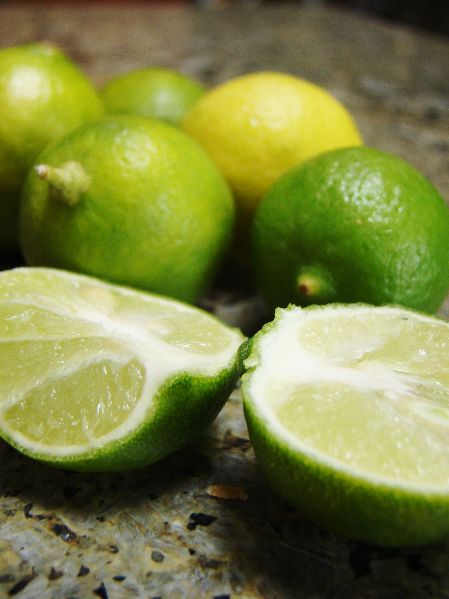

# Lime

**Generic name:** Lime
**Sri Lankan name:** Dehi
**Scientific name:** Citrus aurantiifolia
**Plant family:** Rutaceae
**Edible parts:** Fruit, zest
**Nutrition value:** High in vitamin C, folate, potassium, and citric acid. A medium lime contains about 20 calories.

**Companion plants:**
- Lemongrass: Shares similar growing conditions and repels mosquitoes, complementing the lime's pest-deterrent properties.
- Thai Basil: Its strong scent confuses pests, providing a natural shield for the lime tree.
- Mint: Attracts pollinators and repels various pests, contributing to a balanced ecosystem.
- Marigolds: Deter nematodes and other pests while adding visual appeal to the garden.
- Nasturtiums: Lure aphids away from lime trees and attract beneficial insects.
- Chives: Their pungent aroma deters pests, and they complement lime in culinary uses.
- Garlic: Offers strong pest-repelling abilities, but needs space consideration to avoid resource competition.

**Non-companion plants:**
- Heavy feeders (e.g., corn, sunflowers, pumpkins): Compete aggressively for nutrients, potentially starving the lime tree.
- Allelopathic plants (e.g., eucalyptus): Release chemicals that can inhibit the growth of nearby plants.
- Water-hungry plants (e.g., willows, ferns): Create an overly moist environment that can lead to root rot in lime trees.
- Pest attractors (e.g., roses, pears): Draw pests that could also target lime trees.
- Potatoes, tomatoes, and cucumbers: Can negatively affect each other's growth when planted near lime trees.

## Description:
Lime trees are well-suited to Sri Lanka's tropical climate. They thrive in the warm, humid conditions found in many parts of the country. Lime trees in Sri Lanka typically grow to a height of 3-5 meters and can be found in home gardens, agricultural plots, and even in some urban areas. The trees have glossy, dark green leaves and produce small, fragrant white flowers before bearing fruit. They typically need at least 3 to 4 years to bear fruit, depending on the size of your tree at purchase. Lime trees can grow up to 24 inches per year under optimal conditions.

## Planting requirements
**Planting season:** Best planted from June to December in Sri Lanka

### Planting conditions:
| Aspect | Recommendation |
|--------|----------------|
| Propagation | Can be grown from seeds, saplings, or cuttings. For seeds, dry for 24 hours before planting. For cuttings, use semi-hard green stems and root in water or soil. |
| Planting method | Plant healthy seedlings in 75 cm x 75 cm x 75 cm pits at 5 to 6 m spacing. For container growing, use pots 18-36 inches in diameter with good drainage. |
| Soil | Requires deep, well-draining loamy soils. A pH between 6.0 and 7.0 is ideal. Mix local topsoil, compost, and sand for an ideal growing medium. |
| Water | Irrigate copiously after planting. After establishment, irrigate at 7-10 day intervals. Avoid water stagnation. Water whenever the top layer of soil dries out. |
| Light | Requires 6-8 hours of full sunlight daily |

### Growing conditions:
| Aspect | Recommendation |
|--------|----------------|
| Temperatures | Thrives in Sri Lanka's tropical temperatures (22°C to 33°C). Cannot tolerate temperatures below 10°C (50°F). |
| Soil | Use a mix of local topsoil, compost, and sand. Monitor soil pH a few times a year. |
| Water | Water deeply once or twice a week, depending on rainfall. Increase frequency during dry seasons. Be careful to avoid overwatering. |
| Fertilizer | Apply a shovelful of organic compost every four months. |
| Pruning | Not necessary but can be done to maintain size and shape. Remove unhealthy branches at any time of year. |

## Harvesting:
In Sri Lanka, limes can be harvested year-round, with peak seasons typically occurring from May to August and November to January. Harvest when the fruit is fully sized and light green in color with a slight hint of yellow for maximum juice content. Fruits can be twisted off by hand or cut with scissors, being careful of thorns.

## Storage:
In Sri Lanka's warm climate, store limes in the refrigerator for up to 2 weeks. For longer storage, limes can be pickled or their juice can be frozen in ice cube trays. Lime rinds can be dried in the sun for a few days to make tea.

## Protecting your plants
### Pest control
**Pest types:** Leaf miner, Leaf caterpillar, White fly, Black fly, Aphids, Rust mite, Fruit sucking moth, Shoot borer, Stem borer, Fruit fly, Mealy bugs, Citrus mites

**Control methods:** 
- Spray with neem oil for organic pest management
- Implement integrated pest management strategies, including companion plants
- Use baits and traps for fruit flies and other specific pests

### Disease Control
**Disease types:** Twig blight, Scab, Canker, Tristeza virus

**Management:**
- Prune infected parts and apply copper-based fungicides
- Use disease-resistant varieties
- Remove and destroy trees infected with Tristeza virus
- Maintain a balanced ecosystem to prevent pest and disease outbreaks

## Difficulty Rating
### Low country wet zone (Difficulty: 3/10)
**Explanation:** Ideal conditions for lime cultivation with ample rainfall, humidity, and suitable temperatures
**Challenges/Adaptations:**
- Monitor for fungal diseases due to high humidity
- Ensure good drainage to prevent waterlogging

### Low country dry zone (Difficulty: 5/10)
**Explanation:** Suitable for lime trees but requires additional water management
**Challenges/Adaptations:**
- Implement drip irrigation or frequent watering during dry spells
- Use mulch to retain soil moisture

### Mid country (Difficulty: 4/10)
**Explanation:** Good growing conditions with moderate temperatures and rainfall
**Challenges/Adaptations:**
- Protect from occasional cold spells in higher elevations
- Adjust watering based on seasonal rainfall patterns

### Up country (Difficulty: 7/10)
**Explanation:** Cooler temperatures can be challenging for lime trees
**Challenges/Adaptations:**
- Consider planting in sheltered areas or using greenhouses in very high elevations
- Choose more cold-tolerant lime varieties if available
- Provide extra protection during colder months

## Sources
- https://agritech.tnau.ac.in/horticulture/horti_fruits_acidlime.html
- https://permacultureplants.com/plants/lime/
- https://greg.app/makrut-lime-companion-plants/
  
