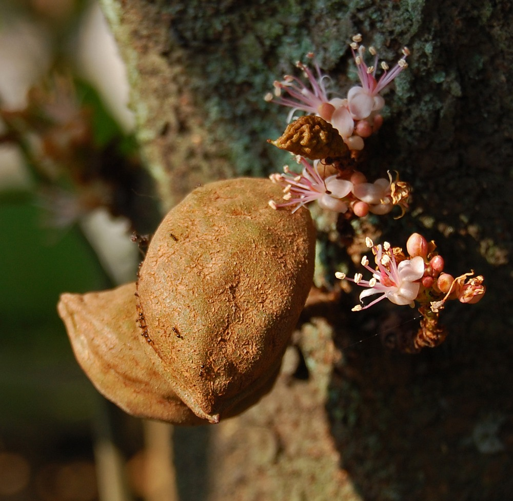

# Namu-Namu

## General Information
**Generic name:** Nam-Nam
**Sri Lankan name:** Namnam (Sinhala)
**Other names:** Katak Puru, Puki Anjing, Namu-Namu
**Scientific name:** Cynometra cauliflora
**Plant family:** Fabaceae
**Edible parts:** Fruit, Young leaves
**Other uses:** Ornamental, Medicinal
**Companion plants:**
Companion plant information is limited.

## Description:
Cynometra cauliflora is a small, cauliflorous tree growing 3-15 meters tall, with a thick, heavily branched stem. Each leaf has a pair of ovate to ovate-oblong leaflets about 5.5-16.5 cm long and 1.6-5.6 cm wide, with a smooth surface. Small pinkish-white flowers, about 1.2 cm across, are borne on the trunk (cauliflorous), with 4-5 small racemes clustered together on hard knots.

The fruits are brownish-green kidney-shaped fleshy pods, 3-9 cm long, containing 1 brown flattened seed. The pod does not split open readily, but a line is visible along the fruit and divides it into two. The texture of the skin is coriaceous and uneven. The pod is edible, with aromatic and juicy yellow pulp.

In Sri Lanka, it is primarily known as Namnam and is found in home gardens and some commercial plantations, particularly in the wet and intermediate zones.  The tree is wind-resistant. Yields data from South-East Asia shows low productivity, so it's often grown more for curiosity and variety than output. As a legume, it likely has a symbiotic relationship with soil bacteria, fixing nitrogen in the soil.

## Planting requirements
**Planting season:** October to November (during the north-east monsoon)

### Planting conditions:
| **Propagation** | Direct seeding or through budding |
|-----------------|-----------------------------------|
| Planting method | Well-draining soil is ideal. |
| Soil | Prefers a pH in the range 5-6, tolerating 4.5-6.5. Avoid waterlogging, especially during monsoon seasons. Ensure proper drainage. |
| Water | Moderate water requirements. Annual rainfall of 1,500-2,000mm preferred, tolerates 1,200-2,500mm. |
| Sunlight | Full sun preferred, but tolerates some shade. |

### Growing conditions:
| Temperatures | Prefers annual daytime temperatures within the range 22-35°C, but can tolerate 17-40°C. Adaptable plant that can grow in most Sri Lankan climates, but may require protection from extreme heat in dry zones. |
|--------------|-----------------------------------------------------------------------------------------------------------------------------------------------------------------------------------|
| Elevation | Grows well at elevations up to 400 meters |
| Soil | Well-draining soil is ideal |
| Water | Regular watering during dry periods, especially in dry and intermediate zones. |
| Pruning | Prune in late winter to early spring to encourage bushier growth. |
| Weed control | Mulch around the base of the plant to suppress weeds and retain moisture. |

## Harvesting:
Seedling trees begin to flower after about 6 years. Pods mature about 2 months after flowering. Fruits are ready to harvest when they turn yellow-brown.

## Curing:
The fruits can be eaten fresh or dried for later use.

## Storage
Store fresh fruits in a cool, dry place for up to a week. For longer storage, dry the pods and keep them in an airtight container in a cool, dry place for up to 6 months.

## Uses
**Culinary:** Young fruit can be eaten raw or cooked. Mature fruit can be eaten fresh, cooked with sugar to make sweets, made into fruit salad, pickled, or used to prepare 'sambal'.

**Medicinal:** Oil extracted from the seeds is applied to treat leprosy and skin diseases.

**Ornamental:** Commonly grown in pots as a bonsai specimen.

## Protecting your plants
### Pest control
**Pest type:** Mealybugs

**Symptoms:** White, cottony masses on stems and leaves, stunted growth.

**Control method:** Use neem oil or introduce natural predators like ladybugs. Prune affected parts if infestation is severe.

### Disease Control
**Disease type:** Root rot

**Symptoms:** Yellowing leaves, wilting, stunted growth, and eventual plant death.

**Management:** Ensure well-draining soil, avoid overwatering, and improve soil aeration. Remove affected plants to prevent spread.

## Difficulty Rating
### Low country wet zone (Difficulty: 5/10)
**Explanation:** Nam-Nam thrives in the wet zone due to high rainfall and humidity. However, care must be taken to prevent fungal diseases.

**Challenges/Adaptations:**
- Implement proper drainage systems to prevent waterlogging during heavy monsoon rains.

### Low country dry zone (Difficulty: 6/10)
**Explanation:** Nam-Nam can tolerate dry conditions but may require additional irrigation during prolonged dry spells.

**Challenges/Adaptations:**
- Use mulching to retain soil moisture and reduce water evaporation.

### Mid country (Difficulty: 5/10)
**Explanation:** The mid-country climate is generally suitable for Nam-Nam, offering a balance of rainfall and temperature.

**Challenges/Adaptations:**
- Protect plants from strong winds, especially during the south-west monsoon season.

### Up country (Difficulty: 7/10)
**Explanation:** Nam-Nam may struggle with colder temperatures in higher elevations but can be grown with proper care.

**Challenges/Adaptations:**
- Plant in sheltered locations to protect from cold winds and frost.
- Consider using polytunnels or greenhouses for cultivation in very high elevations.

## Sources:
- https://doa-gov-lk.translate.goog/fruit-crops-namnam-s/
- https://www.nparks.gov.sg/florafaunaweb/flora/2/8/2833
- Samling, B. A., Assim, Z., Tong, W. Y., Leong, C. R., Ab Rashid, S., Kamal, N. N. S. N. M., ... & Tan, W. N. (2021). Cynometra cauliflora L.: An indigenous tropical fruit tree in Malaysia bearing essential oils and their biological activities. Arabian Journal of Chemistry, 14(9), 103302.
- https://tropical.theferns.info/viewtropical.php?id=Cynometra+cauliflora
