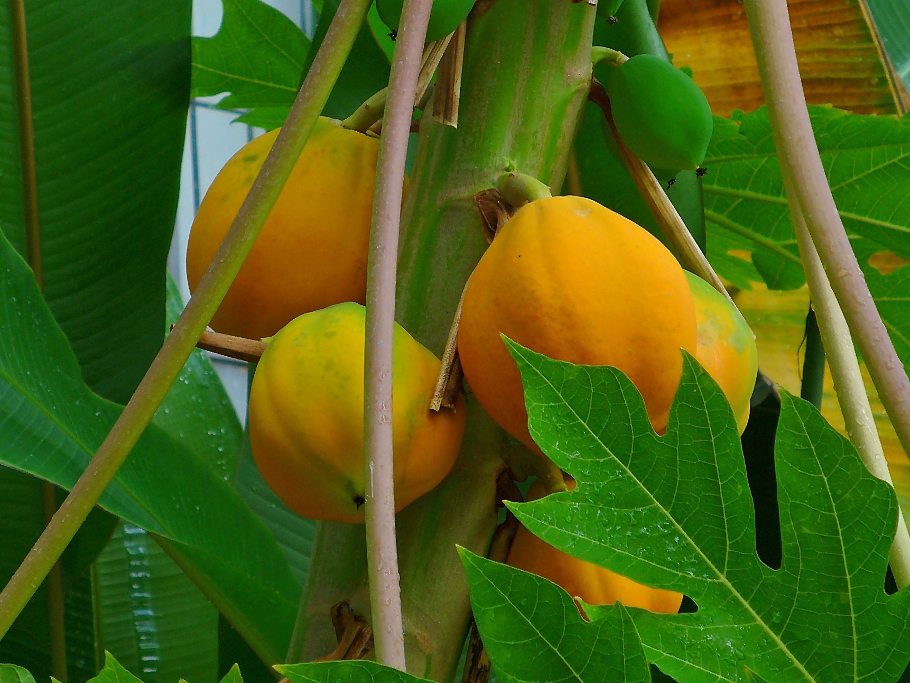

# Papaya

**Generic name:** Papaya, papaw, paw paw
**Sri Lankan name:** Papol (Sinhala), Pappāḷi (Tamil)
**Scientific name:** Carica papaya
**Plant family:** Caricaceae
**Edible parts:** Fruit
**Nutrition value:** High in vitamins A and C, folate, pantothenic acid, and magnesium. It also contains fiber, potassium, and small amounts of other vitamins and minerals.
## Companion Plants for Papaya

- Marigolds: They act as natural guardians against underground nematodes, protecting papaya trees from these harmful pests.
- Basil: It serves as a pest deterrent, creating a protective barrier around papaya trees by repelling unwanted insects.
- Nasturtiums: These flowers act as a sacrificial trap crop, luring pests away from papaya trees while adding color to the garden.
- Comfrey: It enriches the soil with nutrients, supporting papaya trees' growth in a symbiotic relationship.
- Chives: They offer a pest-repellent fragrance that keeps aphids and other insects at a distance from papaya trees.
- Legumes: As nitrogen-fixers, legumes enrich the soil with essential nutrients, promoting healthier growth and improved fruit production in papaya trees.

## Non-Companion Plants for Papaya

- Potatoes: They compete with papaya for nutrients and attract similar pests, including green peach aphids that can spread diseases like the Papaya ringspot virus.
- Fennel: It's allelopathic, releasing chemicals into the soil that can inhibit papaya's growth, and competes aggressively for root space and nutrients.

## Description:
Papaya is a tropical fruit known for its sweet, juicy flesh and vibrant color. The fruit has a soft, butter-like consistency when ripe, with a central cavity filled with black, edible seeds. In Sri Lanka, papaya is widely cultivated in home gardens and commercial plantations, particularly in the low country wet and dry zones.

The taste of papaya is often described as a blend of mango and cantaloupe, with a subtle musky undertone. Ripe papayas have a rich, sweet flavor, while unripe green papayas have a milder, slightly bitter taste. The fruit's flavor can vary depending on the variety and growing conditions.

Several papaya varieties are cultivated in Sri Lanka, each with its own characteristics:

1. **Ratna:** The first papaya variety recommended by the Department of Agriculture. It produces medium-sized fruits (800g-1500g) with an attractive appearance and good taste. However, it's susceptible to Papaya ringspot virus.

2. **Horana Papaya Hybrid-1:** Known for its red flesh and excellent taste, with a sugar content (Brix) of about 12.5. The average fruit weight is 1.2-2 kg. This variety is fairly resistant to ringspot virus and yields well in dry and intermediate zones.

3. **Red Lady:** A high-quality imported hybrid that produces 60-80 fruits per tree annually. The fruits weigh 1.5-2.0 kg and have red flesh with a sugar content (Brix) of 12. It's resistant to ringspot virus disease, making it a popular choice for commercial cultivation.

Papayas can be consumed in various ways:
1. Fresh: Eaten raw as a dessert or in fruit salads
2. Green papaya: Used in salads or cooked as a vegetable in curries
3. Juice: Blended into refreshing drinks or smoothies

In Sri Lanka, papaya is not only valued for its taste but also for its nutritional benefits and versatility in local cuisine. It's a common sight in markets and is often served as a breakfast fruit or used in various dishes throughout the day. The availability of different varieties allows growers to choose types that best suit their local climate conditions and intended use, whether for home consumption or commercial production.

*Image - Tim McCormack, WIkimedia Commons*

## Planting requirements
**Planting season:** Year-round in Sri Lanka, with best results when planted at the onset of rainy seasons (Yala and Maha). Papaya can survive long periods of neglect and will send deep roots in, so removing it will be quite difficult once the plant takes root. 

### Planting conditions:
| **Propagation** | Plant the seeds in a pot for germination and when the seedlings are 1 foot tall, plant them on the ground |
|----|----|
| Planting method | Requires well drained soil that is rich in organic matter. Prefer a soil pH of 5.5 to 6.5 |
| Soil | Requires regular watering in the growing season. Keep the soil moist |
| Water | Requires full sunshine |

### Growing conditions:

| **Temperatures** | Thrives in Sri Lanka's tropical climate with temperatures between 25°C and 35°C |
|----|----|
| Soil | Add compost or manure into the soil |
| Water | Regular watering is crucial, especially during dry spells. In wet zones, ensure proper drainage to prevent waterlogging |
| Pruning | Propagation from seeds |

## Harvesting:
Ripe papaya turns either yellow or an amber to orange hue depending on the type. Pick them when they are ripe. In Sri Lanka, papayas can be harvested year-round, with peak seasons typically occurring 6-9 months after planting.

## Curing:
Papayas do not require curing after harvesting.

## Storage
Store ripe papayas at room temperature for up to 5 days, or in the refrigerator for up to a week. Unripe papayas can be stored at room temperature until ripe. In Sri Lanka's warm climate, refrigeration is recommended for extending shelf life.

## Water Management
- Maintain proper soil moisture, especially during dry spells.
- In wet zones, ensure proper drainage to prevent waterlogging.
- Consider drip irrigation for efficient water use, especially in dry zones.
- Water requirement varies from 4-20 liters per plant per day, depending on growth stage.

## Fertilizer Application
- Apply organic fertilizer (dung or well-digested compost) at 10 kg per pit 2 weeks before planting.
- Apply 500g of dolomite per trench 2 weeks before planting when soil pH is below 5 in wet zone.
- Apply chemical fertilizers every 2 months, adjusting based on plant growth and soil conditions.
- Consider fertigation (fertilizer application through irrigation system) for more efficient nutrient uptake.

## Protecting your plants
### Pest control
**Pest type:** Fruit flies, mealybugs, spider mites, and whiteflies

**Symptoms:** Leaf discoloration, wilting, and spots on fruits.

**Control method:** Use neem oil or pyrethrum-based organic insecticides. Implement fruit bagging techniques to protect against fruit flies. Maintain good air circulation to prevent pest buildup.

### Disease Control
**Disease type:** Papaya ringspot virus, anthracnose, and phytophthora root rot

**Symptoms:** Yellowing and mottling of leaves, stunted growth, and deformed fruits for papaya ringspot virus. Brown or black spots on fruits and leaves for anthracnose. Wilting and root decay for phytophthora root rot.

**Management:** Use disease-resistant varieties, practice crop rotation, maintain proper drainage, and apply copper-based fungicides when necessary. For viral diseases, control insect vectors and remove infected plants promptly.

## Post-Harvest Handling
- Harvest fruits when 15-25% yellow for best quality and shelf life.
- Use proper packaging methods to prevent damage during transportation.
- Store at 12°C to extend shelf life up to 20-25 days.

## Difficulty Rating
### Low country wet zone (Difficulty: 4/10)
**Explanation:** While papaya can face challenges in the wet zone due to high humidity and rainfall, which increase the risk of fungal diseases, its adaptability and the popularity of consumption in this region make it a moderately easy crop to grow. With proper disease management and drainage, successful cultivation is achievable.

**Challenges/Adaptations:**
- Provide good air circulation around plants.
- Monitor for and manage diseases promptly.
- Implement raised beds or mounds to improve drainage.
- Choose disease-resistant varieties like Horana Papaya Hybrid-1.

### Low country dry zone (Difficulty: 3/10)
**Explanation:** Papaya thrives in the dry zone with adequate watering. The lower humidity reduces the risk of fungal diseases, and the fruit's popularity in local cuisine makes it a rewarding crop to grow. The main challenge is ensuring consistent water supply.

**Challenges/Adaptations:**
- Implement efficient irrigation systems, such as drip irrigation.
- Protect plants from strong winds.
- Use mulching to conserve soil moisture.
- Consider planting drought-resistant varieties.

### Mid country (Difficulty: 4/10)
**Explanation:** The mid country offers a balance between the wet and dry zones, making papaya cultivation moderately easy. The varying temperatures and rainfall patterns can be managed with proper care, and the fruit's versatility in local dishes adds to its value.

**Challenges/Adaptations:**
- Provide windbreaks in exposed areas.
- Ensure consistent moisture through proper irrigation.
- Choose suitable microclimates within the region.
- Utilize the fruit in both ripe and green stages for various culinary purposes.

### Up country (Difficulty: 5/10)
**Explanation:** While more challenging due to cooler temperatures and shorter growing seasons, papaya cultivation in the up country is still feasible with extra care. The unique flavor of papayas grown in cooler climates can be a selling point for local markets.

**Challenges/Adaptations:**
- Provide protection from frost and cold winds.
- Ensure adequate sunlight, possibly through greenhouse cultivation.
- Monitor for and manage diseases promptly.
- Focus on varieties that are more tolerant of cooler temperatures.
- Explore value-added products like papaya jam or dried papaya to maximize returns.

##  Sources:
- https://doa-gov-lk.translate.goog/fruit-crops-papaw-s/
- https://www.hort.purdue.edu/newcrop/CropFactSheets/factsheets/papaya.html
- https://edis.ifas.ufl.edu/publication/MG054
- https://www.tropicalpermaculture.com/growing-papaya.html
- https://greg.app/papaya-companion-plants/

