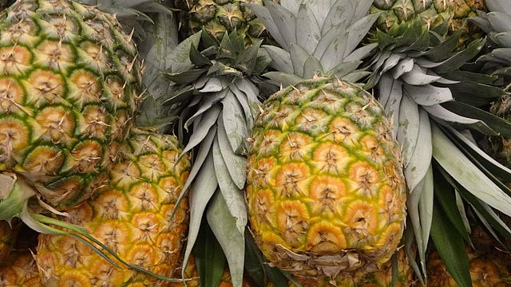

# Pineapple

## General Information
**Generic name:** Pineapple
**Sri Lankan name:** Annasi
**Scientific name:** Ananas comosus
**Plant family:** Bromeliaceae
**Edible parts:** Pericarp and thalamus
**Nutrition value:** High in vitamins A, C, and manganese. One cup of pineapple provides 131% DV vitamin C.

**Companion plants:**
- Marigolds: Their vibrant blooms deter nematodes and aphids, providing natural pest control.
- Basil: Its strong scent wards off pests, promoting a healthier pineapple crop.
- Nasturtiums: Their peppery scent attracts beneficial insects while repelling common pests.
- Mint: Its aromatic leaves are known to deter a variety of insects.
- Garlic: Its strong scent is a natural pest deterrent, protecting nearby pineapple plants.
- Oregano: Its pest-repellent properties help keep the pineapple patch free of unwanted visitors.
- Beans: They improve the soil by fixing nitrogen during the first year of pineapple growth.
- Groundnuts: Like beans, they enhance soil quality through nitrogen fixation.
- Bananas: They provide some shade, which can improve pineapple fruit quality.
- Coconut: Traditionally grown with pineapples, providing partial shade and creating a microclimate.
- Papaya: Can be intercropped with pineapples, offering some shade and diversifying the garden.
- Clover: Acts as a living mulch, helping to suppress weeds and improve soil health.
- Chives: Repel certain pests and can improve the flavor of nearby fruits.
- Lemongrass: Its strong scent can help deter pests from the pineapple patch.

**Non-companion plants:**
- Cassava: Competes for nutrients and may hinder pineapple growth.
- Sweet potato: Can be invasive and compete with pineapples for resources.
- Walnut trees: Produce chemicals that can inhibit pineapple growth.
- Eucalyptus: Their aggressive root systems and allelopathic properties can harm pineapples.
- Brassicas (e.g., broccoli, cabbage, kale): Release compounds that can stifle pineapple growth.
- Trees and large shrubs: Can overshadow and outcompete pineapples for sunlight and nutrients.
- Invasive species: Plants like Mexican petunia can spread quickly and take over, leaving little room for pineapples.

## Description:
Pineapple plants can be easily grown by planting the pineapple tops in soil. The pineapple top grows into a bushy plant. If you get growing conditions right, the pineapple plant flowers and a pineapple fruit eventually appears. Pineapples can grow in pots indoors, or if you live in warmer climates it can grow outdoors in your garden.

In Sri Lanka, pineapples are commonly grown in the low country wet and intermediate zones, particularly in areas like Gampaha, Kurunegala, and Ratnapura districts. The fruit is known for its sweet-tart flavor, juicy texture, and tropical aroma. Sri Lankan pineapples are often described as having a perfect balance of sweetness and acidity, with a rich, golden flesh that's both refreshing and satisfying.

Pineapples are widely used:
1. Fresh consumption: Eaten as a refreshing snack or dessert, especially during hot weather.
2. Culinary uses: Used in fruit salads, curries (particularly with seafood), and as a meat tenderizer.
3. Beverages: Pineapple juice is popular, often mixed with other tropical fruits or used in cocktails.
4. Traditional medicine: Used in Ayurvedic and traditional remedies for digestive issues and inflammation.
5. Preserves: Made into jams, chutneys, and candied fruit.
6. Tourism industry: Featured in tropical fruit platters for tourists and used to make welcome drinks in hotels.
7. Export: High-quality Sri Lankan pineapples are exported, contributing to the country's agricultural economy.

## Planting requirements
**Planting season:** Can be planted year-round in Sri Lanka, but best during the onset of rainy seasons (April-May or September-October)

### Planting conditions:
| **Propagation** | Propagated from suckers |
|----|----|
| Planting method | Prepare 20 cm width and 20 cm deep trenches. Put the suckers in the trenches and add the soil to cover 10 - 15 cm of sucker base |
| Soil | Needs well drained Sandy Loams soil with pH 5 -6 for cultivation |
| Water | Requires moderate water but not overwatering |
| Light | Requires at least 6 hours of sunshine |

### Growing conditions:

| **Temperatures** | Thrives in Sri Lanka's tropical climate, with optimal temperatures between 23-32°C |
|----|----|
| Soil | Make sure your soil is thickly mulched to reduce evaporation. The plant requires lots of nutrition. Mix compost in with your soil before you plant the pineapple, and then mulch thickly around it. |
| Water | Always water from top down. They are tolerant of being under-watered rather than over-watered |
| Pruning | Prune suckers that grow around the main plant to encourage fruit production.
| Weed control | Keep the area around the plant weed-free to prevent competition for nutrients and water.

## Harvesting:
Well matured fruits with 25% colour change from the fruit base are suitable for harvesting. Fruits should be harvested with 10-15 cm of stem.

## Curing:
After harvest, cure pineapples at room temperature for a few days to develop their full flavor.

## Storage
Store ripe pineapples in the refrigerator for up to five days. Unripe pineapples can be stored at room temperature until ripe.

## Protecting your plants
### Pest control
**Pest type:** Mealy bugs, pineapple mites, nematodes

**Symptoms:** Mealybugs appear as small, cottony masses on leaves and stems. Mites cause bronzing of leaves, while nematodes lead to stunted growth and yellowing.

**Control method:** Select healthy suckers, pre treatment prior to planting, weed control, spray insecticides with neem oil or insecticidal soap. Use approved pesticides as per local agricultural department recommendations.

### Disease Control
**Disease type:** Top rot, base rot, fruit collapse

**Symptoms:** Top rot causes the center leaves to wilt and rot. Base rot leads to plant collapse. Fruit collapse results in soft, watery fruit.

**Management:** Avoid overwatering, maintain good air circulation, use disease-resistant varieties, and treat with fungicides if necessary. Practice crop rotation and use clean planting material.

## Difficulty Rating
### Low country wet zone (Difficulty: 4/10)
**Explanation:** Pineapples grow well in this zone, with abundant rainfall and suitable temperatures.
**Challenges/Adaptations:**
- Root rot can be a problem during extremely wet periods. Ensure good drainage and avoid overwatering.
- Use raised beds or mounds to improve drainage during heavy rains.
- The humid climate is ideal for pineapple growth, reducing the need for frequent watering.

### Low country dry zone (Difficulty: 5/10)
**Explanation:** Pineapples can tolerate some drought once established, but may require additional care in dry periods.
**Challenges/Adaptations:**
- Water stress can cause fruit to be small and less sweet. Provide adequate water, especially during fruiting.
- Use mulch to conserve soil moisture and consider drip irrigation.
- The dry climate can help reduce disease incidence, making pest management easier.

### Mid country (Difficulty: 3/10)
**Explanation:** The moderate climate of the mid country is highly suitable for pineapple cultivation, offering an excellent balance of temperature and rainfall.
**Challenges/Adaptations:**
- Mild temperature fluctuations are generally beneficial for fruit development.
- Implement windbreaks to protect plants from occasional strong winds.
- The climate in this zone is ideal for producing high-quality, flavorful pineapples.

### Up country (Difficulty: 7/10)
**Explanation:** The cooler temperatures and shorter days of the up country can make pineapple cultivation more challenging, but not impossible.
**Challenges/Adaptations:**
- Pineapples may take longer to ripen in cooler conditions. Provide additional warmth, such as row covers or greenhouse protection.
- Choose sheltered locations and consider using plastic mulch to increase soil temperature.
- Focus on growing pineapples for local consumption, as the cooler climate may produce less sweet but more aromatic fruits.

## Sources:
- https://doa.gov.lk/fruit-crops-pineapple-e/
- https://www.tropicalpermaculture.com/growing-pineapples.html
- https://edis.ifas.ufl.edu/publication/MG055
- https://www.accessagriculture.org/intercropping-pineapples
