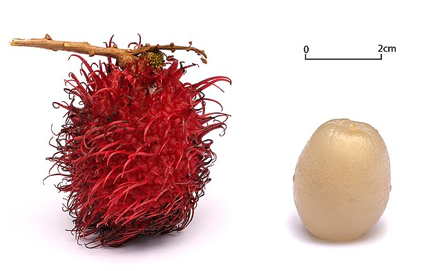

# Rambutan

## General Information
**Generic name:** Rambutan
**Sri Lankan name:** Rambutan (Sinhala) | Rambutan (Tamil)
**Scientific name:** _Nephelium lappaceum_
**Plant family:** _Sapindaceae_
**Edible parts:** Fruit
**Nutrition value:** Contains vitamins B6, A, B, and C and minerals Potassium, Manganese, Zinc, and Iron
  
**Companion plants:**
Not applicable

**Non-companion plants:** 
Not applicable

## Description:
A tree of the soapberry family (Sapindaceae), Rambutan grows best in tropical climates and yields edible fruit. It attracts bees and other pollinators and its fruit has a pleasant aroma. The bright-red, oval fruit is covered with long, soft spines and has a tasty acidic pulp. The tree grows to about 9 - 15 metres (30 - 50 feet) in height. 

Recommended varieties for cultivation in Sri Lanka: Malwana Special, Malayan Red, and Malayan Yellow.
Other varieties available in Sri Lanka that are not recommended: Java Special, Java Labukabola, Java Simadjan, Java Seedless, Java Sinjanjan

## Planting requirements
**Planting season:** May to August

### Planting conditions:
| Propagation | Grafting/Transplanting. It is not possible to reach a firm conclusion about the quality of the fruits of the plants produced by planting seedlings. Therefore, planting seedlings is not recommended. |
|----|----|
| Planting method | Carefully remove the polythene cover so as not to damage the roots and plant the soil in the center of the hole without spilling. Plant a support near the plant and place the plant on it and tie it carefully. It is necessary to provide shade during the initial period of planting in the field. Mark the spacing between plants as 10 x 10 or 10 x 8 meters and dig pits of 60 x 60 x 60 cm (length, width, height). |
| Soil |  Fill the holes with the recommended mixture of fertilizers and compost. pH of 5.5 to 6.5 is perfect and they won't do well in soil that is too acidic or alkaline |
| Water | Provide water evenly during the dry season till the first 2-3 years from transplanting in the field |
| Light | When planting transplants in the permanent ground, shading is very important to prevent the scorching of young plants from strong sunlight. Coconut branches can be used to build shades for the young plants |

### Growing conditions:
| Temperatures | Ambient temperature 27 – 30C |
|----|----|
| Soil | Well-drained loamy soil is ideal for cultivation. Apart from this, the soil depth of 2-3 meters also affects the success of cultivation |
| Water | Rainfall between 1500 – 2000mm is required, which is common in Sri Lanka's wet and intermediate zones. Areas with relative humidity of 75% – 80% are favorable for rambutan cultivation, typical of many parts of Sri Lanka |
| Pruning | Proper pruning and maintenance of a plant is essential for a successful harvest. When the plant is young, the shoots should be removed from time to time to maintain good branching in all directions |
| Weed control | Applying organic mulch around the base of rambutan trees helps suppress weed growth, retain soil moisture, and improve soil health |

## Harvesting:
In Sri Lanka, the first harvest from a grafted rambutan tree can be seen in 3-4 years. It takes 7-8 years to get a high economic yield. In the lowland and midland wet zones, harvesting typically takes place between June and August, and in the intermediate zone, it is from January to March. Harvesting may vary slightly due to weather changes.

A well-managed mature rambutan tree can yield about 200 kg (6000 fruits) per year.

The best time to harvest rambutan is when its characteristic color is seen in the fruits. Rambutan does not ripen further when it is plucked from the tree. Cluster harvesting is useful as it provides some pruning.

## Curing:
Rambutan does not require a curing stage

## Storage
Store at a temperature of 8 to 15°C (46 to 59°F) with 90 to 95% relative humidity for a storage life of 14 to 16 days. While the skin and spine color may change, the flesh remains unaffected. If stored at 20°C (68°F) with 60% relative humidity, the fruit will last only 3 to 5 days. Temperature recommendations can vary by cultivar.

## Protecting your plants
### Pest control
**Pest type:**
- Animals (squirrels, crows, monkeys, bats)
- Mealybugs (Piti Makuna)
- Nut borer
- Fruit fly
- Stem borer beetle
- Stem borer

**Symptoms:**
- **Animals:** Direct damage to fruits and trees
- **Mealybugs:** White flour-like substance on the fruit surface, black spots on the outer bark
- **Nut borer:** Damage to fruit's bark, pulp, and possibly seed
- **Fruit fly:** Semi-liquid state of rambutan pulp, larvae in fallen fruits
- **Stem borer beetle:** Tunnels in the stem of small rambutan plants
- **Stem borer:** Red-brown bollworm eating stem tissue of young plants

**Control method:**
- **Animals:** Use tricks like shaking sticks, bursting firecrackers, and lighting trees at night
- **Mealybugs:** Keep plantation clean, apply grease around the trunk, renew grease layer weekly
- **Nut borer:** Cover rambutan bunches with perforated paper or polythene sheets, remove fallen husks and nuts
- **Fruit fly:** Destroy fallen fruits, agitate soil around trees, hang fly traps

### Disease Control
**Disease type:**
- Powdery mildew

**Symptoms:**
White powdery patches on leaves, flowers, immature fruits, and buds. Infected parts turn black and dry out. Young leaves turn yellow and shrivel.

**Management:**
- Prune unnecessary branches for better sunlight and ventilation
- Remove and destroy infected parts from the previous season
- Use recommended fertilizers
- Monitor for infection

## Difficulty Rating
### Low country wet zone (Difficulty: 2/10)
**Explanation:** The wet zone provides high rainfall (over 2000mm annually), high humidity, and consistent temperatures between 27-30°C, which is ideal for Rambutan cultivation. The soil in the wet zone is typically fertile and well-drained, matching the need for loamy soil. These factors ensure that water availability, temperature, and soil conditions are favorable.
**Challenges/Adaptations:**
- Managing overwatering or waterlogging during the monsoon.
- Potential for disease spread due to excessive moisture.

### Low country dry zone (Difficulty: 6/10)
**Explanation:** The dry zone's low rainfall (under 1500mm annually) and arid conditions are less suitable for Rambutan, which requires consistent water availability and high humidity. Soil may be less fertile and lack the loamy structure needed for proper drainage. Temperatures can also fluctuate beyond the optimal range.
**Challenges/Adaptations:**
- Watering systems or irrigation will be essential during dry periods.
- Fertilizer and compost need to be added to improve soil quality.
- Shading to prevent heat stress on young plants.

### Mid country (Difficulty: 4/10)
**Explanation:** The mid-country's cooler climate and moderate rainfall are generally supportive of Rambutan cultivation. While rainfall may be slightly lower than in the wet zone, supplemental irrigation can make up the difference. The soil in this zone is often rich, making it easier to meet the pH and fertility needs of Rambutan.

**Challenges/Adaptations:**
- Managing occasional dry spells through irrigation.
- Monitoring temperature drops to avoid any plant stress.

### Up country (Difficulty: 8/10)
**Explanation:** The up-country has cooler temperatures, often below Rambutan’s preferred range of 27-30°C. Additionally, lower rainfall and humidity levels make it difficult for Rambutan to thrive. Soil conditions may also be more challenging due to increased acidity or poor drainage in some areas.

**Challenges/Adaptations:**
- Installing greenhouses or other controlled environments to manage temperature and humidity.
- Regular irrigation to compensate for lower rainfall.

## References for this entry
### Sources: