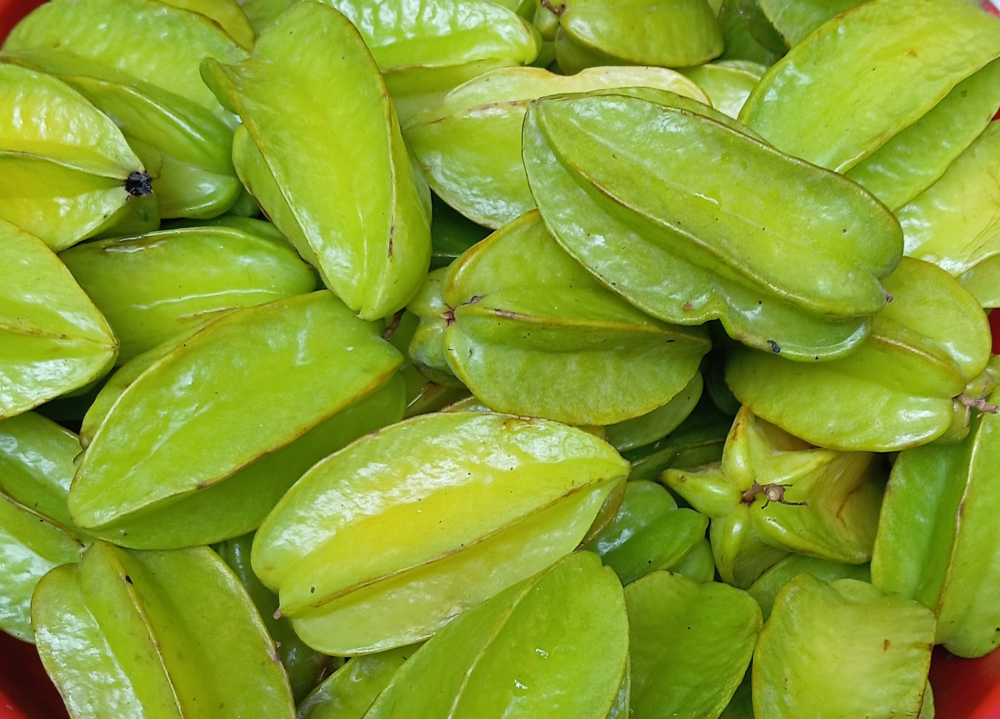

# Star Fruit

## General Information
**Generic name:** Star fruit, Carambola
**Sri Lankan name:** Kamaranga (Sinhala) | naṭcattira paḻam (Tamil)
**Scientific name:** _Averrhoa carambola_
**Plant family:** _Oxalidaceae_
**Edible parts:** Fruit
**Nutrition value:** Low in calories and rich in vitamins, including vitamin C and B, as well as minerals like copper, potassium, and magnesium. Also rich in fibre and protein

**Companion plants:**
Not applicable
  
**Non-companion plants:** 
Not applicable

## Description:
_Averrhoa carambola_, also known as star fruit, is a small tree or shrub that grows 5-12 meters tall. It produces rose to red-purple, bell-shaped flowers with five petals, blooming year-round in tropical climates. The tree is grown in tropical and subtropical regions for its edible, star-shaped fruits.

## Planting requirements
**Planting season:** Year-round

### Planting conditions:
| Propagation | Seedlings, cuttings, or grafts. Grafted trees from a superior mother plant are recommended for better quality and higher yields |
|----|----|
| Planting method | Select healthy seedlings about ¼ inch thick. Plant at original depth, backfilling carefully. For grafting, use veneer or chip budding during active growth. Choose mature twigs with leaves for graftwood, or remove leaves days prior to stimulate buds |
| Soil | Grows in a variety of soil but it is important to have well-drained soil that removes access moisture. Recommended to have a moderately acidic pH range of 5-6 |
| Water | Star fruit trees are sensitive to drought and need regular watering, especially when young, to support growth. Once they start bearing fruit (1-2 years after planting), they should be irrigated consistently from flowering to harvest |
| Light | Requires full sunshine |

### Growing conditions:
| Temperatures | The temperature must be 20° C to 35° C for fruit production |
|----|----|
| Soil | Dig 60 cm cubic pits. Fill 2/3 with topsoil-compost mix. After 2 weeks, fill the remainder with the same mixture and plant. Provide support for proper establishment |
| Water | A soaker hose around the tree can be used to do a slow, deep watering, but base your placement on a ring that's at about the midpoint of the tree's canopy all the way around |
| Pruning | Focus on removing weak or crowded branches, along with any dead or diseased wood, to create an open canopy structure that enhances airflow and light exposure |
| Weed control | Regularly remove weeds by hand |

## Harvesting:
Harvest when the grooves in the sides of the fruit are completely yellow, and only the very upper tips of the raised sections are still green.

## Curing: 
Unripe fruits can be cured at room temperature for a few days to ripen further after harvesting.

## Storage: 
Store ripe fruits in the refrigerator for up to 2 weeks. Unripe fruits can be stored at room temperature until ripe.

## Protecting your plants
### Pest control
**Pest type:**
- Scale insects (plumose scale - *Morganella longispina*, philephedra scale - *Philephedra tuberculosa*)
- Diaprepes weevil (*Diaprepes abbreviatus*)
- Stink bugs (*Nezara* sp.)
- Squash bugs (*Acanthocephala* sp.)
- Fruit blotch miner (Lepidoptera: Gracillaridae)
- Brown scales (*Coccus hesperidum*)
- Red-banded thrips (*Selenothrips rubrocinctus*)
- Weevil (*Myctides imberbis*)

**Symptoms:**
- **Scale insects:** Attack leaves and twigs, causing defoliation and stem dieback.
- **Diaprepes weevil:** Damages roots, leading to root and shoot dieback.
- **Stink bugs and squash bugs:** Cause pinhole-sized markings on the fruit surface and dry areas of the flesh under the puncture wounds.
- **Fruit blotch miner:** Causes superficial damage to the waxy cuticle, identifiable by meandering brownish colored trails on the fruit surface.
- **Birds, opossums, and raccoons:** May attack fruit, especially early in the season, leaving V-shaped marks on the ribs of the fruit.

**Control method:**
- Spray insecticides, neem oil, and horticulture oil.

### Disease Control
**Disease type:**
- Leaf spot diseases (caused by *Cercospora averrhoa*, *Corynespora cassiicola*, *Phomopsis* sp., *Gloesporium* sp. and *Phyllosticta* sp.)
- Red alga (*Cephaleuros virescens*)
- Fruit-rotting fungus (*Colletotrichum gloeosporioides*)
- Sooty mold or sooty blotch (*Gloeodes pomigena*)
- Root rot (*Pythium splendens*)

**Symptoms:**
- **Leaf spot diseases:** Reddish colored spots on leaves, more common on stressed or nutritionally deficient trees.
- **Red alga:** Rough, circular, greenish-grey or rusty-red areas on twigs and limbs, and shoot dieback.
- **Fruit-rotting fungus:** Causes anthracnose on ripe, injured fruit.
- **Sooty mold or sooty blotch:** Superficial blackish discoloration on fruit surfaces.
- **Root rot:** Causes general tree decline syndrome, including loss of tree vigor, leaf drop, twig, shoot, and root dieback, and reduced fruit size and production.

**Management:**
- For leaf spot diseases, no control is necessary as they typically occur on older leaves that normally drop during winter and early spring.
- For red alga, contact your local agricultural agent for current control methods.
- Generally, no control is warranted for fruit diseases like anthracnose and sooty mold.
- For root rot and general tree decline, regular pruning to improve air circulation can help prevent fungal diseases.

## Difficulty Rating
### Low country wet zone (Difficulty: 4/10)
**Explanation:** Requires consistent irrigation and well-drained soil. The high humidity and rainfall in this zone are ideal for the growth of star fruit.

**Challenges/Adaptations:**
- Soil pH should be maintained within a specific range (5-7).
- Regular monitoring for pests and diseases is necessary due to the humid climate.
- Use raised beds or mounds to improve drainage in heavy clay soils common in this zone.

### Low country dry zone (Difficulty: 5/10)
**Explanation:** Water availability may be more challenging. The dry season can last up to eight months in this zone.

**Challenges/Adaptations:**
- Star fruit is not that drought resistant.
- Soil pH should be maintained within a specific range (5-7).
- Additional irrigation may be required during the dry season.
- Regular monitoring for pests and diseases is necessary due to the dry climate.
- Mulching around the base of the tree can help retain soil moisture during dry periods.

### Mid country (Difficulty: 6/10)
**Explanation:** Similar to the wet zone, but temperatures may vary more significantly. This zone experiences both hot and cold seasons.

**Challenges/Adaptations:**
- Soil pH should be maintained within a specific range (5-7).
- Temperature fluctuations may affect fruit production
- Regular monitoring for pests and diseases is necessary due to varying weather conditions.
- Consider using windbreaks to protect trees from strong winds common in this zone.

### Up country (Difficulty: 7/10)
**Explanation:** This zone experiences both hot and cold seasons with significant temperature fluctuations.

**Challenges/Adaptations:**
- Temperature fluctuations may affect fruit production; protection from frost may be necessary during the cold season.
- Water availability may be limited, requiring additional irrigation.
- Regular monitoring for pests and diseases is necessary due to varying weather conditions.

## Sources:
- https://www.epicgardening.com/star-fruit-tree/
- https://edis.ifas.ufl.edu/publication/MG269
- https://www.greendreamsfl.com/single-post/growing-starfruit-trees-how-to-grow-carambola
- https://doa.gov.lk/fruit-crops-star-fruit-s/