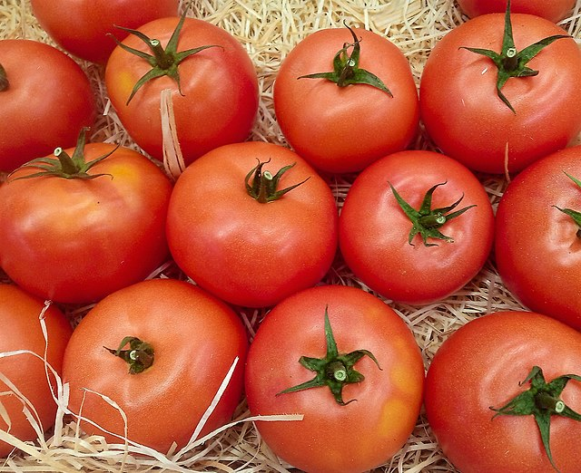

# Tomatoes

## General Information
**Generic name:** Tomato, Garden Tomato
**Sri Lankan name:** Thakkali (Sinhala)| Thakkali (Tamil)
**Scientific name:** _Solanum lycopersicum_
**Plant family:** Nightshade family (_Solanaceae_)
**Edible parts:** Berry
**Nutrition value:** Rich source of vitamin A and C along with various minerals and B vitamins. Contains antioxidants like lycopene.

**Companion Plants:**
- Basil
- Marigolds
- Carrots
- Chives
- Garlic
- Parsley
- Nasturtiums
- Sweet Alyssum
- Cilantro
- Sunflowers

**Non-Companion Plants:**
- Potatoes
- Cabbage and other brassicas
- Corn
- Eggplant
- Peppers

## Description:
Tomatoes are not only important flavor enhancers in various dishes but also a rich source of vitamins and minerals. Studies have shown that consuming tomatoes can protect against certain cancers and that organic tomatoes contain higher levels of beneficial antioxidants like lycopene.

In Sri Lanka, tomatoes are an essential ingredient in many local dishes, adding a vibrant flavor and color to curries, salads, and chutneys. The taste of tomatoes can range from sweet to tangy, depending on the variety. They are commonly used in dishes like curries, consumed raw in salads and sandwiches, and used to make fresh juices and sauces.

Sri Lanka has developed several tomato varieties suited to its climate and resistant to common diseases. Some notable varieties include:

1. Maheshi-F1 (2005): High-yielding hybrid (58 t/ha), thick pericarp, resistant to bacterial wilt, slightly flat fruit shape.
2. Lanka Sour (Goraka Takkali) (2005): More sour taste, resistant to bacterial wilt, yield potential of 29 t/ha.
3. Bathiya (F1) (2008): Indeterminate growth, resistant to bacterial wilt and curly top virus, high yield (61 t/ha).
4. Lanka Cherry (2008): Indeterminate growth, small pear-shaped fruits, suitable for salads and processing.
5. HORDI tomato hybrid 03 (2019): Attractive red color, thick pericarp, long shelf life, high yield (55-60 t/ha).
6. Thilina: Semi-indeterminate, heart-shaped fruit, thick pericarp, moderately resistant to bacterial wilt.
7. KWR: Bush type, resistant to bacterial wilt, suitable for areas with bacterial wilt problems.
8. T245: Bush type, tolerant to bacterial wilt, nematodes, and leaf curl virus.
9. Ravi: Bush type, heart-shaped fruits, resistant to flower drop in high temperatures.
10. Tharindu: Bush type, dark red round fruits, suitable for sauce production.
11. Rajitha: Bush type, resistant to bacterial wilt and leaf curl virus.
12. Rashmi: Bushy growth, moderately resistant to bacterial wilt and leaf blight.
13. KC 1: Bush type, suitable for dry zones with higher temperatures.

## Planting requirements
**Planting season:** October to December and April to May

#### Planting conditions:
| Propagation | Seeds |
|----|----|
| Planting method | Grow in seed trays, plant out in 4-6 weeks. Sow seed at a depth approximately three times the diameter of the seed. Ensure seeds are planted at least 1/2 inch deep. In Sri Lanka, direct seeding is also common in some areas |
| Soil | Requires rich soil with pH between 6.5 to 7. Harrow the soil and break it finely. Mix organic matter/compost prior to planting. Good drainage is essential. In Sri Lanka, well-draining loamy soils are ideal. Add coconut husk or rice hull ash to improve drainage in heavy soils |
| Water | Don't water too much; keep the soil slightly on the dry side—just dry-to-moist. In Sri Lanka's climate, water seeds daily but lightly until germination, especially during dry spells |
| Light | Need plenty of sunshine (at least 6 hours of direct sunlight) but do not like humidity. In Sri Lanka, provide partial shade during the hottest part of the day, especially in lowland areas |

#### Growing conditions:

| Temperatures | Requires soil temperature of 70°F (21°C) for germination. Tomatoes grow well in Sri Lanka's tropical climate. In cooler upcountry areas, use plastic mulch to warm the soil |
|----|----|
| Soil | Recommended to add 5 to 7cm of mulch throughout the plants to ensure soil remains moist. Organic material such as shredded bark and chopped leaves will make the soil better as they crumble. In Sri Lanka, use locally available mulch materials like paddy straw or coconut fronds. This helps conserve moisture during dry spells |
| Water | Water plants daily or at least every other day to maintain sufficient soil moisture. In Sri Lanka's hot climate, water deeply 2-3 times a week. Use drip irrigation if possible to conserve water |
| Pruning | Remove lower leaves and suckers to improve air circulation, which is crucial in Sri Lanka's humid climate to prevent fungal diseases |
| Weed control | Keep surrounding area around the plant free from weed. Manual weeding is common in Sri Lanka. Apply organic mulch to suppress weed growth |

## Harvesting:
In Sri Lanka, tomatoes are typically ready for harvest 60-80 days after transplanting, depending on the variety and climate conditions.

## Curing:
Curing is not necessary for ripe tomatoes. For green tomatoes harvested before monsoon rains, store in a cool, dry place to ripen gradually.

## Storage
In Sri Lanka's hot climate, store ripe tomatoes in a cool, shaded area. Use within 3-5 days for best quality. Avoid refrigeration as it affects flavor.

## Protecting your plants

### Pest control

**Pest type:**
- Aphids
- Thrips (*Thysanoptera*)
- Spider Mites
- Tomato Fruit Worms
- Whiteflies

**Symptoms:**
- **Aphids:** Distorted growth, leaf curling, and yellowing; can transmit viruses like Potato Virus Y (PVY)
- **Thrips:** Stippling and discoloration on leaves; fruit may develop "ghost rings" due to feeding damage
- **Spider Mites:** Fine webbing on leaves, yellowing, and leaf drop
- **Tomato Fruit Worms:** Tunneling into fruits, leading to decay and secondary infections
- **Whiteflies:** Yellowing leaves and stunted growth; can transmit viral diseases

**Control method:**
- **Aphids:** Use insecticidal soaps or natural predators like ladybugs; maintain plant health through proper nutrition and watering practices
- **Thrips:** Crop rotation and maintaining good air circulation; use sticky traps and insecticidal soaps as needed
- **Spider Mites:** Increase humidity around plants; introduce predatory mites or use miticides if infestations are severe
- **Tomato Fruit Worms:** Hand-picking larvae, using pheromone traps, or applying Bacillus thuringiensis (Bt) for control
- **Whiteflies:** Use yellow sticky traps to monitor populations; insecticidal soap can help manage infestations

### Disease Control

**Disease type:**
- Bacterial Speck
- Powdery Mildew
- Fusarium Wilt
- Tomato Yellow Leaf Curl Virus (TYLCV)
- Phytophthora Blight

**Symptoms:**
- **Bacterial Speck:** Small dark spots with yellow halos on leaves; stunted growth in seedlings
- **Powdery Mildew:** White powdery growth on leaves; leaves may turn yellow and drop off
- **Fusarium Wilt:** Yellowing of lower leaves, wilting, and eventual plant death
- **Tomato Yellow Leaf Curl Virus (TYLCV):** Malformed leaves that are smaller than usual, with yellowing between veins
- **Phytophthora Blight:** Dark brown lesions on stems and fruit; can lead to sudden plant collapse

**Management:**
- **Bacterial Speck:** Crop rotation, removal of infected plants, and using resistant varieties
- **Powdery Mildew:** Ensure adequate air circulation, avoid overhead watering, and apply fungicides when necessary
- **Fusarium Wilt:** Use resistant tomato varieties; practice crop rotation and maintain healthy soil conditions
- **Tomato Yellow Leaf Curl Virus (TYLCV):** Control whitefly populations that spread the virus; use resistant tomato varieties when available
- **Phytophthora Blight:** Avoid waterlogging by improving drainage; use resistant varieties and apply fungicides preventively during wet conditions

## Difficulty Rating
### Low country wet zone (Difficulty: 6/10)
**Explanation:** While the wet zone presents challenges due to high humidity and frequent rains, the availability of disease-resistant varieties like Bathiya (F1) and Rajitha, combined with effective companion planting, makes tomato cultivation more manageable.

**Challenges/Adaptations:**
• Use varieties resistant to bacterial wilt and leaf curl virus, such as Bathiya (F1) or Rajitha
• Implement raised beds or container gardening to improve drainage
• Apply copper-based fungicides as recommended by local agricultural extension services
• Use trellising to improve air circulation, especially for indeterminate varieties
• Utilize companion plants like marigolds and basil to repel pests and improve plant health
• Implement intercropping with plants like carrots to improve soil structure

### Low country dry zone (Difficulty: 5/10)
**Explanation:** The dry zone's water scarcity is counterbalanced by the availability of varieties like KC 1, which is suitable for higher temperatures. Companion planting can significantly improve water retention and pest management.

**Challenges/Adaptations:**
• Choose drought-tolerant varieties like KC 1 or Ravi
• Implement water-efficient irrigation methods like drip irrigation
• Use mulching extensively to conserve soil moisture
• Consider shade netting during the hottest parts of the day
• Utilize companion plants like sweet alyssum and nasturtiums to attract beneficial insects
• Implement intercropping with plants like garlic to deter pests naturally

### Mid country (Difficulty: 3/10)
**Explanation:** The moderate climate of the mid country, combined with a wide range of suitable varieties and effective companion planting strategies, makes this zone ideal for tomato cultivation.

**Challenges/Adaptations:**
• Select varieties based on specific local conditions (e.g., Thilina for areas with moderate bacterial wilt pressure)
• Implement integrated pest management practices
• Use trellising for indeterminate varieties like Bathiya (F1) to maximize space and yield
• Utilize companion plants like chives and cilantro to repel pests and attract beneficial insects
• Implement crop rotation with non-solanaceous crops to prevent soil-borne diseases

### Up country (Difficulty: 5/10)
**Explanation:** While cooler temperatures can slow growth, the availability of bush-type varieties and techniques to warm the soil make cultivation in this zone quite feasible. Companion planting can help mitigate temperature-related challenges.

**Challenges/Adaptations:**
• Choose bush-type varieties like T245 or KWR, which may be more suitable for cooler climates
• Use plastic mulch to warm the soil and conserve moisture
• Implement greenhouse or polytunnel cultivation for extended growing seasons
• Be vigilant about fungal diseases due to potential humidity; choose resistant varieties when possible
• Utilize companion plants like sunflowers to provide windbreaks and attract pollinators
• Implement intercropping with carrots to improve soil structure and utilize space efficiently

## References for this entry
### Sources:
- https://doa.gov.lk/hordi-crop-tomato/
- https://doa.gov.lk/hordi-variety1-tomato/
- https://www.gardeningknowhow.com/edible/vegetables/tomato/tropic-tomato-care.htm
- https://www.allthatgrows.in/blogs/posts/how-to-grow-tomatoes-at-home-in-india
- https://www.thespruce.com/companion-plants-for-tomatoes-1403289
