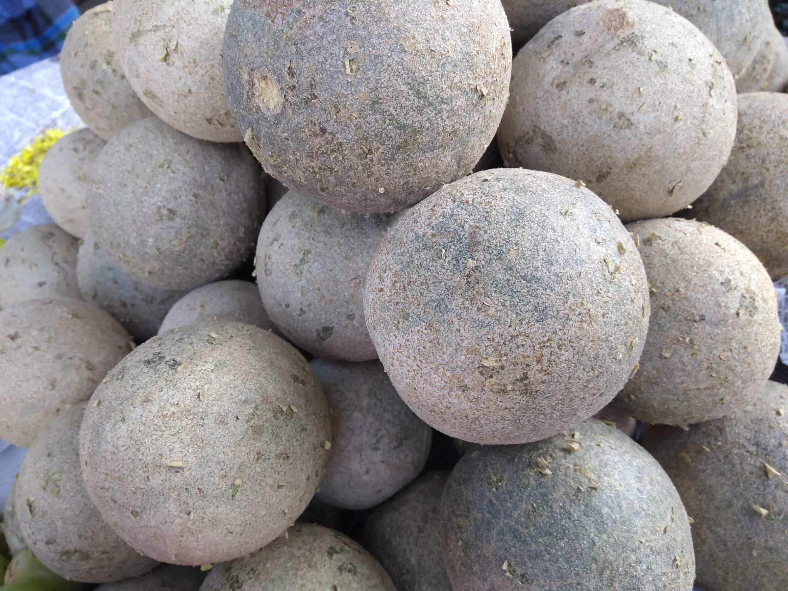

# Woodapple

## General Information
**Generic name:** Wood apple, Elephant apple
**Sri Lankan name:** Divul (Sinhala)
**Scientific name:** Limonia acidissima (Syn: Feronia limonia)
**Plant family:** Rutaceae
**Edible parts:** Brownish pulp inside the fruit
**Nutrition value:** Rich in vitamins and minerals, antioxidant properties
**Companion plants:** Coconut (Cocos nucifera), which provides partial shade and helps maintain soil moisture
**Non-companion plants:** Cinnamon (Cinnamomum verum), as it may compete for nutrients in the soil

## Description:
Wood apple is a fruit indigenous to Sri Lanka. Wood apple trees grow up to around 15 - 20 metres and live for around 50 – 70 years, and are extremely well adapted to Sri Lankan environments. Woodapple trees are commonly found in home gardens, especially in the dry and intermediate zones. Wood apple pulp is a rich source of carbohydrates, proteins, and minerals, particularly calcium, phosphorus, and iron, as well as vitamins including carotene, riboflavin, and vitamin C. The fruit has a unique sour-sweet taste and aromatic pulp, which is consumed fresh with sugar, made into jellies, jams, chutneys, and sherbets, or blended with milk and sugar syrup to create beverages and ice cream.

Two main forms exist: one with large, sweet-tasting fruits and another with small, acid fruits. In Sri Lanka, improved varieties include:
1. ANK WOOD APPLE 01 (ACC53): Average fruit weight of 463g, dark white outer covering, pulp thickness of 4.06 mm.
2. ANK WOOD APPLE (ACC63): Average fruit weight of 565g, dull white outer covering, thinner pulp (3.25 mm).

## Planting requirements
**Planting season:** Best planted at the onset of the monsoon season, typically May-June or October-November

### Planting conditions:
| **Propagation** | Wood apple seeds are planted in the beds. The seedling plants appear in 5- 10 days. In four to six weeks it is transferred to pots consisting of compost, sand and top soil. Vegetative propagation methods like budding and grafting are also successful. |
|----|----|
| Planting method | Requires a soil pH of 5.8 to 6.5. Can thrive in a wide range of soil. A light sandy loamy soil that drains well is ideal. |
| Soil | Well-draining soil with added organic matter. In Sri Lanka, red-yellow podzolic soils or reddish-brown earths are suitable. |
| Water | Daily irrigation should be carried out during the early stages. Young plants require more irrigation than the older plants. |

### Growing conditions:

| **Temperatures** | It can grow in climates that vary in temperature from 48°C and -6°C in the winter |
|----|----|
| Soil | Can mix manure when preparing the soil and remove weeds from the land |
| Water | In Sri Lanka's dry zone, regular watering is crucial, especially during prolonged dry spells. In wet zones, ensure proper drainage to prevent waterlogging. |
| Propagation | Propagated mainly by seeds or vegetative propagation. There are several methods of vegetative propagation such as grafting and budding. |

## Harvesting:
Mature green fruit can be harvested typically from July to September in Sri Lanka

## Curing:
Wood apples should be cured at room temperature for about a week to allow the pulp to soften

## Storage
Store wood apples in a cool, dry place for up to two weeks. In Sri Lanka's humid climate, storing in a well-ventilated area is crucial to prevent mold growth.

## Protecting your plants
### Pest control
**Pest type:** Wood apple being a hardy crop, there is no serious insect or pest diseases
**Symptoms:** However, watch out for scale insects, mealybugs, and Deudorix isocrates that may appear occasionally
**Control method:** Use neem oil or traditional Sri Lankan pest control methods like spraying with a mixture of tobacco and soap water. For Deudorix isocrates, inspect and destroy fallen fruit to control the pest's life cycle.

### Disease Control
**Disease type:** Fruit rot is a common issue in Sri Lanka's humid climate
**Symptoms:** Soft, discolored patches on the fruit, often with a foul odor
**Management:** Improve air circulation around the tree, avoid overhead irrigation, and remove affected fruits promptly

## Difficulty Rating
### Low country wet zone (Difficulty: 3/10)
**Explanation:** Woodapple trees are relatively easy to grow in the low country wet zone with proper care. The warm temperatures and high rainfall provide suitable conditions for woodapple growth.

**Challenges/Adaptations:**
- Ensure good drainage to prevent root rot
- Monitor for fungal diseases due to high humidity

### Low country dry zone (Difficulty: 3/10)
**Explanation:** Woodapple trees are well-suited to the low country dry zone, as they are drought-tolerant once established. The hot temperatures and lower rainfall are similar to their native habitat.

**Challenges/Adaptations:**
- Provide shade during extreme heat and ensure consistent moisture through irrigation
- Use mulching to conserve soil moisture

### Mid country (Difficulty: 3/10)
**Explanation:** Woodapple trees grow well in the mid country with moderate temperatures and rainfall. The conditions are generally suitable for woodapple growth, but some care is required to prevent pests and diseases.

**Challenges/Adaptations:**
- Monitor for pests and diseases, especially during humid conditions
- Ensure proper sunlight exposure in areas with more cloud cover

### Up country (Difficulty: 5/10)
**Explanation:** Woodapple trees may require additional care in the upcountry due to cooler temperatures and lower humidity. The higher altitude can make it more challenging to maintain optimal growing conditions.

**Challenges/Adaptations:**
- Provide protection from strong winds, ensure consistent moisture through irrigation, and maintain optimal soil temperature
- Consider planting on south-facing slopes to maximize sunlight exposure

## Sources:
- https://doa-gov-lk.translate.goog/fruit-crops-wood-apple-s/
- http://eagri.org/eagri50/HORT181/lec21.pdf
- https://tropical.theferns.info/viewtropical.php?id=Limonia+acidissima
- http://www.b4fn.org/resources/species-database/detail/limonia-acidissima/
