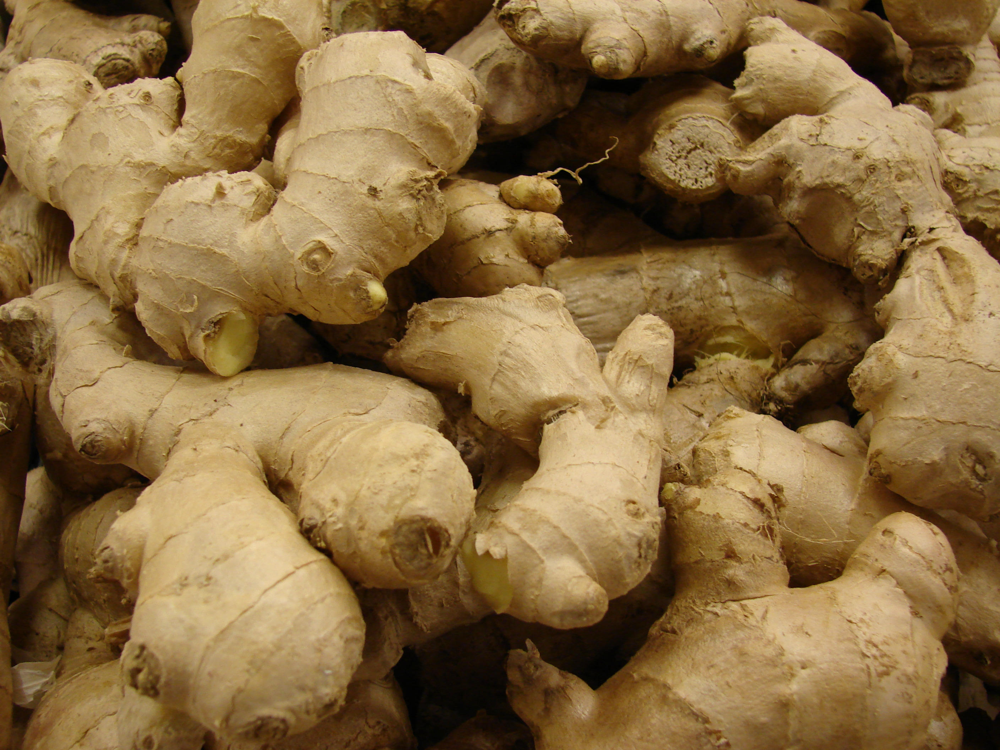

# Ginger

## General Information
**Generic name:** Ginger
**Sri Lankan name:** Inguru
**Scientific name:** Zingiber officinale
**Plant family:** Zingiberaceae
**Edible parts:** Rhizome (underground root)
**Nutrition value:** High in antioxidants, ginger contains potassium, magnesium, and manganese. It also has anti-inflammatory properties.
**Companion plants:**
- <update>Gotukola</update>
- Kaffir lime
- Chili peppers
- Cilantro
- <update>Curry leaves</update>
- Lemongrass
- Spinach
- <update>Mukunuwenna</update>
- Turmeric
**Non-companion plants:**
- <update>Mango</update>
- Walnut
- Eggplant
- Tomatoes

## Description:
Ginger is a plant known by the Latin name Zingiber officinale. It is a perennial herb which is generally grown for its swollen underground stems, or rhizome that has a thickness of between 1.5 and 2.5cm. The plant grows to around 30-100cm in height, and in optimal conditions can grow to form clumps of around 1.5m x 1.5m. Ginger belongs to the same plant family as turmeric, cardamom, and galangal.

## Planting requirements
- Mostly found in dry zone, wet zone
**Planting season:** <update>Maha season (October to January)</update>

### Planting conditions:
| **Propagation** | Rhizome (the part of the ginger we commonly call the root) |
|----|----|
| Planting method | Each section (cut ginger pieces) should be planted around 6 inches apart |
| Soil | Requires a humus rich nutrient soil. Prior to planting, mulching with a layer of compost or any other organic material will retain moisture and slowly break down into the soil, increasing nutrient levels. <update>Adding coconut coir can improve soil structure.</update> |
| Water | Requires a moist soil but not waterlogged |
| Light | Requires partial sunlight. 3 - 5 hours of sunlight would be ideal |

### Growing conditions:

| **Temperatures** | <update>Thrives in temperatures between 25°C and 30°C, common in Sri Lankan lowlands</update> |
|----|----|
| Soil | Prefers well-draining soil with plenty of organic matter. Hence, better to prepare the soil with compost as it provides the necessary nutrients while supporting the moisture retention |
| Water | Provide light watering to encourage root development. Watering is required simply to moist the soil. Once roots begin to develop and the leaves sprout, you can increase the watering. <update>During dry spells, increase watering frequency.</update> |

## Harvesting:
Can be harvested within 25 weeks after the plant dies. <update>In Sri Lanka, harvesting typically occurs 8-10 months after planting.</update>

## Curing:
<update>After harvesting, ginger should be cured by spreading it out in a well-ventilated area for about two weeks. In Sri Lanka, ginger is often sun-dried on mats or concrete floors.</update>

## Storage
<update>Ginger can be stored in a cool, dry place for up to six months. It can also be frozen or pickled for longer storage. In Sri Lankan households, freshly harvested ginger is often stored in clay pots with sand to maintain freshness.</update>

## Protecting your plants
### Pest control
**Pest type:** Root-knot nematodes, Shoot borer, Rhizome scale <update>Mealy bugs</update>

**Symptoms:** Root-knot nematodes cause gall-like swellings on roots. Shoot borers create holes in the stems and leaves, while <update>mealy bugs appear as white, cotton-like masses on the plant.</update>

**Control method:** Provide ginger with plenty of water and enough nutrients to allow them to fight pests on their own. <update>Use neem oil sprays for organic pest control, common in Sri Lankan agriculture.</update>

### Disease Control
**Disease type:** Bacterial wilt<update>Rhizome rot</update>

**Symptoms:** <update>Bacterial wilt causes the plant to suddenly wilt and die. Rhizome rot causes softening and decay of the rhizomes.</update>

**Management:** Provide ginger with plenty of water and enough nutrients to allow them to fight pests on their own.

## Difficulty Rating
### Low country wet zone (Difficulty: 5/10)
**Explanation:** Ginger grows well in humid conditions but requires careful management to prevent diseases.
**Challenges/Adaptations:**
- Keep the soil moist but not waterlogged.
- Provide partial shade.
- <update>Use raised beds to improve drainage during heavy monsoon rains.</update>

### Low country dry zone (Difficulty: 7/10)
**Explanation:** Ginger can tolerate some drought but requires consistent moisture for optimal growth.
**Challenges/Adaptations:**
- Ensure consistent irrigation during dry periods.
- Apply mulch to retain soil moisture.
- <update>Consider intercropping with taller plants like coconut to provide shade.</update>

### Mid country (Difficulty: 6/10)
**Explanation:** Ginger grows well in the mid-country climate with its moderate temperatures and rainfall.
**Challenges/Adaptations:**
- Maintain even watering throughout the growing season.
- Provide some shade during peak heat hours.
- <update>Implement terracing techniques on sloped land to prevent soil erosion.</update>

### Up country (Difficulty: 7/10)
**Explanation:** The cooler temperatures and higher altitudes of the upcountry can slow ginger growth.
**Challenges/Adaptations:**
- Ensure soil temperatures remain between 68°F and 86°F. Use black plastic mulch or row covers to warm the soil if necessary.
- Provide additional protection from strong winds using windbreaks or stakes.
- <update>Consider greenhouse cultivation for better temperature control in cooler regions like Nuwara Eliya.</update>

## References for this entry
### Content Sources:
https://www.ars.usda.gov/eastern-region-plant-introduction-research-and-development/plant-germplasm-quarantine/ginger
<update>https://www.doa.gov.lk/HORDI/index.php/en/crop-2/ginger</update>

### Image Sources: (In order of appearance)
https://commons.wikimedia.org/wiki/File:Ginger_roots.jpg