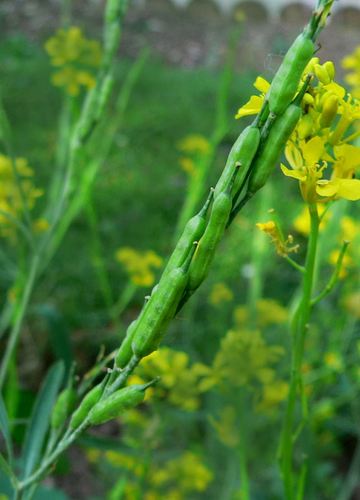

# Mustard

## General Information
**Generic name:** Mustard
**Sri Lankan name:** Aba (Sinhala) | Kaduku (Tamil)
**Scientific name:** Brassica nigra
**Plant family:** Brassicaceae
**Edible parts:** Seeds and leaves
**Nutrition value:** Rich in minerals, vitamins, and antioxidants. Mustard is high in calcium, iron, magnesium, phosphorus, potassium, zinc, vitamin C, riboflavin, niacin, folate, thiamine, and pantothenic acid.
**Companion plants:**
- Yarrow: Attracts pollinators and repels pests, benefiting mustard plants.
- Dill: Attracts beneficial insects and enhances overall garden biodiversity.
- Mint: Repels pests and attracts beneficial insects, promoting a healthier garden ecosystem.
- Celery: Improves soil structure and enhances water retention, supporting mustard growth.
- Chamomile: Attracts pollinators and beneficial insects, enhancing biodiversity around mustard plants.
- Corn: Provides shade and reduces weed growth, creating a favorable microclimate for mustard.
- Garlic: Deters pests with its strong aroma and acts as a natural fungicide against soil-borne diseases.
- Onion: Repels pests with its strong scent and improves soil structure with its fibrous roots.

**Non-companion plants:**
- Beans: Compete for nutrients and may inhibit mustard growth.
- Strawberry: May compete for resources and potentially alter soil conditions unfavorably for mustard.
- Eggplant: Can compete for nutrients and potentially attract pests that may harm mustard plants.
- Tomato: May compete for resources and potentially host diseases that could affect mustard.

## Description:
Mustard seeds, either whole or grounded, are used in culinary preparations. Young mustard shoots cut two or three weeks after sowing form the mustard ingredient of the traditional British salad, mustard and cress. Mustard plants have glossy, dark green leaves and small white flowers.

## Planting requirements
**Planting season:** April - May (Yala season), October - November (Maha season)

### Planting conditions:
| **Propagation** | Seeds |
|----|----|
| Planting method | Sow the seeds thinly in rows of two feet (60 cm) apart. For better germination, soak seeds overnight before planting. |
| Soil | Requires a well fertile, well-drained, lightly textured sandy loam soil with a pH no less than 6. Good soil fertility is essential for obtaining good yield. Add compost or cattle manure during soil preparation, ensuring the soil has adequate organic matter. |
| Water | Soil requires enough water for seeds to germinate. Supply water at 5-7 days interval during first 4 weeks of planting and then water at least 10-14 days interval until seeds mature. Keep the soil consistently moist but not waterlogged. |
| Light | Full sunshine to partial shade. If the climate is too hot, may need shade covers to protect the plant. Mustard plants require at least 6 hours of sunlight daily. |

### Growing conditions:

| **Temperatures** | Soil temperatures between 50°F and 95°F |
|----|----|
| Soil | Organic fertilizers are very important. Apply well decomposed compost (1%N) at the rate of 2.3 t/ha or cattle manure at the rate of 1.5 t/ha at land preparation. Apply another round 3 weeks after planting. Organic mulches help maintain moisture, suppress weeds, and boost soil fertility. |
| Water | Adjust watering frequency based on rainfall and weather conditions. Water deeply once a week, ensuring the top inch of soil is dry between waterings. |
| Pruning | Prune plants if they become leggy or to encourage bushier growth. |
| Weed control | Remove weeds and maintain a clean field. Weed management is easier when row seeding is practiced. |

## Harvesting:
Pod harvesting is done manually several times since pod maturity is staggered. Pull the plants out of the ground before the pods are fully ripened, when they are a yellow-brown color. Harvest leaves when they are young and tender, about 6-8 weeks after planting. Harvest seeds once they turn yellow and the pods begin to dry.

## Curing:
After harvesting, spread the plants in a well-ventilated area to dry for about two weeks. This helps to reduce moisture content and prevents mold growth.

## Storage:
Store dried mustard seeds in an airtight container in a cool, dark place. They can last up to 5 years if stored properly. For leaves, store them in the refrigerator for up to one week.

## Protecting your plants
### Pest control
**Pest type:** Diamond back moth, Sucking bugs-Bagrada spp

**Symptoms:** Diamondback moth larvae feed on leaves, creating small holes. Bagrada bugs cause wilting and yellowing of leaves.

**Control method:** For diamond back moth: Weed management and maintain a clean field. For sucking bugs: Plant on time and maintain a clean field. Use insecticidal soap or neem oil to control pests if infestation is severe.

### Disease Control:
Mustard plants are susceptible to Alternaria blight, which causes dark spots on leaves that eventually turn brown. To prevent this, avoid overhead watering and maintain good air circulation around plants. If infected, remove affected leaves promptly.

## Difficulty Rating
### Low country wet zone (Difficulty: 7/10)
**Explanation:** Mustard is more challenging to grow in the wet zone due to its high susceptibility to diseases like Alternaria blight, which thrive in humid conditions. The frequent rainfall in this zone can also lead to waterlogging, which mustard doesn't tolerate well.

**Challenges/Adaptations:**
- Monitor plants closely for signs of disease, especially Alternaria blight.
- Provide adequate spacing between plants for better air circulation to reduce disease risk.
- Implement raised beds or ridges to improve drainage and prevent waterlogging.
- Use disease-resistant varieties when available.

### Low country dry zone (Difficulty: 5/10)
**Explanation:** Mustard is moderately easy to grow in the dry zone, as the drier conditions reduce disease pressure. However, careful water management is crucial, especially during dry spells.

**Challenges/Adaptations:**
- Implement a consistent watering schedule, following the recommended 5-7 day interval for the first 4 weeks, then 10-14 day interval until maturity.
- Use mulching to conserve soil moisture and reduce water evaporation.
- Choose drought-tolerant varieties if available.

### Mid country (Difficulty: 6/10)
**Explanation:** Mustard cultivation in the mid country faces moderate challenges due to fluctuating temperatures and occasional heat stress. The mix of wet and dry periods can also create disease pressure.

**Challenges/Adaptations:**
- Provide shade during the hottest parts of the day to prevent wilting and heat stress.
- Monitor and adjust watering based on rainfall patterns.
- Implement good air circulation practices to reduce disease risk.

### Up country (Difficulty: 8/10)
**Explanation:** Mustard is more difficult to grow in the up country due to cooler temperatures, potential frost risk, and higher humidity which can increase disease pressure.

**Challenges/Adaptations:**
- Protect plants from frost using row covers or other protective measures during cold periods.
- Choose cold-tolerant varieties if available.
- Plant during the warmest seasons to avoid the coldest periods.
- Implement raised beds to improve soil temperature and drainage.
- Monitor closely for disease due to higher humidity, and ensure good air circulation.

## Sources:
- https://doa.gov.lk/field-crops-mustard/
- https://plantpropagation.com/mustard/
- https://www.growveg.com/guides/how-to-grow-mustard
- https://www.almanac.com/plant/mustard
- Saharan, G. S., Naresh Mehta, N. M., & Sangwan, M. S. (2003). Nature and mechanism of resistance to Alternaria blight in rapeseed–mustard system.
