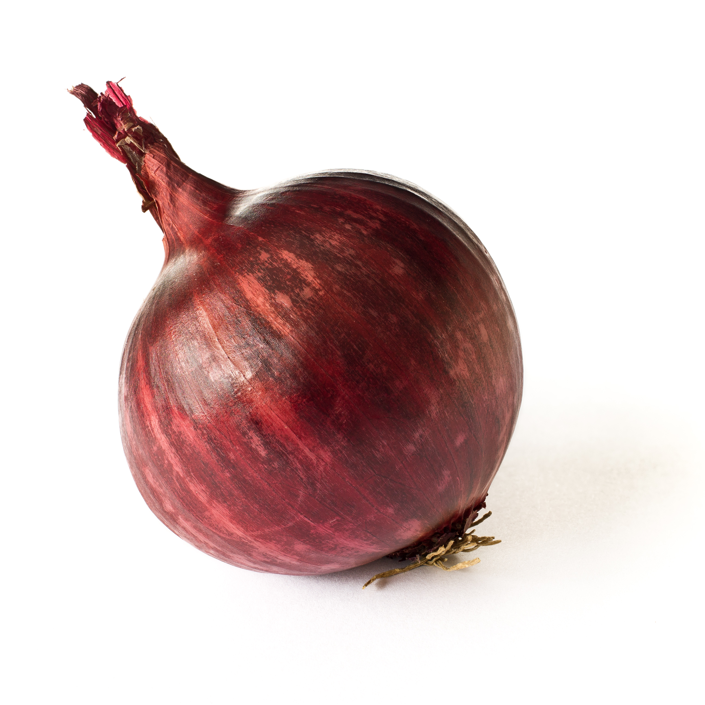

# Red Onion

## General Information
**Generic name:** Red Onion
**Sri Lankan name:** Rata lunu, Bombai lunu (Sinhala) | VeLLAi veLLai (Tamil)
**Scientific name:** _Allium cepa l._
**Plant family:** _Amaryllidaceae_
**Edible parts:** The bulb
**Nutrition value:** High in vitamins C and B6, potassium, manganese,and copper

**Companion plants:**
- Herbs
- Chamomile

**Non-companion plants:**
- Asparagus
- Legumes
- Sage
- Garlic
- Leeks
- Chives
- Shallots
- Turnips

## Description:
Onions are an essential ingredient in Sri Lankan cuisine and have been grown for centuries. It can be grown the year around in many different climatic conditions, though the right timing and the method depends largely on where we live. However, they prefer cool weather during the leaf-developing stage while much hot weather is needed during the bulb-producing stage. 

There are different varieties of onions;
- Jaffna local 
- Tinnaveli Red
- Vellarai
- Vedalam
- Telulla 

## Planting requirements
**Planting season:** In dry zone areas plant according to the following,
- From rainwater: September to November and March and April
- With additional water: December to mid-January and May to mid-June

### Planting conditions:
| Propagation | Onions can be propagated from seeds, transplants, and bulbs |
|----|----|
| Planting method | Onions are typically planted as either bulbs (known as "sets") or transplants. Grow seeds in seed trays, and plant out the seedlings in 4-6 weeks. Sow them at a depth approximately three times the diameter of the seed |
| Soil | Well-drained sandy loam and clay loam range soils are suitable. Gravel and water-dependent clay soils are not suitable. The crop is also sensitive to salinity so keep the salinity low |
| Water | Onions require consistent moisture, especially during bulb formation. In drier regions of Sri Lanka, regular irrigation is crucial |
| Light | Onions need full sun exposure |

### Growing conditions:
| Temperatures | Onions thrive in various climates, preferring cool weather for leaf development and hotter conditions for bulb formation |
|----|----|
| Soil | Maintain soil pH between 6.0 and 7.0. In more acidic soils common in some parts of Sri Lanka, add lime to adjust the pH |
| Water | In Sri Lanka's climate, water deeply once or twice a week, depending on rainfall. Drip irrigation is effective in conserving water and preventing leaf diseases |
| Pruning | Not Applicable |
| Weed control | Regular weeding is crucial, especially in the initial stages of growth |

## Harvesting:
Can be harvested within 60-90 days. When the tips of the leaves start turning yellow, bend over and break the necks of the onions. This starts the ripening process. Also, loosen the onions with a fork to start them drying without damaging the skin. Ease the onions out of the ground.

## Curing:
Leave the harvested onions a week or two in the sun to dry. It is important to dry the onions well.

## Storage
Store cured onions in a cool, dry place with good air circulation. In Sri Lanka's tropical climate, it's challenging to store onions for extended periods. Use mesh bags or open-weave baskets to ensure good airflow. Regularly check and remove any spoiling onions to prevent spread.

## Protecting your plants
### Pest control
**Pest type:** 
- Onion Fly (_Delia antique_)
- Thrips
- Eelworm

**Symptoms:**
- **Onion Fly**: Maggots eat into the bulbs of seedlings, stunting growth. Spring-sown onions are most affected, while onions grown from sets are less vulnerable.
- **Thrips**: Damage occurs under hot, dry conditions. Leaves turn white or silver, and the insects hide between newly emerged leaves.
- **Eelworm**: Microscopic worms cause the tops of onion plants to wilt.

**Control method:**
- **Onion Fly**: Dust onion rows with flowers of sulfur or soot, or sprinkle with a solution of 1 ounce of kerosene to 1 gallon of water. Dust regularly, especially after thinning.
- **Thrips**: Use organic pesticides, neem oil, or remove affected plants. Mulching with neem leaves can help reduce populations.
- **Eelworm**: Burn all affected plants. Avoid planting onions or allowing chickweed to grow in the same soil for six years.

### Disease Control
**Disease type:**
- Purple Blotch (_Alternaria porri_)
- Stemphylium Blight (_Stemphylium vesicarium_)
- Basal Rot (_Fusarium oxysporum f.sp. cepae_)
- Downy Mildew (_Perenospora destructor_)

**Symptoms:**
- **Purple Blotch:** Small, sunken, whitish flecks with purple-colored centers on leaves and flower stalks. Lesions may girdle leaves/stalk causing drooping.
- **Stemphylium Blight:** Small yellowish to orange flecks or streaks in the middle of the leaves, developing into elongated spindle-shaped spots surrounded by a pinkish margin.
- **Basal Rot:** Yellowing of leaves, stunted growth, roots become pink, and bulb starts decaying from lower ends.
- **Downy Mildew:** Violet growth of fungus on leaves or flower stalk, which later becomes pale greenish yellow. Leaves or seed stalks eventually collapse.

**Management:**
- **Purple Blotch:** Use healthy seeds, and practice crop rotation.
- **Stemphylium Blight:** Field sanitation, collect and burn crop residues.
- **Basal Rot:** Practice crop rotation, and soil solarization.
- **Downy Mildew:** Expose seed bulbs to the sun for 12 days.

## Difficulty Rating
### Low country wet zone (Difficulty: 6/10)
**Explanation:** High humidity and rainfall increase disease risk, making onion cultivation challenging in this zone.
**Challenges/Adaptations:**
- Use raised beds to improve drainage

### Low country dry zone (Difficulty: 4/10)
**Explanation:** Ideal conditions for onion growth, but irrigation is crucial
**Challenges/Adaptations:**
- Implement efficient irrigation systems like drip irrigation
- Use mulch to conserve soil moisture

### Mid country (Difficulty: 6/10)
**Explanation:** Moderate conditions, but may face challenges with sudden weather changes
**Challenges/Adaptations:**
- Use row covers to protect from unexpected rain or temperature fluctuations
- Choose varieties suited for mid-country conditions

### Up country (Difficulty: 7/10)
**Explanation:** Cooler temperatures can hinder onion growth
**Challenges/Adaptations:**
- Use plastic tunnels or greenhouses for protection
- Choose cold-tolerant varieties

## References for this entry
### Sources: