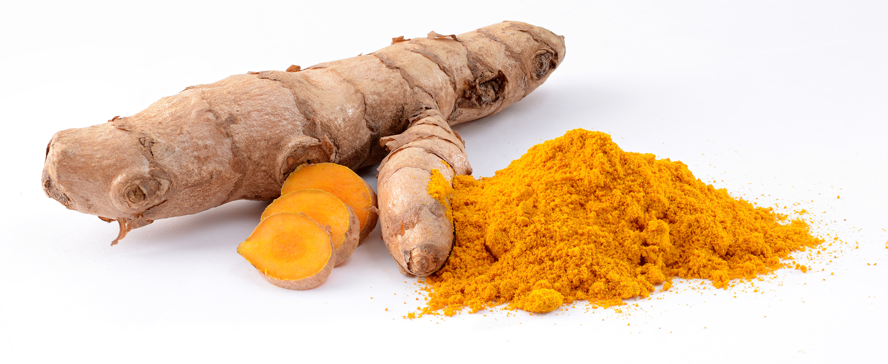

# Turmeric

## General Information
**Generic name:** Curcuma longa
**Sri Lankan name:** Kaha (Sinhala) | Manjal (Tamil)
**Scientific name:** Curcuma longa
**Plant family:** Zingiberaceae
**Edible parts:** Rhizomes
**Nutrition value:** High in iron, manganese, and potassium. Rich in antioxidants.
**Companion plants:**
- Beans: Turmeric's pest-repelling properties can benefit beans.
- Cilantro: Both plants enjoy similar growing conditions and can enhance each other's growth.
- Eggplant: Turmeric may help protect eggplants from pests.
- Fruit Trees: Turmeric can thrive in the partial shade provided by fruit trees.
- Ginger: As a close relative, ginger shares similar growing requirements with turmeric.
- Lemongrass: Both plants enjoy similar tropical conditions and can complement each other in the garden.
- Onions: Turmeric's pest-repelling properties can benefit onions.
- Peas: Turmeric may help protect peas from pests.
- Peppers: Turmeric can help repel pests that commonly affect pepper plants.
- Tomatoes: Turmeric is said to repel ants, which can protect tomato plants.
- Taller trees: These provide afternoon shade, replicating turmeric's native understory habitat in tropical forests.

**Non-companion plants:**
- Corn: Corn's high nutrient demands may compete with turmeric's needs.

## Description:
Turmeric has been used in Sri Lanka and South Asia for more than 5000 years. Initially, it was cultivated as a dye due to its vivid yellow color. Currently, it is widely used as a key ingredient in Sri Lankan cuisine, Ayurvedic medicine, and traditional ceremonies.

Turmeric has a warm, bitter taste with a mild fragrance reminiscent of orange and ginger. It's often used to flavor or color curry powders, mustards, butters, and cheeses. In Sri Lankan cuisine, it's a staple in many curry dishes, adding both flavor and a rich golden color.

The main chemical compound in turmeric is curcumin, which gives it its characteristic yellow color. Curcumin is known for its potential anti-inflammatory and antioxidant properties, making turmeric a popular subject in health research.

## Planting requirements
**Planting season:** March - April (Yala season), September - October (Maha season)

### Planting conditions:
| **Propagation** | Rhizomes |
|----|----|
| Planting method | Need to plant in raised beds or ridges. The field should be ploughed up to 35-40cm in depth and tilled to prepare the soil. Preferably the Beds should be 4ft in width and 10ft length. But can vary with the space available. Select plump rhizomes with several bumps and plant them 3-4 bumps each |
| Soil | Can be grown in many soil types. Preferably a soil pH of 5.5 – 6.5. A well-drained sandy clay loam soils rich with organic matter and sandy loam are the most suitable for growing turmeric. Red and lateritic soils common in Sri Lanka are also suitable. Poorly drained rocky or clay type soils are not suitable. |
| Water | Requires ample water though without waterlogging conditions |
| Light | Requires partial sunlight/medium shade |

### Growing conditions:

| **Temperatures** | Grows in temperature between 20 ºC – 35º C |
|----|----|
| Soil | In order to protect moisture and to keep the weeds under control, mulching is recommended immediately after planting. Paddy straw, coconut husks, coir dust, dry leaves or Gliricidia leaves are most suitable mulching materials. Gliricidia leaves can be added as an organic fertilizer and is also ideal for protecting the soil moisture |
| Water | Its important to keep the soil moist without making it excessively wet. Hence, using a slow drip hose or soaker hose can be useful for consistent watering. |
| Pruning | Prune damaged leaves regularly.
| Weed control | Hand-pull weeds regularly and apply organic mulch to suppress weed growth.

## Harvesting:
Harvesting is done after 8-10 months of planting. Hence, turmeric planted during Yala season (March - April) can be harvested by December - January, and Maha season (September - October) can be harvested by June - July. During that time, the plants become yellow in color and leaves start drying. Harvesting should be done without damaging the rhizomes and attached soil clusters should be removed with a wooden stick.

## Curing:
After harvesting, cure turmeric rhizomes by spreading them out in a shaded area for 2-3 weeks to reduce moisture content. Processing turmeric involves boiling the rhizomes for about 30-45 minutes, then drying them in the sun for 10-15 days. Once dried, they can be ground into the familiar yellow powder used in cooking and traditional medicine.

## Storage
Store cured turmeric rhizomes in a cool, dry place. They can be stored for up to one year.

## Protecting your plants
### Pest control
**Pest type:** Shoot borer, rhizome scale, leaf roller

**Symptoms:** Holes in stems, rolled leaves, sticky honeydew on leaves.

**Control method:** Destroy damage plant parts, use neem oil or other organic pesticides.

### Disease Control
**Disease type:** Rhizome rot, leaf blotch

**Symptoms:** Wilted plants with yellowing leaves for rhizome rot; water-soaked spots on leaves that enlarge and turn brown for leaf blotch.

**Management:** Avoid overhead irrigation, maintain good air circulation, remove infected plant parts, use disease-resistant varieties if available.

## Difficulty Rating
### Low country wet zone (Difficulty: 6/10)
**Explanation:** Turmeric grows well in the wet zone but requires consistent moisture without waterlogging.
**Challenges/Adaptations:**
- Watch out for fungal diseases; use organic fungicides if necessary.
- Ensure proper drainage to prevent waterlogging.

### Low country dry zone (Difficulty: 7/10)
**Explanation:** Turmeric can be grown in the dry zone with adequate irrigation.
**Challenges/Adaptations:**
- Ensure consistent watering to prevent excessive heat stress.
- Use drought-resistant varieties suitable for dry zone conditions.

### Mid country (Difficulty: 5/10)
**Explanation:** Turmeric grows well in the mid-country due to its varied temperature conditions and suitable soil types.
**Challenges/Adaptations:**
- Monitor for pests and diseases; apply organic pesticides and fungicides as needed.
- Implement soil conservation techniques to prevent erosion on sloped lands.

### Up country (Difficulty: 8/10)
**Explanation:** Turmeric can be grown in the upcountry but requires careful management of moisture levels and temperature.
**Challenges/Adaptations:**
- Ensure proper drainage to prevent waterlogging; use organic mulch to retain soil moisture.
- Use cold-tolerant varieties and provide protection during cold periods.

## Sources:
- https://dea.gov.lk/turmeric/
- https://gardeningsolutions.ifas.ufl.edu/plants/edibles/vegetables/turmeric/
- http://www.phytotheca.com/phytotheca/turmeric/
