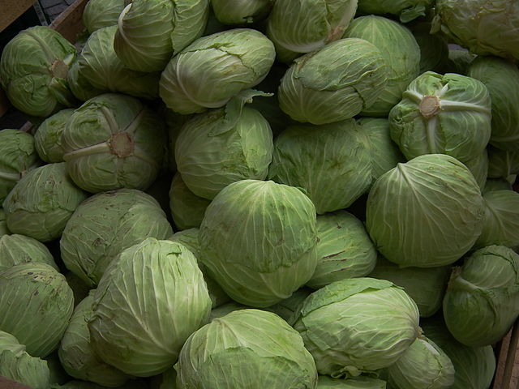

# Cabbage

## General Information
**Generic name:** Cabbage
**Sri Lankan name:** Gova
**Scientific name:** Brassica oleracea capitata
**Plant family:** Brassicaceae (formerly Cruciferae)
**Edible parts:** The vegetative bud
**Nutrition value:** Rich in vitamin A, vitamin C, Iron and Zinc. A 100g serving contains approximately 15 calories.

**Companion plants:**
- Lettuce
- Beets
- Spinash
- Garlic
- Onions
- Marigold
- Nasturtium
- Celery
- Aromatic herbs (sage, dill, Basil, thyme)

**Non-companion plants:**
- Corn
- Pumpkin
- Squash
- Tomatoes
  

## Description:
Cabbage belong to the Brassicaceae (formerly Cruciferae), which is one of the most important families, for it includes the genus Brassica, the cabbage tribe. This contains a great variety of plants, most of which are very good to eat. They come in different colours. The Green Coronet is the varity released in Sri Lanka.

## Planting requirements
- Grows in cooler climate/mild climates. Heat tolerant varieties can be cultivated in dry zone.

**Planting season:** 
- Up-country: Year-round
- Low-country: October to February

### Planting conditions:
| **Propagation** | Transplant seedlings |
|----|----|
| Planting method | Start seeds indoors 4 to 6 weeks and then transplant them in the garden when they are 3 to 4 inches (7-10cm) tall. Plant them about ½ inch deep spaced 1 inch (2.5cm) apart. Prepare the planting beds ahead of planting by covering beds with 2 to 3 inches (5-7cm) of aged compost and turning it under to 12 inches (30cm) deep |
| Soil | It requires a soil pH between 6.0 and 6.5. Well-drained loamy soil with lots of organic matter. These plants are heavy feeders that require plenty of organic matter as well as plenty of nitrogen and lime. So mixing the soil with compost before planting is ideal |
| Water | Cabbage requires regular, even watering. Uneven watering can result in stunted or cracked heads |
| Light | Full sun to partial shade |

### Growing conditions:

| **Temperatures** | Needs soil temperatures between 41°F and 64°F (5°C to 18°C) |
|----|----|
| Soil | Cabbages like deeply dug ground with plenty of humus worked into it. |
| Water | Give 1 to 1½ inches of water every week. Always water at the base of the plant; avoid over-head watering which can spread disease. |
| Pruning | Remove outer leaves as they become yellow or damaged to encourage inner leaf growth and prevent pests. |
| Weed control | Keep the garden weed-free, especially during early stages of growth. |

## Harvesting:
Can be harvested within 90-110 days after planting. Cut your cabbages at the top of the stem with a sharp knife. Remember to pull both the stem and the root from the ground.

## Curing:
Cabbage does not require curing.

## Storage
Store cabbages in a cool, dry place or in the refrigerator for up to 2 weeks. For longer storage, consider processing methods like pickling or dehydrating.

## Protecting your plants
### Pest control
**Pest type:**
- Diamond back moth (_Plutella xylostella_)
- Cabbage looper (_Chrysodexis eriosoma_)
- Tobacco cut worm (_Spodoptera litura_)
- Black cut worm (_Agrotis spp_)
- Root maggot (_Delia spp_)
- Aphids
- Slug and Snail

**Symptoms:**
- **Diamond back moth:** The small green larvae feed heavily on leaves, leaving only a thin layer, and in severe cases, they remove all leaf tissue except the veins, affecting cabbage head formation.
- **Cabbage loopers:** Holes in leaves; presence of greenish-brown caterpillars with a distinctive loop-like movement.
- **Tobacco cut worm:** Irregular holes on leaves.
- **Black cut worm:** The nocturnal larvae make holes in leaves early on, but later cut entire plants at the base during emergence, causing wilting during the day.
- **Root maggot:** Wilting leaves and plants shrivel, when pulled up, tiny root maggots can be seen on the roots.
- **Aphids:** They suck sap from the plant, causing leaf malformation and contamination of edible parts.
- **Slug and Snail:** Irregular holes in leaves.

**Control method:**
- **Diamond back moth:** Regular monitoring, crop rotation, and destruction of crop residues. Avoid broad-spectrum pesticides.
- **Cabbage loopers:** proper nursery management, regular field monitoring, crop rotation, and chemical control (as per local recommendations).
- **Tobacco cut worm:** Proper field sanitation, crop rotation, and protection of natural predators.
- **Black cut worm:** Regular monitoring, hand collection, weed management, deep plowing, and encouraging predatory birds.
- **Root maggot:** Field monitoring, crop rotation, yellow sticky traps, removal of infected plants, and proper compost application.
- **Aphids:** Visual monitoring, weed control, and protection of natural predators.
- **Slug and Snail:** Removal of debris, trapping and hand collection, and encouraging predatory birds.

#### Recommended chemicals (follow local guidelines for application):
- Emamectin benzoate 5%SG
- Chlorantraniliprole 200g/ SC
- Spinosad 25g/l SC
- Thiamethoxam 25% WG

### Disease Control
**Disease type:**
- Cabbage club root disease
- Cercospora leaf spot
- Black rot
- Head rot
- Cabbage ring spot
- Downey mildew

**Symptoms:**
- **Cabbage club root disease:** Above Ground: Stunted growth, yellowing leaves, and wilting during hot weather, with temporary recovery at night. Roots become swollen and distorted into club-like shapes, leading to reduced water and nutrient absorption.
- **Cercospora leaf spot:** Circular, dark brown to gray spots with a purple border on leaves. These spots can cause premature leaf drop, affecting overall plant vigor and yield.
- **Black rot:** Yellow V-shaped lesions on leaf margins, wilting, and eventual necrosis of leaves. Affected plants may exhibit stunted growth and reduced yield.
- **Head rot:** Soft, water-soaked areas on the heads that can develop into a gray mold. Affected heads may become mushy and emit a foul odor.
- **Cabbage ring spot:** Dark green to black circular spots on leaves, often surrounded by yellow halos. This can lead to leaf drop and reduced photosynthesis
- **Downey mildew:** Yellow patches on the upper leaf surface with a downy white or gray growth on the underside. Affected leaves may die prematurely, impacting overall plant health

**Management:**
- **Cabbage club root disease:** Use disease-free planting materials, increase soil pH with lime, rotate crops with non-cruciferous plants, remove weed hosts, and use clean equipment.
- **Cercospora leaf spot:** Field sanitation
- **Black rot:** Use healthy seeds, maintain field sanitation and proper drainage, practice crop rotation, continuously monitor fields, and destroy infected plants.
- **Head rot:** Field sanitation
- **Cabbage ring spot:** Use healthy planting materials, ensure field sanitation, remove alternate host weeds, and maintain proper spacing to avoid overlapping of plants.
- **Downey mildew:** Maintaining field sanitation and weed control.

## Difficulty Rating
### Low country wet zone (Difficulty: 7/10)
**Explanation:** Cabbages are challenging in the wet zone due to high humidity, rainfall, and temperatures, which favor pests and diseases.

**Challenges/Adaptations:**
- Keep garden clean and weed-free to minimize pest habitat.
- Provide adequate spacing between plants for air circulation.
- Use row covers to protect young plants from pests.
- Monitor plants regularly for signs of disease or pests.
- Consider raised beds to improve drainage in high rainfall areas.

### Low country dry zone (Difficulty: 6/10)
**Explanation:** Cabbages can be grown in the dry zone but require consistent watering and protection from heat stress.

**Challenges/Adaptations:**
- Ensure consistent moisture through regular watering.
- Apply mulch to retain soil moisture and suppress weeds.
- Provide some shade during peak heat hours using taller companion plants or structures.
- Choose heat-tolerant varieties suitable for dry zone conditions.

### Mid country (Difficulty: 5/10)
**Explanation:** The mid-country's moderate temperatures and rainfall make it suitable for cabbage cultivation, but pest management is still crucial.

**Challenges/Adaptations:**
- Monitor soil moisture levels; adjust watering accordingly.
- Protect young plants from strong winds using supports or structures.
- Practice crop rotation to prevent disease buildup.
- Implement integrated pest management techniques to control common pests.

### Up country (Difficulty: 4/10)
**Explanation:** The upcountry's cooler temperatures are ideal for cabbage growth, but care is needed to protect from occasional frost and heavy rainfall.

**Challenges/Adaptations:**
- Provide protection from frost using row covers or cold frames when necessary.
- Choose cold-hardy cabbage varieties suitable for higher elevations.
- Ensure adequate soil drainage to prevent waterlogging during heavy rainfall.
- Time planting to avoid the wettest months to reduce disease pressure.

## References for this entry
### Content Sources:
https://doa.gov.lk/hordi-crop-cabbage/
https://www.epicgardening.com/growing-cabbage/
https://www.epicgardening.com/cabbage-companion-plants/
https://www.rhs.org.uk/disease/club-root
https://extension.umn.edu/plant-diseases/clubroot
https://www.ncbi.nlm.nih.gov/pmc/articles/PMC9831288/

### Image Sources: (In order of appearance)
