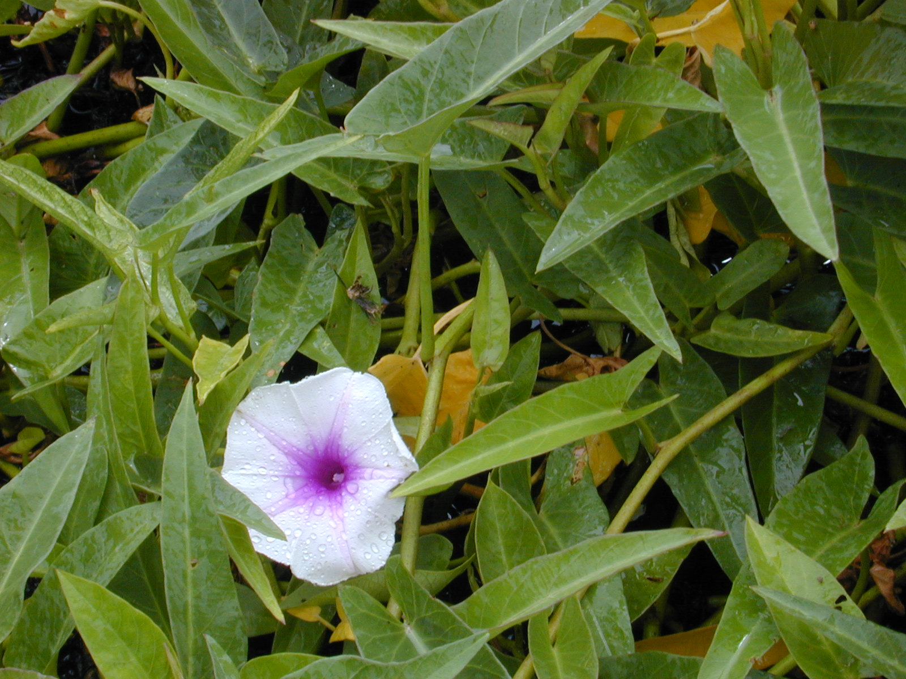

# Kangkung

    
## General Information
**Generic name:** Water Spinach
**Sri Lankan name:** Kangkung (Sinhala) | Vallal (Tamil)
**Scientific name:** _Ipomoea aquatica_
**Plant family:** _Convolvulaceae_
**Edible parts:** Almost all parts, but leaves and shoots are preferred
**Nutrition value:** High in vitamins A, C, and B6. Also contains plant protein, dietary fiber, calcium, iron, magnesium, potassium, and zinc
**Companion plants:** Not Applicable
**Non-companion plants:** Not Applicable

## Description:
Kang Kung is a creeping plant that has a hollow stem and can float on water. The leaves are green and are normally and depending on the variety, the shape and size of the leaves can vary. The flowers are trumpet shaped and white in colour. The runners develop roots at the nodes and also branch. This branching increases when tips are picked off. In Sri Lanka, it is commonly found growing wild in paddy fields, irrigation canals, and marshy areas. Kankung is so well-suited to growing in Sri Lanka that it is often considered an invasive plant, growing into mats that will block waterways. The USDA considers it a noxious weed. 

Stir-fried kankung is one of the cheapest and most popular vegetable dishes in many parts of South Asia and South East Asia. In some ayurvedic practices, kankung is also recommended as a method of controlling blood sugar. 

## Planting requirements
**Planting season:** Year-round in Sri Lanka, but best planted at the onset of rainy seasons

### Planting conditions:
| Propagation | In the drylands it is normally grown from seed but sometimes however the seeds are pre-soaked for 12-24 hours prior to sowing. Plants can also be grown from cuttings                                 |
|----|----|
| Planting method | Can be grown in the pot (which is better as kangkung grows aggressively) or on the ground. You can also plant it near the edge of a pond or other water bodies |
| Soil | Requires a soil with a pH between 5.3–6.0. Damp places and swamps will be ideal for growing. It can also grow as a partly floating plant in swamps and lagoons behind a beach along the coast |
| Water | It needs consistently muddy soil |
| Light | It requires full sun to thrive, though it can grow in partial shade as well |

### Growing conditions:
| Temperatures | Thrives in Sri Lanka's tropical climate with temperatures typically above 25°C |
|----|----|
| Soil | Requires evenly moist, wet, and nutrient-rich soil |
| Water | Unless planted next to a water body or stream, deep and regular watering is required to keep the soil nearly wet |
| Pruning | Regular harvesting of young shoots promotes bushy growth |
| Weed control | Hand weeding is usually sufficient in small-scale cultivation |

## Harvesting:
Can be harvested usually 4 to 6 weeks after planting. Cut only a few leaves or entire plant with leaves and stems leaving only 3 inches of growth, for the plant to regrow. In Sri Lanka, continuous harvesting is common, with new shoots ready for harvest every 1-2 weeks.

## Curing: 
Kang-Kung does not require a curing stage.

## Storage: 
Store in refrigerator crisper drawer for up to one week. In Sri Lanka, it's often sold fresh in markets and consumed within a day or two of harvest.

## Protecting your plants
### Pest control
**Pest type:**
- Leaf beetle
- Wireworm
- Aphids

**Symptoms:**
- Holes in leaves
- Damaged roots
- Stunted growth
- Curling leaves

**Control method:**
- Use soapy water or neem-based organic pesticides
- Implement crop rotation
- Remove infected plants
- In Sri Lanka, neem-based organic pesticides are commonly used

### Disease Control
**Disease type:**
- Stem rot
- Root rot
- Leaf spot
- Mosaic virus

**Symptoms:**
- Wilting
- Yellowing leaves
- Dark spots on leaves
- Stunted growth
- Distorted leaves

**Management:**
- Improve soil drainage
- Avoid overwatering
- Remove and destroy infected plants
- Use disease-resistant varieties when available
- For viral diseases, control insect vectors like aphids

## Difficulty Rating
### Low country wet zone (Difficulty: 2/10)
**Explanation:** Grows exceptionally well in the low country wet zone of Sri Lanka, thriving in the abundant moisture and warm temperatures.

**Challenges/Adaptations:**
- Monitor during heavy monsoon rains to prevent waterlogging
- May need to control aggressive growth

### Low country dry zone (Difficulty: 3/10)
**Explanation:** While the warmth is suitable, the dry conditions may require more attention to watering.

**Challenges/Adaptations:**
- Implement irrigation systems or regular watering schedules
- Consider mulching to retain soil moisture
- Grow near water sources when possible

### Mid country (Difficulty: 3/10)
**Explanation:** The mid-country climate of Sri Lanka is generally favorable for Kangkong cultivation.

**Challenges/Adaptations:**
- May need additional watering during drier periods
- Monitor for cooler temperatures in higher elevations

### Up country (Difficulty: 4/10)
**Explanation:** The cooler temperatures of Sri Lanka's up country can slow Kangkong growth, but cultivation is still possible.

**Challenges/Adaptations:**
- Choose warmer, sheltered locations for planting
- Consider using polytunnels or greenhouses in cooler areas
- Plant during the warmest months of the year

## References for this entry
### Sources:
- https://worldcrops.org/crops/water-spinach
- https://fdc.nal.usda.gov/fdc-app.html#/food-details/169301/nutrients
- https://ausveg.com.au/biosecurity-agrichemical/crop-protection/asian-vegetables/
- Wiart, C. (2017). Medicinal plants in Asia for metabolic syndrome: natural products and molecular basis. CRC Press.
- Gunasekera, L. (2009). Invasive Plants: A guide to the identification of the most invasive plants of Sri Lanka. Saravasi, Sri Lanka.
- https://plants.usda.gov/java/noxious?rptType=Federal
