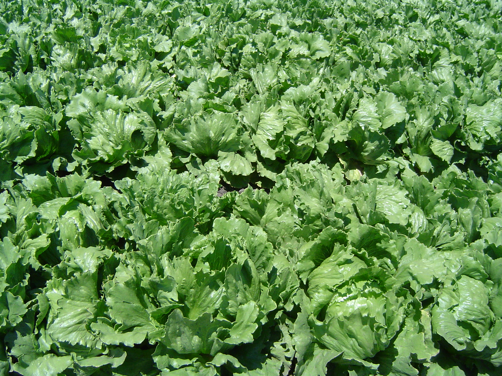

# Lettuce

## General Information
**Generic name:** Lettuce
**Sri Lankan name:** Salada kola (Sinhala)
**Scientific name:** Lactuca sativa
**Plant family:** Asteraceae
**Edible parts:** Leaves
**Nutrition value:** A very low-calorie, low-nutrient food. 95 

**Companion plants:**
- Alyssum: Attracts beneficial insects like hoverflies and lacewings that control aphids.
- Basil: Improves the flavor and growth of lettuce.
- Beets: Have different root depths, preventing nutrient competition and improving soil health.
- Calendula: Acts as a trap crop for aphids, protecting lettuce.
- Chamomile: Attracts beneficial insects like parasitic wasps and hoverflies.
- Chives and Garlic: Help deter pests, particularly aphids.
- Cilantro: Attracts beneficial insects that eat aphids.
- Carrots: Loosen soil and attract beneficial insects like ladybugs and lacewings.
- Dill: Attracts beneficial insects and improves lettuce health and growth.
- Marigolds: Deter pests like nematodes and aphids, and can act as a trap crop for slugs.
- Nasturtiums: Attract beneficial insects and deter pests like beetles and aphids.
- Onions and Shallots: Deter pests and discourage rabbits without competing for nutrients.
- Parsnips: Have different root depths, improving soil health without competing for nutrients.
- Peas: Fix nitrogen in the soil and provide shade for lettuce.
- Radishes: Break up compacted soil and become more tender when grown with lettuce.
- Strawberries: Improve soil health and attract beneficial insects.
- Turnips: Break up compacted soil and deter pests like aphids and flea beetles.
- Asparagus, Corn, Cucumbers, Eggplant, Spinach, Sunflowers: Generally compatible with lettuce growth

**Non-companion plants:**
- Cabbage family crops (broccoli, cauliflower, cabbage, brussels sprouts, kale, kohlrabi): Compete for similar nutrients and may inhibit lettuce growth.
- Fennel: Secretes a chemical that can stunt the growth of nearby plants, including lettuce.
- Celery: Attracts similar pests and diseases, potentially increasing the risk of infestations.
- Parsley: Causes lettuce to bolt (go to seed) prematurely.

## Description:
Lettuce is an annual plant most often grown as a leaf vegetable and used for salads. It comes in a range of varieties with flavors from buttery and mild to nutty and slightly bitter; textures from delicate to crunchy; and colors from pale to dark green and burgundy. Lettuces have a wide range of shapes and textures, from the dense heads of the iceberg type to the notched, scalloped, frilly or ruffly leaves of leaf varieties.

## Planting requirements
**Planting season:** Can be grown year-round in Upcountry Wet and Upcountry Intermediate Zones of Sri Lanka. In lowland areas, best planted during the dry season (May to September).

### Planting conditions:
| **Propagation** | Seed |
|----|----|
| Planting method | Prepare raised beds about 1 m wide, apply well-decomposed organic manure. Sow seeds in rows at 10 cm spacing in nursery beds. Transplant seedlings after three weeks, spacing plants 30 cm between rows and 15 cm between plants. In upcountry areas, direct seeding is possible. |
| Soil | Well-drained sandy loam soil with a loose structure and rich in organic matter. pH should be between 6.0 and 7.0 (add lime if soil is too acidic). |
| Water | Water regularly, especially during dry periods. Ensure soil remains moist but not waterlogged. |
| Light | In upcountry areas, full sun is acceptable. In lowland areas, partial shade during the hottest part of the day is beneficial. |

### Growing conditions:

| **Temperatures** | Optimal growth at less than 20°C. In lowland areas, provide shade or grow during cooler months to prevent bolting and bitter taste. |
|----|----|
| Soil | Loose, well-draining soil enriched with organic matter. Maintain pH between 6.0 and 7.0. |
| Water | Water daily in the first few days after planting. After two weeks, water every four days according to rainfall. In dry zones, more frequent watering may be necessary. |
| Pruning | Remove outer leaves as needed for consumption. This promotes continued growth. Remove any yellowing or diseased leaves promptly. |
| Weed Control | Maintain proper growth by keeping the field weed-free. Hand weeding is advisable. |

## Harvesting:
Can be harvested 50-60 days after transplanting. At harvest, the entire plant can be removed and the roots cut off. A well-grown plant should weigh about 200 – 400 g. In home gardening, the leaves can be cut separately and used for consumption as required.

## Storage:
Store lettuce in a cool, humid place. In areas without refrigeration, wrap in damp cloth and keep in a cool spot. If available, refrigerate at 0°C to 4°C for up to a week.

## Protecting your plants
### Pest control
**Pest types:** Root-eating caterpillars, Cutworms, Aphids, Slugs and Snails

**Symptoms and Control methods:**
- Root-eating caterpillars: Larvae damage roots and lower stem parts. Control by capturing adults using yellow or blue sticky traps.
- Cutworms: Caterpillars cut seedlings at the base. Inspect crop and apply recommended pesticides for severe damage.
- Aphids: Curled or distorted leaves. Use neem oil or soap sprays.
- Slugs and Snails: Holes in leaves. Set up beer traps or use wood ash barriers.

Maintain field hygiene and remove weeds regularly.

### Disease Control
**Disease types:** Soft rot, Sclerotium rot, Damping off, Downy mildew

**Symptoms and Management:**
- Soft rot: Rotting starts from lower leaves and moves upwards. Control by proper spacing and preventing lower leaves from touching the soil. Apply polythene mulch to reduce infection.
- Sclerotium rot: White mold growth under humid conditions. Improve drainage and maintain proper spacing.
- Damping off: Seedling collapse. Use well-draining soil and avoid overwatering.
- Downy mildew: Yellowing leaves with white fuzzy growth. Ensure good air circulation and avoid overhead watering.

Practice crop rotation and use approved fungicides as per local recommendations for severe cases.

## Difficulty Rating
### Low country wet zone (Difficulty: 6/10)
**Explanation:** Lettuce cultivation is challenging due to high humidity and temperatures.
**Challenges/Adaptations:**
- Use raised beds for better drainage
- Grow during cooler months or provide shade
- Choose heat-tolerant varieties

### Low country dry zone (Difficulty: 7/10)
**Explanation:** High temperatures and water scarcity make lettuce cultivation difficult.
**Challenges/Adaptations:**
- Use drip irrigation or mulching to conserve water
- Provide shade during hot periods
- Grow during cooler months

### Mid country (Difficulty: 4/10)
**Explanation:** Moderate climate is suitable for lettuce, but pest management is crucial.
**Challenges/Adaptations:**
- Implement integrated pest management
- Use row covers to protect from pests
- Ensure proper spacing for air circulation

### Up country (Difficulty: 3/10)
**Explanation:** Cool climate is ideal for lettuce cultivation.
**Challenges/Adaptations:**
- Protect from occasional frost
- Manage soil moisture during heavy rains
- Choose varieties suited to local conditions

### Sources:
- https://www.gardenia.net/guide/best-worst-companions-for-lettuce
- https://www.gardeningknowhow.com/edible/vegetables/lettuce/companion-plants-for-lettuce.htm
- http://farmer.gov.lk/index.php?option=com_content&view=article&id=123&Itemid=76
- https://www.doa.gov.lk/HORDI/index.php/en/crop-recommendations/1103-lettuce
- https://fdc.nal.usda.gov/fdc-app.html#/food-details/169249/nutrients
