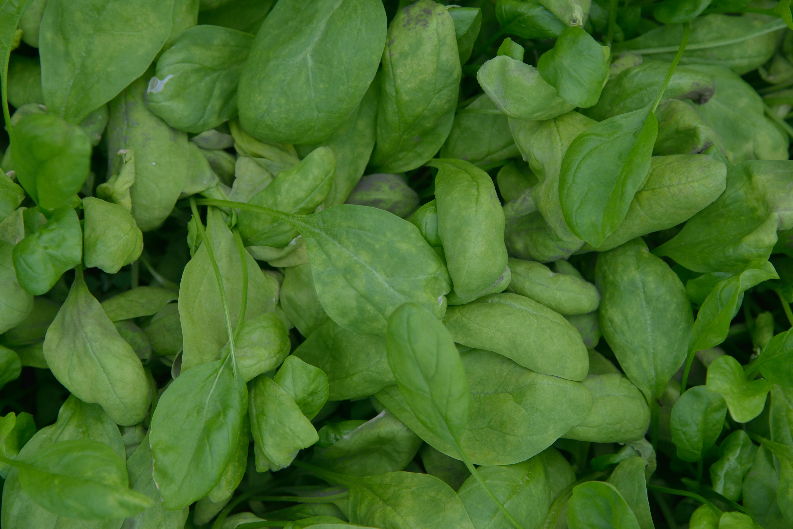

# Malabar Spinach

## General Information
**Generic name:** Malabar Spinach, Ceylon Spinach, Sri Lankan Spinach, Vine Spinach, Creeping Spinach
**Sri Lankan name:** Nivithi (Sinhala) | Pasalaikīrai, Vasalakkīrai, Kodipasalai (Tamil)
**Scientific name:** _Basella alba_ (green stemmed variety) and _Basella rubra_ (red stemmed variety)
**Plant family:** _Basellaceae_
**Edible parts:** Leaves
**Nutrition value:** High in iron, calcium, vitamin A, and vitamin C. It also contains proteins and dietary fiber.

**Companion plants:** Malabar spinach tends to be an agressive vine that takes over plants close to it. Some sources note that they work well with beets, brassicas, eggplant, leeks, lettuce, peas, and radishes, but this plant will have to be carefully pruned; ours has taken over an entire section of the office front yard. 

**Non-companion plants:** Not Applicable

## Description:
While the name Niwithi is given to both spinach and Malabar spinach, the two plants are from different families. Malabar spinach, the more heat-resistant variety, is a member of the Basellaceae family. A native to India and tropical moist lowlands of South Asia, it is a vine that has dark green leaves that resemble those of spinach. It occurs in two varieties, Basella rubra, the red stemmed variety, and Basella alba, which has green stems and thick fleshy leaves.

Both the leaves and tender shoots are edible, offering a mild, slightly peppery flavor that complements many dishes. Malabar spinach is commonly used in various ways:

- Raw: Young leaves are added to fresh salads or "mallum" (a traditional Sri Lankan salad of chopped greens mixed with grated coconut).
- Cooked: The leaves are often used in "kola kenda" (a traditional herbal porridge), curries, and stir-fries.
- Soups and Stews: Due to its mucilaginous texture (similar to okra), Malabar spinach serves as a natural thickener in soups and stews, adding both nutrition and consistency to dishes.
- Curries: It's a popular addition to coconut milk-based curries, often paired with other vegetables or lentils.
- Sambols: Finely chopped Malabar spinach can be incorporated into spicy sambols, adding a nutritious boost to this popular condiment.

## Planting requirements
**Planting Season:** Can be grown year-round in Sri Lanka, best planted at the onset of the rainy season (May-June or October-November)

### Planting conditions:
| Propagation | Seeds can be directly sown or stem cuttings used for faster propagation. Seeds germinate in 10 days to 3 weeks |
|----|----|
| Planting Method | Place plants at least a foot apart. Provide a sturdy trellis or support for the vines. |
| Soil | Well-drained, fertile soil rich in organic matter. Add compost or well-rotted manure before planting |
| Water | Regular watering is necessary, especially during dry spells. Consistent moisture is important to prevent flowering |
| Light | Grows well in full sun but can tolerate partial shade, especially in hotter regions of Sri Lanka |

### Growing conditions:
| Temperatures | Thrives in Sri Lanka's tropical temperatures, typically between 25-35°C. Growth slows when night temperatures are consistently below 15°C |
|--------|----------------|
| Soil | Adapts to various soil types found in Sri Lanka, but prefers well-drained, loamy soil with a pH of 6.0-6.8 |
| Water | Regular watering is crucial, especially during dry seasons. Drip irrigation or hand watering at the base of the plant is recommended |
| Pruning | Pinch back growing tips to encourage bushier growth. Prune as needed to maintain desired shape |
| Weed Control | Regular weeding is important. Use organic mulch to suppress weeds and retain soil moisture |

## Harvesting
Start harvesting when the plant has reached full maturity, typically 70 to 85 days after planting. Cut individual leaves, stems, and vine tips using garden shears or scissors. Harvest only as much as you need at any given time. Regular harvesting encourages more leaf growth. The young leaves can be eaten raw in salads, while mature leaves are better cooked.

## Curing:
Malabar Spinash does not require a curing stage.

## Storage
After harvesting, wash the leaves thoroughly and dry them in a shaded area. Store in a clean, damp cloth or perforated plastic bag in the refrigerator for up to 5-7 days. For longer storage, leaves can be blanched and frozen.

## Protecting your plants
### Pest control
**Pest type:**
- Aphids
- Whiteflies
- Leaf-eating caterpillars

**Symptoms:**
- Curled or distorted leaves
- Sticky residue on leaves
- Visible insects

**Control method:**
- Use neem oil or insecticidal soap
- Encourage natural predators like ladybugs
- In severe cases, use approved organic pesticides

### Disease Control
**Disease type:**
- Fungal leaf spots
- Root rot

**Symptoms:**
- Brown or black spots on leaves
- Yellowing leaves
- Wilting

**Management:**
- Improve air circulation
- Avoid overhead watering
- Remove infected plants
- Use copper-based fungicides if necessary

## Difficulty Rating
### Low Country Wet Zone (Difficulty: 3/10)
**Explanation:** Malabar spinach thrives in the warm, humid conditions of the low country wet zone. It's well-adapted to this climate and grows vigorously.
**Challenges/Adaptations:**
- Monitor for fungal diseases due to high humidity
- Ensure good drainage to prevent waterlogging

### Low Country Dry Zone (Difficulty: 5/10)
**Explanation:** Can be grown successfully with proper irrigation. The hot, dry conditions are suitable for growth but require more water management.
**Challenges/Adaptations:**
- Implement efficient irrigation systems
- Use mulch to conserve soil moisture
- Provide partial shade during the hottest part of the day

### Mid Country (Difficulty: 4/10)
**Explanation:** The mid country's moderate climate is suitable for Malabar spinach cultivation. Growth might be slightly slower compared to the low country.
**Challenges/Adaptations:**
- Protect from occasional cold spells
- Ensure adequate sunlight exposure

### Up Country (Difficulty: 6/10)
**Explanation:** The cooler temperatures of the up country can challenge Malabar spinach growth, but it can be managed with proper care.
**Challenges/Adaptations:**
- Choose warmer, sunnier locations for planting
- Use protective structures like polytunnels during cooler months
- Adjust watering practices to suit cooler, potentially wetter conditions

## References for this entry
### Content Sources:
- https://hort.extension.wisc.edu/articles/malabar-spinach-basella-alba/
- https://foodprint.org/real-food/malabar-spinach/
- https://www.growveg.com/plants/us-and-canada/how-to-grow-malabar-spinach/
