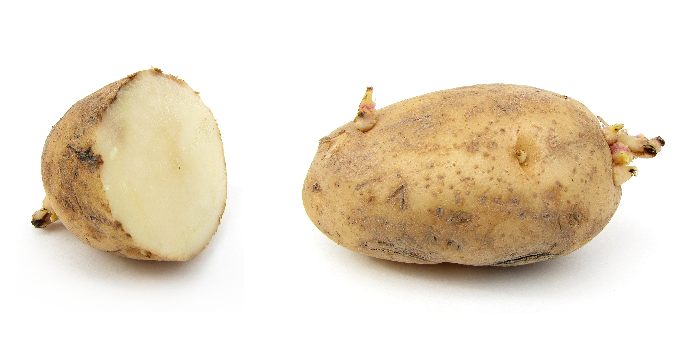

# Potato

## General Information
**Generic name:** Potato
**Sri Lankan name:** Ala (Sinhala) | Urulai Kilangu (Tamil)
**Scientific name:** _Solanum tuberosum_
**Plant family:** _Solanaceae_
**Edible parts:** Only the tubers
**Nutritional value:** Potatoes are a source of vitamin C, iron, riboflavin, potassium, and carbohydrates.

**Companion plants:**
- [Marigolds](https://lanka.wiki/flowers/marigold.html)
- Petunias
- [Coriander](https://lanka.wiki/herbs%20&%20spices/coriander.html)
- Basil
- [Corn](https://lanka.wiki/vegetables/corn.html)
- [Beans](https://lanka.wiki/vegetables/green-beans.html)
- [Garlic](https://lanka.wiki/herbs%20&%20spices/garlic.html)

**Non-companion plants:**
- Asparagus
- Squash
- Fennel
- [Sunflowers](https://lanka.wiki/flowers/sunflowers.html)
- [Tomatoes](https://lanka.wiki/fruit/tomatoes.html)
- [Cucumbers](https://lanka.wiki/vegetables/cucumber.html)

## Description:
Potatoes are generous plants and they easily grow and produce abundant harvests. They come in a variety of types, colors, and shapes. Though there are thousands of varieties of potatoes, only a few dozen are commercially available.

Like the tomato, the potato is nightshade in the genus Solanum, and the vegetative and fruiting parts of the potato contain the toxin solanine which is dangerous for human consumption. Normal potato tubers that have been grown and stored properly produce glycoalkaloids in amounts small enough to be negligible for human health, but, if green sections of the plant (namely sprouts and skins) are exposed to light, the tuber can accumulate a high enough concentration of glycoalkaloids to affect human health.

## Planting requirements
**Planting season:** In cooler regions, in early to mid-April, and in warmer regions the times range from September to February.

### Planting conditions:
| Propagation | Potatoes can be started either from tubers or true botanical seeds. However, the most popular method is using tubers. Plant either the seed potatoes or the transplants grown from true seed at 18 inch intervals in all directions |
|----|----|
| Planting method | Plant seed potatoes from which eyes (buds) protrude. Only small, golf ball-sized potatoes should be planted whole. Cut large tubers into pieces and leave them for a few days to be "cured" in a warm space and then plant them. Potatoes grow best in rows about 3 feet apart. With shovel, dig a trench row about 6 inches wide and 8 inches deep. Taper the bottom to about 3 inches wide. Spread and mix in aged manure, compost, and/or leaves. In each trench, place a seed potato piece cut side down every 12 to 14 inches and cover with 3 to 4 inches of soil |
| Soil | The tubers need to grow in fertile (organic), loose, well-drained soil. Using raised beds solves the problem of water logging in advance. Ideal pH range: 5.5 - 6.6 |
| Water | Need to maintain even moisture throughout. Tuberization and tuber bulking stages require high watering, therefore sprinkler or drip irrigation methods are recommended |
| Light | Plant potatoes in a sunny place with at least 6 hours of direct sunlight each day. Potatoes grow best in full sun, but can tolerate partial shade |

### Growing conditions:
| Temperatures | Sprouts grow longest at 18ºC while the ideal temperature for tuber planting is between 10-24ºC. Tuber development declines if the soil temperature is over 24ºC (68ºF) and nearly stops if the soil temperature is over 30ºC (86ºF). Yet heat-tolerant varieties are available and can be grown in dry areas such as Jaffna and Kapitiya |
|----|----|
| Soil | Put a good layer of compost in the furrow, and plant the potatoes on top. Cover them with compost, then mulch with straw |
| Water | Potatoes need sufficient water to prevent hollow tubers and to grow them to optimal sizes. The equivalent of one inch of water weekly is sufficient |
| Pruning | Leaf Removal: Remove lower leaves to improve air circulation and focus energy on tubers, especially in containers or dense plantings.
Flower Prevention: Remove flower buds to prioritize tuber growth. |
| Weed control | Weed management is crucial for potato cultivation as weeds compete for nutrients, water, and light, which can significantly affect yield |

## Harvesting:
Harvest your early potatoes at any time after the plants have flowered. Late potatoes can be left in until the plants have died down. Dig potatoes out carefully with a fork, making sure you don’t spear any. 

## Curing:
After digging up and cleaning potatoes, cure them for 7 to 10 days in a dark, well-ventilated area with moderate temperatures and high humidity. This helps them last longer in storage.

## Storage
Potatoes should be stored in a cool, dry place with temperatures between 45-50°F (7.2-10°C). When properly stored, potatoes will remain fresh for up to a month. Throw away potatoes that are shriveled or green or have many sprouts.

## Protecting your plants
### Pest control
**Pest type:**
- Leaf miner (_Liriomyza huidobrensis_)
- Potato tuber moth (_Phthorimaea operculella_)
- Black cut worm (_Agrotis spp_)
- Golden cyst nematode (_Globodera rostochiensis_)
- Potato aphid (_Myzus persicae_)
- Thrips (_Thrips palmi_ and _Thrips spp_)
- Whitefly (_Bemisia tabaci_)
- White grub (_Melolontha spp_/_Anomala spp_)
- Slug and Snail

**Symptoms:**
- **Leaf miner:** Irregular mines on leaves, spotted appearance on foliage, drying and withering of leaves.
- **Potato tuber moth:** Wilting and reduced photosynthesis in leaves, larvae enter tubers causing irregular galleries and tunnels.
- **Black cutworm:** Round holes in leaves, shoots damaged close to the ground, wilting during daytime.
- **Golden cyst nematode:** Yellowing of plants, stunted growth, wilting in warmer temperatures.
- **Potato aphid:** Curling and deformation of young leaves, sooty mold development.
- **Thrips:** Deformities of the crop, silvery or bronze scarring on stems or leaves.
- **Whitefly:** Yellowing and dropping of leaves, sooty mold growth on leaf surfaces.
- **White grub:** Damage to roots, stems, and tubers, reduced market quality of tubers.
- **Slug and Snail:** Irregular holes with smooth edges on leaves, destruction of tender leaves.

**Control method:**
- **Leaf miner:** Yellow sticky traps, removal of infected plant material, use of parasitoids, chemical control with approved insecticides.
- **Potato tuber moth:** Proper earthing up, crop rotation, destruction of residues, chemical control in severe cases.
- **Black cutworm:** Hand collecting and destroying, weed management, encouraging predatory birds, chemical control if necessary.
- **Golden cyst nematode:** Use of certified seeds, crop rotation, soil testing, use of resistant varieties.
- **Potato aphid:** Weed control, protection of natural predators, chemical control with approved insecticides.
- **Thrips:** Weed control, protection of natural predators, planting at the correct time, crop rotation, chemical control if necessary.
- **Whitefly:** Use of yellow/blue sticky traps, spraying water to dislodge adults, and chemical control with approved insecticides.
- **White grub:** Deep ploughing, encouraging predatory birds, crop rotation, field sanitation.
- **Slug and Snail:** Elimination of shelters, trapping and removing, debris removal, weed management, use of metaldehyde baits.

### Disease Control
**Disease type:**
- Potato late blight (_Phytopthora infestans_)
- Potato early blight (_Alternaria solani_)
- Potato common scab (_Streptomyces scabies_)
- Black scurf (_Rhizoctonia solani_)
- Powdery scab (_Spongospora subterranea_)
- Bacterial wilt (_Ralstonia solancearum_)
- Dry rot (_Fusarium solani_)
- Virus diseases (Potato leaf roll virus, potato virus Y, potato virus X)

**Symptoms:**
- **Late blight:** Dark green to black spots on leaves, white mold on infected tissue, defoliation.
- **Early blight:** Brown spots on leaves, leaf drop, cankers on stems.
- **Common scab:** Scab-like lesions on tuber surface.
- **Black scurf:** Black, irregular masses on tuber surface.
- **Powdery scab:** Powdery lesions on tuber surface.
- **Bacterial wilt:** Wilting of plants, browning of vascular tissue.
- **Dry rot:** Dry, sunken areas on tubers.
- **Virus diseases:** Various symptoms including leaf rolling, mosaics, and stunted growth.

**Management:**
- **Late blight:** Crop rotation, use of disease-free tubers, application of fungicides (Mancozeb, Maneb, Metalaxyl, Fluazinam).
- **Early blight:** Crop rotation, application of fungicides (Mancozeb, Maneb).
- **Common scab:** Use of disease-free tubers, maintaining soil pH 5.0-5.2, maintaining soil water level, crop rotation.
- **Black scurf:** Crop rotation.
- **Powdery scab:** Use of disease-free tubers, crop rotation.
- **Bacterial wilt:** Use of disease-free tubers, and crop rotation for at least three years, improving field drainage.
- **Dry rot:** Use of disease-free tubers, crop rotation.
- **Virus diseases:** Control of vectors (aphids), regular field monitoring, removal of infected plants.

## Difficulty Rating

### Low country wet zone (Difficulty: 7/10)
**Explanation:** Potatoes require consistent moisture and cool temperatures, which can be challenging in the wet zone.
**Challenges/Adaptations:**
- Ensure adequate drainage to prevent waterlogging. Consider using raised beds or mounding soil
- Provide shade during peak heat hours. Mulching can also help regulate soil temperature

### Low country dry zone (Difficulty: 8/10)
**Explanation:** The dry zone's hot temperatures and low rainfall make it difficult to grow potatoes successfully.
**Challenges/Adaptations:**
- Irrigate regularly to maintain even moisture. Drip irrigation is recommended
- Use mulch to retain soil moisture and suppress weeds. Organic mulches like straw or grass clippings can be used
- Use heat-resistant variants

### Mid country (Difficulty: 4/10)
**Explanation:** The mid-country's varied climate can be suitable for potato cultivation with proper management.
**Challenges/Adaptations:**
- Monitor temperatures closely, as potatoes prefer cooler conditions.
- Ensure adequate drainage to prevent waterlogging during heavy rainfall periods. Mounding soil can help improve drainage

### Up country (Difficulty: 4/10)
**Explanation:** The up-country's cool climate is well-suited for potato cultivation.

**Challenges/Adaptations:**
- Ensure adequate drainage to prevent waterlogging during heavy rainfall periods. Mounding soil can help improve drainage

## References for this entry

## References for this entry
### Sources:
