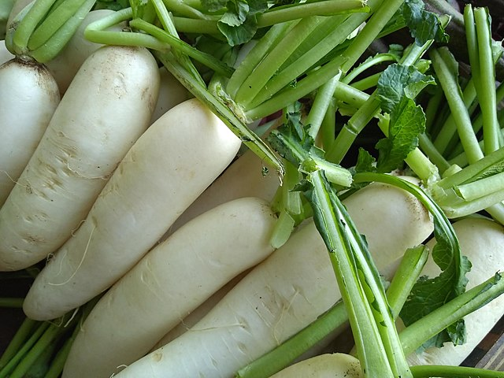

# Radish

## General Information
**Generic name:** Radish
**Sri Lankan name:** Rabu (Sinhala) | Muḷḷaṅki, Muḷḷaṅkik kiḻaṅku (Tamil)
**Scientific name:** _Raphanus sativus L._
**Plant family:** _Brassicaceae_
**Edible parts:** bulbs, seeds, leaf-tops
**Nutrition value:** High in vitamins C, B6, Folate, Riboflavin, Niacin, Thiamine. Also rich in minerals Calcium, Potassium, Iron, and Manganese.

**Companion plants:**
- Other Brassicas (broccoli, turnips, cauliflower, cabbage, etc.)
- Dill
- Parsnips
- Pole Beans
- Mint
- Oregano
- Borage
- Eggplant
- Tomatoes

**Non-companion plants:** 
Not applicable

## Description:
Two types of radish are commonly grown in Sri Lanka, Beeralu Rabu, and Japanese ball. Radish belongs to the family Brassicaceae which can be grown in all agro-climatic zones of Sri Lanka. Varieties of radish are now broadly distributed around the world, but almost no archeological records are available to help determine their early history and domestication. However, scientists have tentatively located the origin of Raphanus sativus in Southeast Asia, as this is the only region where truly wild forms have been discovered.

## Planting requirements
**Planting season:** Radish can be planted throughout the year in Sri Lanka if adequate moisture is available.

### Planting conditions:
| Propagation | Direct seeding |
|----|----|
| Planting method |  Soil should be ploughed to a depth of 30-40 cm to provide the necessary depth. Spacing should be 25-30 cm between rows; and 10 cm between plants. Sow seeds in rows on raised beds |
| Soil | Well-drained soils are suitable, poorly drained soils can cause growth problems. A pH range of 6.0 – 7.5 is appropriate for cultivation. Radishes can grow in Sand, Loam, Clay, Acidic, Neutral, and Alkaline soils |
| Water | Irrigate daily for the first 4-5 days and then every 3-4 days, depending on rainfall |
| Light | Requires plenty of sunlight |

### Growing conditions:
| Temperatures | Grows well even in dry zone conditions, but prefers cooler temperatures between 4°C - 24°C (40°F - 70°F)  |
|----|----|
| Soil | Well-drained soils are suitable, poorly drained soils can cause growth problems. A pH range of 6.0 – 7.5 is appropriate for cultivation |
| Water | Irrigate daily for the first 4-5 days and then every 3-4 days, depending on rainfall |
| Pruning | No pruning required |
| Weed control | One-hand weeding is enough after 2 weeks of planting |

## Harvesting:
Monitor plants to ensure that they are harvested at the correct maturity stage. If radishes grow too big, large radishes get pithy and eventually woody.

## Curing: 
Radishes do not require a curing stage.

## Storage: 
Remove the tops of radishes and store them in plastic bags in the refrigerator. They can stay fresh for up to 2 weeks this way.

## Protecting your plants
### Pest control
**Pest type:**
- Leaf-eating caterpillars
- Leaf miner
- Cutworm

**Symptoms:**
- **Leaf-eating caterpillars:** In severe damage, leaves are skeletonized. Young larvae are light green in color and then turn dark green when mature.
- **Leaf miner:** Irregular or serpentine pale grey lines appear on both sides of the leaf blades. These burrows are usually limited by the leaf veins and contain black fecal material visible as slim trace inside the tunnels.
- **Cutworm:** Larvae hide in the soil during the day and cause damage at night. Eats young plants at the soil level. Eats leaves of mature plants.

**Control method:**
- **Leaf-eating caterpillars:** In severe cases, apply DOA-recommended insecticides.
- **Leaf miner:** No specific control method, maintain good field hygiene.
- **Cutworm:** 
  - Plough soil, pick up and discard caterpillars hiding in the soil.
  - Caterpillars in the soil are destroyed by birds when the soil is ploughed.
  - Apply more organic manure to the soil.
  - Keep fields weed-free.

### Disease Control
**Disease type:**
- Clubroot disease

**Symptoms:**
- When grown in low pH (acidic) soils it can cause serious damage to the crop. The roots of the plant become thick and club shaped.

**Management:**
- The causal organism remains in the soil for a long time and cannot be destroyed by chemicals.
- Check the soil before planting and, if necessary, increase the pH by applying lime.
- Uproot and burn the infected plants. Don't use infected plants for compost preparation.
- Disease can be minimized by transplanting crops which are not in the same genus for about four years.

## Difficulty Rating
### Low country wet zone (Difficulty: 8/10)
**Explanation:** Radish can be challenging in the wet zone due to high humidity and potential fungal diseases.
**Challenges/Adaptations:**
- Monitor plants closely for disease signs.
- Ensure good air circulation around plants.
- Use raised beds to improve drainage in areas with heavy rainfall.

### Low country dry zone (Difficulty: 4/10)
**Explanation:** Radish grows well in the dry zone with adequate irrigation.
**Challenges/Adaptations:**
- Irrigate regularly to maintain soil moisture.
- Protect plants from strong winds.
- Use mulching to conserve soil moisture in the dry climate.

### Mid country (Difficulty: 5/10)
**Explanation:** Radish can be moderately challenging in the mid country due to varying temperatures and rainfall.
**Challenges/Adaptations:**
- Provide shade during hot periods.
- Ensure consistent watering.
- Choose varieties that are well-adapted to mid-country conditions.

### Up country (Difficulty: 8/10)
**Explanation:** Radish may struggle in the up country due to cooler temperatures.
**Challenges/Adaptations:**
- Protect plants by using row covers or mulch.
- Provide additional warmth with black plastic mulch.

## References for this entry
### Sources:
