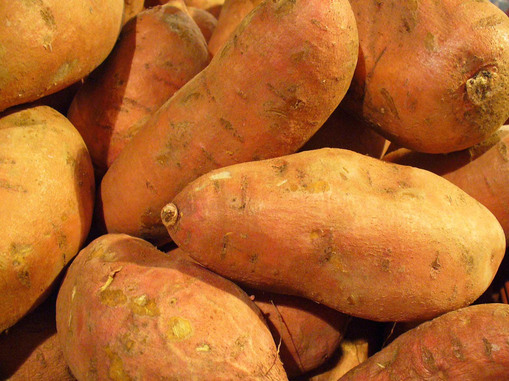

# Sweet Potato

## General Information
**Generic name:** Sweet Potato
**Sri Lankan name:** Batala, Vel-kelengu
**Scientific name:** *Ipomoea batatas*
**Plant family:** *Convolvulaceae*
**Edible parts:** tuberous root, shoots and young leaves
**Nutritional value:** (*The Nutrition Source does not recommend or endorse any products)*
* Vitamins and minerals  - Vitamin A, Vitamin C, Vitamin B6, potassium, manganese
* Rich in fibre
**Companion plants:**
>Companion plants aid growth by attracting beneficial insects, repelling pests, and providing support. They are part of a natural pest control system, maximising space and increasing crop productivity.

- Okra
Beetroot
Capsicum
Onions

## Description:
Sweet potatoes are distinct from regular potatoes and yams. They belong to the Convolvulaceae family, which includes morning glories. The sweet potato's starchy tuberous roots are used as a root vegetable and have a sweet taste.

Sweet potatoes come in a variety of types with different shapes, colours, and textures. They can be white, cream, yellow, reddish-purple, or deep purple. The most significant part of the sweet potato plant is the tuber, a large root that grows underground and is used as a food source. The leaves of the sweet potato plant vary in appearance, some being divided like fingers while others are whole. These leaves are edible and can be cooked like spinach. The plant also produces trumpet-shaped flowers in a range of purple and white hues.

However, it is crucial to be aware that the green fruits that develop from the flowers of sweet potato plants are not edible.

:::tip
For more information on locally available sweet potato varieties, check <https://doa.gov.lk/hordi-variety-sweet-potato/>

:::

## Planting requirements

**Planting season:** <update>Sweet potatoes prefer warm climates and should be planted between February to April in Sri Lanka.</update>

## **Planting conditions**

The sweet potato plant can adapt to diverse rainfall patterns and soil types. However, it is susceptible to cold temperatures and excessive water in the root zone, which can be fatal to the crop.

| Propagation        | Plant cuttings - recommended. Plant within 4 days of cutting.\nSmall slips that sprouts directly from a sweet potato can also be planted.\nFresh sweet potato seeds also germinate relatively easily but are harder to find.                                                                                                                                                                                   |
|--------------------|----------------------------------------------------------------------------------------------------------------------------------------------------------------------------------------------------------------------------------------------------------------------------------------------------------------------------------------------------------------------------------------------------------------|
| Planting method    | Plant cuttings - recommended. Plant within 4 days of cutting.\nSmall slips that sprouts directly from a sweet potato can also be planted.\nFresh sweet potato seeds also germinate relatively easily but are harder to find.                                                                                                                                                                                   |
| Soil               | Sandy/ loam soil with good drainage is suitable.\nIf your soil is clay, rocky, or compacted, it is recommended to consider growing plants in raised beds.\nFocus on developing fertile, well-draining soil for optimal root growth.                                                                                                                                                                            |
| Water              | Keep soil evenly moist. At the crop initial growth stage water supply is important                                                                                                                                                                                                                                                                                                                             |
| Light              | Requires full sunlight for optimal growth. Plant in an area that receives abundant sunlight.\nUnder shaded conditions, both leaf and root production decrease, and the plant tends to climb to seek sunlight. \nThis results in larger but fewer leaves, and fewer tubers are produced in shady conditions. \nHeavy shade is not tolerated well by the plant, although some varieties may tolerate mild shade. |
| Fertiliser / Mulch | Enhance soil quality with compost and coconut coir\nAvoid animal/bird manure and heavy nitrogen fertilisers                                                                                                                                                                                                                                                                                                    |

## Growing conditions**

| Temperatures | This plant grows well with temperatures between <update>21 to 26°C</update> |
|----|----|
| Soil | pH between <update>5.2 to 6.8</update> |
| Water | Excess water reduces tuber production. <update>The equivalent of one inch of water weekly is sufficient. Apply to roots.</update> |
| Pruning | Prune plants regularly to maintain their desired size and shape. <update>When plants are pinched or trimmed, it promotes new growth.</update> |
| Weed control | It is important to remove weeds at early stage of the crop, to reduce plant competition |

## Harvesting**

The time to maturity ranges from <update>4 to 12 months</update> depending on the variety planted and the altitude at which it is being grown. Discard any tubers damaged by insects, pests or disease.

:::tip
Sweet potatoes must be cured after harvest and before they are stored. <update>Curing helps to enhance sweetness and reduces moisture content in the roots.</update>

:::

* Handle sweet potatoes with care to prevent bruising or breaking their delicate skin.
* Use a garden fork to lift the soil outside the root area and avoid damaging the tender roots.
* Place harvested sweet potatoes carefully into a carrying container, instead of tossing them. <update>Use either hands or a garden fork to harvest sweet potatoes from the ground.</update>
* Avoid washing freshly dug sweet potato roots and handle them minimally.

## Curing**

Cure the sweet potatoes by leaving them in a shaded area with high humidity for <update>7 to 14 days</update>.
## Storage

Store the cured sweet potatoes in well-ventilated crates or boxes in a cool, dark, and dry place with low humidity. <update>Ideal storage temperature is between 50 to 60°F (10 to 15°C).</update>

Optionally, sweet potatoes can be frozen after the curing process by peeling, cutting, and boiling them until fork tender.

# Protecting your plants

## Pest control**

## Sweet potato weevil (***Cylas Formicarius*)

**Symptoms:** <update>Sweet potato weevil infestation can cause the vines to turn yellow, but it may not be noticeable until a heavy infestation occurs. The damage caused by these weevils is primarily seen in the tubers, where their larvae create tunnels, resulting in cavities, a spongy texture, and a dark appearance.</update>

**Control method:** <update>It is important to ensure that the slips or cuttings used for planting sweet potatoes are free of weevils. Proper sanitation practices, such as removing discarded and unharvested tubers and controlling Ipomoea weeds, are crucial for managing the weevil population. Maintaining moist soil through irrigation helps deter weevils and promotes the development of fungal diseases that can impact the weevil population. Cracking soils can allow the weevil access to tubers.</update>

## Disease Control**

## Leaf scab (*Elsinoe batatas*) (Fungus)

**Symptoms:** <update>The young leaves of plants can get infected with this fungus. The infection runs along the veins of the leaves, leaf stalks, and even on stems. As the leaves continue to grow, the fungus can make it difficult for the veins to expand properly. This can cause the leaves to twist, curl, and even tear. On older leaves, small spots between the veins will appear and the leaves might twist in a way that exposes their undersides. In rare cases, the tips of the shoots can even be damaged.</update>

**Management:** <update>Sometimes, the fungus can survive in old plant debris, but this is usually not a big problem unless crops are planted in the same spot over and over again. The main way the fungus spreads is through infected vines used for planting.</update>

:::tip
It is important to be careful and avoid using vines that have the fungus to prevent the spread of the disease.

:::

## Collar rot (*Phytophthora*) / Root rot (Fungus)

**Symptoms:** <update>When plants are affected by collar rot or root rot, their leaves will start turning yellow, and eventually, the vines will wilt. The roots may also show signs of rotting.</update>

**Management:** <update>To manage this disease, it is important to remove the affected plants from the field along with the soil.</update> This helps to minimise the spread of the fungus. <update>By removing the diseased plants and soil, we can reduce the chances of the disease spreading to healthy plants.

Remember to be vigilant and take necessary steps to prevent the spread of diseases in sweet potato plants. Regular monitoring and prompt action can help maintain healthy crops and ensure a good yield. <update>Avoiding wounding during harvest, proper curing, and good sanitation practices are best for controlling this disease.</update>

---

# Difficulty Ratings by Climate Zone

## 1. **Lowlands (Temperature range: 27-30°C)**

**Difficulty Rating:** 5/10
**Explanation:** The lowland climate zone in Sri Lanka is suitable for sweet potato cultivation due to its warm temperatures, which fall within the optimal growth range of 21 to 26°C. However, high rainfall and humidity can increase the risk of diseases like collar rot and root rot. Regular monitoring and prompt action are crucial to manage these diseases effectively.

## 2. **Midlands (Temperature range: 24-27°C)**

**Difficulty Rating:** 4/10
**Explanation:** The midland climate zone offers suitable conditions for sweet potato cultivation, with temperatures ranging between 24 and 27°C. This zone has a more balanced rainfall pattern compared to the lowlands, reducing the risk of excessive waterlogging. However, proper soil management is essential to maintain optimal drainage.

## 3. **Highlands (Temperature range: 18-24°C)**

**Difficulty Rating:** 6/10
**Explanation:** The highland climate zone presents some challenges for sweet potato cultivation due to cooler temperatures, which can fall below the optimal growth range of 21 to 26°C. This may result in slower growth and reduced tuber production. Additionally, high rainfall can increase the risk of diseases like leaf scab. Careful temperature management and disease monitoring are crucial for successful cultivation.

## 4. **Dry Zone (Temperature range: 27-35°C)**

**Difficulty Rating:** 6/10
**Explanation:** The dry zone climate presents challenges due to its low rainfall, which can lead to water stress in sweet potato plants. Supplementary irrigation may be necessary to maintain optimal soil moisture levels. Additionally, high temperatures above the optimal range can cause heat stress, affecting plant growth and tuber production. Careful water management and temperature monitoring are essential for successful cultivation.