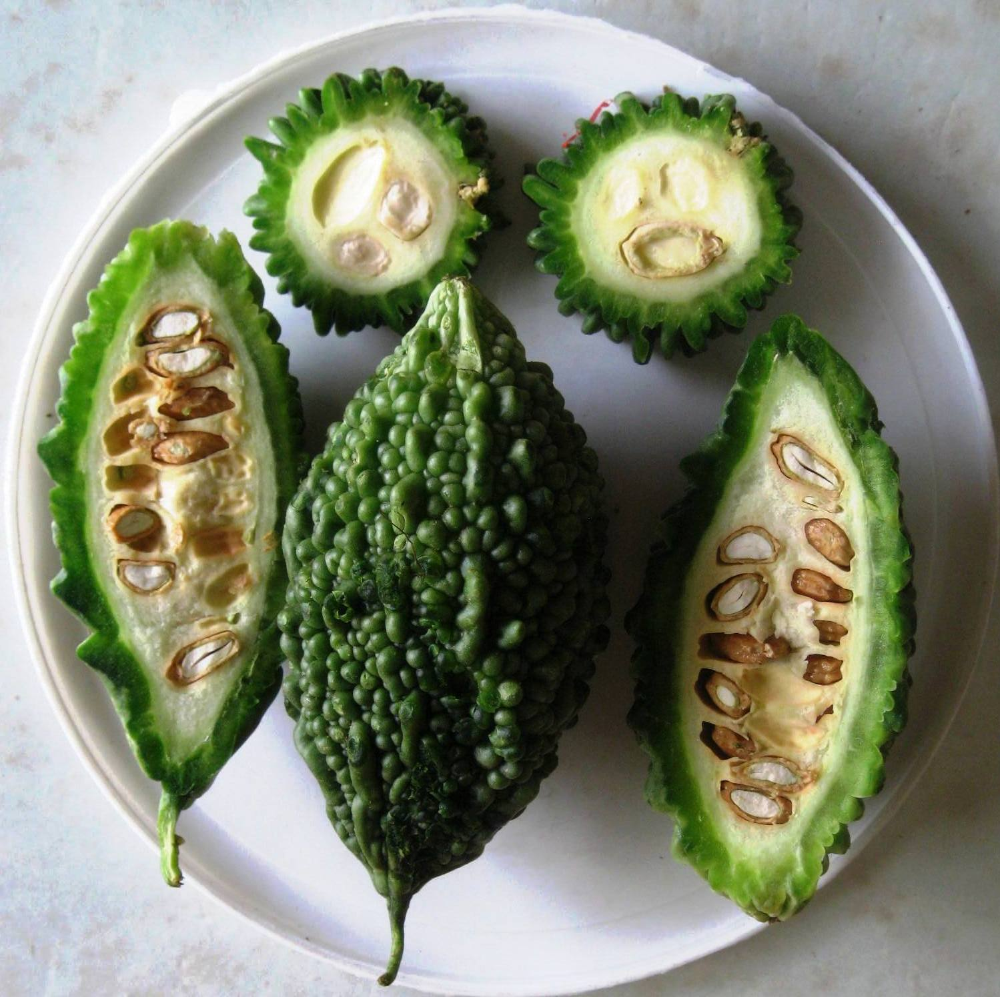

# Bitter Gourd

## General Information
**Generic name:** Bitter Gourd, Balsam pear
**Sri Lankan name:** Karawila (Sinhala)
**Scientific name:** _Momordica Charantia_
**Plant family:** _Cucurbitaceae_
**Edible parts:** Fruit
**Other uses:** Anti diabetic and anti cancer properties
**Nutrition value:** Bitter Gourd is rich in a number of important antioxidants. Half a cup of fresh bitter gourd accounts for about 43% of your recommended daily intake of vitamin C.

**Companion plants:**
- Green beans
- Peas
- Pumpkins
- Other summer squashes

**Non-companion plants:** Herbs

## Description:
A vining plant that grows much like cucumbers or melons in the hot summer sun. The vines of bitter gourd can grow upto 150 to 190 inches in length. Hence, it’s recommended to keep pruning the plant regularly and use a vertical support to save on space. The leaves of bitter gourds are prominently lobbed while the skin of the bitter gourds fruits are warty and highly ribbed. Under the skin, the flesh of bitter gourds is creamy white and firm.

## Planting requirements
**Planting season:** Year round cultivation can be allowed for suitable areas
**Maha season:** October to November
**Yala season:** April, May

### Planting conditions:
- Can be successfully cultivated up to above 1200m of the sea level.

| Propagation | Seeds |
|----|----|
| Planting Method | 6 kg of seeds required per 1 hectare. Nursery can be prepared with seeds directly placed in sand trays or beds. Plough the soil to 30 cm in depth and build small soil hills filled with compost and surface soil. Plant 3 seeds per hill at 2-3 cm depth for direct seeding. Plants can be transferred from nursery to field directly within 10 days. If more time is required, plants can be transferred to pots for another two weeks. |
| Soil | Well drained soil with more compost content and pH range from 5’5 – 7’5 is suitable. |
| Water | Good supply of water needed |
| Light | Minimum of 6 to 8 hours of sunlight per day |

### Growing conditions:

| Temperatures | Optimal temperatures are in the range of 24–27C Bitter gourds can tolerate temperatures up to 35°C but growth may be reduced. |
|----|----|
| Soil | Verticle trellising recommended to save space. Three weeks after planting the vines can be trained along a mesh or stakes. Trellis should be spaced at 1.5 m x 1 m. Lateral branches at lower parts of the plants can be pruned.|
| Water | Bitter Gourd likes a lot of water and humidity. The soil needs to be kept moist throughout the growing season, checking it more often in hot weather. Water whenever the surface soil dries out. Sufficient soil water content needs to be maintained throughout. Water lodging will damage the plants. It is suitable to use soil cover to protect soil moisture during dry periods. |

## Harvesting:
Bitter gourds will start fruiting within 55 to 60 days after sowing. Start harvesting bitter gourds once they are 4-5 inches in length and are of dark green colour. If the fruits are left to ripen on the vine longer than this, they will start changing colour to pale orange and become unpalatable. Snip bitter gourd fruits every 2-3 days with a sharp knife to promote new fruiting through the season.

## Curing:
Bitter Gourd does not require a curing process.

## Storage
Bitter gourds can be stored in the refrigerator for up to 2 weeks. Wrap them in a plastic bag and store in the crisper drawer.

## Protecting your plants
### Pest control
**Pest type:** 
- Fruit Fly

**Symptoms:** 
- **Fruit Fly:** The adult fly lays eggs in the flowers. The eggs hatch into maggots, which feed inside the fruits and causes rotting. 

**Control method:** 
- **Fruit Fly:** prevented by bagging the fruits and using fruit fly traps and pheromone traps

### Disease Control
**Disease type:** 
- Powdery mildew (_Podosphaera xanthii_)
- Downy mildew (_Pseudoperonospora cubensis_)
- Collar rot/Root rot (_Sclerotium spp._, _Fusarium spp._)
- Gummy Stem Blight (_Didymella bryoniae_)
- Bacterial wilt (_Ralstonia solanacearum_)
- Phytoplasma disease of cucurbits

Fungal diseases (Powdery mildew, Downy mildew), Bacterial wilt, Viral diseases (Leaf Curl Virus, Cucumber Mosaic Virus)

**Symptoms:** 
- **Powdery mildew:** The symptoms begin as pale yellow spots on older leaves, which expand as white, fluffy mycelium spreads across the leaf surface. Severely affected leaves turn brown, shrivel, and may eventually drop from the plant.
  
- **Downy mildew:** Angular yellow spots appear on the upper leaf surface, confined by the leaf veins. Over time, the leaves become chlorotic, eventually turning necrotic as plant cells die.
  
- **Collar rot/Root rot:** Initially, the plants exhibit temporary wilting symptoms, with yellowing leaves that lose turgidity and droop. Eventually, the plants die, and the vascular bundles in the collar region turn yellow or brown.

- **Gummy Stem Blight:**
  - **Lesions**: Start as spreading water-soaked areas on leaves and fruit.
  - **Chlorotic Halo**: These lesions may have a chlorotic halo and transition to light brown with irregular outlines.
  - **Fruit Damage**: Dark, cracked, sunken lesions develop on the fruit.
  - **Plant Collapse**: Plants may collapse due to sunken, girdling cankers.
  - **Stem Symptoms**: Spots on stems elongate into streaks, with gummy exudates from cracks.
  - **Fruiting Bodies**: Dark brown to black fruiting bodies (pycnidia) appear on fruit, stems, or leaves.

- **Bacterial wilt:**
  - **Sudden Drooping**: Leaves exhibit sudden drooping.
  - **Whole Plant Wilting**: The entire plant eventually wilts.
  - **Leaf Changes**: Leaves turn brown and dry out.
  - **Vascular Discoloration**: Vascular tissues show brown discoloration.
  - **Permanent Wilting**: The plant experiences permanent wilting.
    
- **Phytoplasma disease of cucurbits:**
  - Smaller, thickened, and yellowish-green leaves
  - Shortened internodes and stunted growth of plants
  - Witch's broom symptoms
  - Greening of flowers

**Management:**
- **Powdery mildew:** Destroy infected plant debris after harvest.
  
- **Downy mildew:** Destroy infected plant debris after harvest.

- **Collar rot/Root rot:** Destory infected plants. Improve drainage.

- **Gummy Stem Blight:** Crop debris should be ploughed deeply immediately after harvest to reduce fungus survival

- **Bacterial wilt:**
  - Destroy infected plants along with the soil.
  - Implement crop rotation using non-susceptible crops (e.g., okra, maize).
  - Practice mixed cropping with cruciferous crops.
  - Avoid moving equipment from infected fields to non-infected fields.
 
- **Phytoplasma disease of cucurbits:** Remove infected plants, control disease vectors (leaf hoppers)

## Difficulty Rating
### Low country wet zone (Difficulty: 6/10)
**Explanation:** Bitter gourds can be challenging to grow in the wet zone due to high humidity and rainfall, which can increase the risk of fungal diseases.

**Challenges/Adaptations:**
- Regularly monitor plants for signs of disease. Provide good air circulation by spacing plants appropriately and using trellises.

### Low country dry zone (Difficulty: 5/10)
**Explanation:** Bitter gourds can tolerate the dry zone's heat but require consistent watering to prevent stress.

**Challenges/Adaptations:**
- Mulch around plants to retain soil moisture. Water deeply and regularly, adjusting for temperature and rainfall.

### Mid country (Difficulty: 6/10)
**Explanation:** Bitter gourds can be grown in the mid country with proper care, but they may require protection from strong winds.

**Challenges/Adaptations:**
- Provide windbreaks or stake plants to protect them from strong winds. Ensure consistent water supply during dry periods.

### Up country (Difficulty: 7/10)
**Explanation:** Bitter gourds can be challenging to grow in the upcountry due to cooler temperatures and shorter growing seasons.

**Challenges/Adaptations:**
- Provide additional warmth by using black plastic mulch or row covers. Ensure consistent water supply, especially during flowering and fruiting stages.

## References for this entry
### Content Sources:
- [Sri Lankan Department of Agriculture](https://doa.gov.lk/hordi-crop-bitter-gourd/)
- [https://nhb.gov.in/pdf/vegetable/bittergourd/bit007.pdf](https://nhb.gov.in/pdf/vegetable/bittergourd/bit007.pdf)
