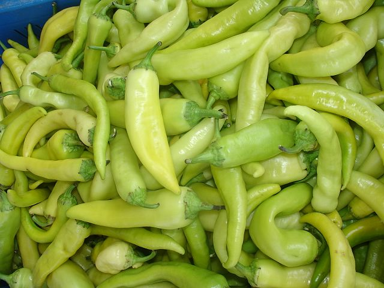

# Capsicum/Banana Pepper

## General Information
**Generic name:** Capsicum
**Sri Lankan name:** Maalu Miris (Sinhala)
**Scientific name:** _Capsicum annuum_
**Plant family:** _Solanaceae_
**Edible parts:** Fruit
**Nutrition value:** Banana peppers are excellent sources of Vitamin C, Vitamin A, Vitamin B6, Vitamin K, Potassium, Calcium and Folate. 

## Companion plants:
- Pepper plants make good neighbours for asparagus, basil, carrots, cucumbers, eggplant, endive, oregano, parsley, rosemary, squash, Swiss chard, and tomatoes

**Non-companion plants:**
- Avoid planting next to beans, brassicas, and fennel

## Description:
The banana pepper is a medium-sized member of the chili pepper family that has a mild, tangy taste. While typically bright yellow, it is possible for them to change to green, red, or orange as they ripen. It is often pickled, stuffed or used as a raw ingredient in foods. It is a cultivar of the species Capsicum annuum.

## Planting requirements
**Planting season:** 
- Yala season – April and May
- Maha season – November and December

It can be cultivated throughout the year under supplementary irrigation and also under rain shelters or greenhouses.

### Planting conditions:
| **Propagation** | Direct seeding or transplanting                                                           |
|----|----|
| Planting method | Direct seeding or transplanting. Seeds germinate in 8-10 days. Seedlings are ready to plant in 21 days |
| Soil | Grows well in well drained, deep and fertile loam soils. Sandy soils also good when required amount of organic matter added. pH value between 5.5 -6.8 is preferred. |
| Water | Irrigation to be practiced in 4-5 day intervals at early stages and 1 week interval at latter stages of the crop. This depends on the rainfall. Irrigation is required before and after fertilizer application, and during flowering and fruit development stages. Water regularly, especially during fruiting. |
| Light | Requires plenty of sunlight like other peppers |

### Growing conditions:

| Temperatures | Above 15 degrees and below 35 degrees celsius. |
|----|----|
| Soil | Grows well in well drained, deep and fertile loam soils. Sandy soils also good when required amount of organic matter added. pH value between 5.5-6.8 is preferred |
| Water | Irrigation to be practiced in 4-5 day intervals at early stages and 1 week interval at latter stages of the crop. This depends on the rainfall. Irrigation is required before and after fertilizer application, and during flowering and fruit development stages. |

## Harvesting:
First harvesting can be done 75 days after nursery sowing and at 5-7 day intervals. Thereafter in 7-10 picks during the crop growth. Practice harvesting in dry weather conditions.

## Curing:
Banana Pepper does not require a curing stage

## Storage
Banan peppers should be kept in a cool environment. Properly stored in the fridge, they last about one week.

## Protecting your plants
### Pest control
**Pest type:** 
- leaf beetles
- Caterpillars
- White flies

**Symptoms:** 
- **White flies:** Acts as vectors carrying 'leaf curl virus disease'

**Control method:** A wind barrier such as maize is recommended as a preventative action. Growing aromatic companion herbs can also serve as pest repellents.

Nurseries should be established in well-drained areas and areas where Solanaceae crops such as tomatoes, brinjals, and chillies are not grown in previous seasons. Avoid sowing too many seeds in the nursery (3m x 1m size bed-40g seeds are recommended). The diseased parts/plants should be removed and destroyed.

### Disease Control
**Disease type:** 
- Damping off (_Fusarium spp._, _Pythium spp._, _Rhizoctonia spp._, _Sclerotium spp._)
- Anthracnose (_Colletotrichum spp_)
- Bacterial wilt (_Ralstonia solanacearum_)
- Leaf curl virus disease
- Leaf spot disease (_Cercospora capsici._)
- Powdery mildew
- Choanephora blight

**Symptoms:**
- **Damping off:**
  - Seedlings may rot and die before they emerge from the soil or collapse after coming up, with soft, wet roots and dead plants scattered around.
- **Anthracnose:**
  - Leaves, stems, and flowers get discolored, flowers and pods fall, and small, round spots form on pods, leading to rot.
  - Severe cases cause plants to wither and die.
- **Bacterial wilt:**
  - Plants wilt in the heat, their leaves shred and fall, and they die quickly.
  - You can check for the disease by cutting a stem and seeing if it oozes bacteria in water.
- **Leaf curl virus:**
  - Leaves turn yellow with visible veins, the plant becomes stunted with small, curled leaves and small pods.
- **Leaf spot disease:**
  - Brown spots with yellow edges appear on leaves, which later turn yellow and drop.
  - It starts on older leaves and can spread to younger ones, especially in warm, humid conditions.
- **Powdery mildew:**
  - Pale yellow spots form on upper leaves.
  - Followed by white, powdery patches on the lower leaves that spread, causing the leaves to yellow and fall.
- **Choanephora blight:**
  - Dark spots appear on flowers and the tops of plants, spreading quickly and causing die-off and wet rot.
  - The infected areas turn grayish due to visible spores, and fruits often get infected near the calyx.

**Management:** 
- **Damping off:**
  - Nurseries should be set up in well-drained areas where tomatoes, brinjals, and chillies haven’t been grown before.
  - Rotate crops with non-host plants, sterilize nursery beds (e.g., by burning or solarization)
  - Avoid overcrowding seeds (40g per 3m x 1m bed).
  - Remove and destroy diseased plants along with the surrounding soil.
- **Anthracnose:**
  - Use resistant plant varieties and healthy seeds.
  - Keep fields clean by destroying crop residues and removing diseased plant parts.
  - Rotate crops with non-host plants every 2-3 years, improve field drainage, and maintain proper plant spacing.
  - Apply beneficial organisms like **Trichoderma spp.** and **Pseudomonas fluorescens**.
- **Bacterial wilt:**
  - Rotate crops with non-host plants, use wilt-resistant varieties, and remove and destroy infected roots, weeds, and plants along with the surrounding soil.
  - Avoid using water from infected fields for healthy ones, and improve field drainage.
- **Leaf curl virus:**
  - Ensure timely cultivation, set up wind barriers like maize, and destroy alternative host plants such as weeds.
- **Leaf spot disease:**
  - Collect and destroy all infected leaves for proper field sanitation.
  - To reduce high humidity, use recommended plant spacing and ensure good drainage.
  - Apply the recommended amount of organic fertilizers.
- **Powdery mildew:**
  - Maintain field sanitation
  - Use resistant varieties
  - Ensure good air circulation with proper spacing and weed control
  - Apply **Trichoderma spp.** to support plant health.
- **Choanephora blight:**
  - Maintain the recommended plant spacing
  - Promptly remove and destroy diseased shoots when symptoms appear.

## Difficulty Rating
### Low country wet zone (Difficulty: 6/10)
**Explanation:** Banana peppers require consistent moisture but are prone to fungal diseases in overly wet conditions.

**Challenges/Adaptations:**
- Fungal diseases can be a challenge. Ensure good air circulation and avoid overwatering.

### Low country dry zone (Difficulty: 4/10)
**Explanation:** The dry zone's hot, sunny climate is well-suited to banana peppers.

**Challenges/Adaptations:**
- Drought stress can be an issue. Ensure consistent watering.
  
### Mid country (Difficulty: 5/10)
**Explanation:** The mid country's varied climate requires careful attention to temperature and moisture levels.

**Challenges/Adaptations:**
- Temperature fluctuations can affect fruit set. Provide shade during peak heat hours if necessary.
  
### Up country (Difficulty: 8/10)
**Explanation:** The upcountry's cooler temperatures and higher rainfall make growing banana peppers more challenging.

**Challenges/Adaptations:**
- Cooler temperatures can slow growth. Provide additional warmth with row covers or black plastic mulch.

## References for this entry
### Content Sources:
-

### Image Sources: (In order of appearance)
- 
