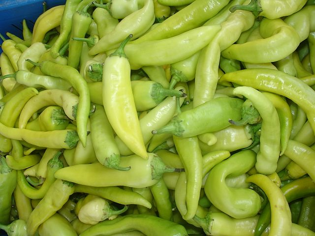

# Capsicum/Banana Pepper

## General Information
**Generic name:** Capsicum annuum 'Banana'
**Sri Lankan name:** Maalu Miris (Sinhala)
**Scientific name:** Capsicum annuum
**Plant family:** Solanaceae
**Edible parts:** Fruit
**Other uses:** NA

## Companion plants:
- Pepper plants make good neighbours for asparagus, basil, carrots, cucumbers, eggplant, endive, oregano, parsley, rosemary, squash, Swiss chard, and tomatoes

**Non-companion plants:**
- Avoid planting next to beans, brassicas, and fennel

## Description:
The banana pepper is a medium-sized member of the chili pepper family that has a mild, tangy taste. While typically bright yellow, it is possible for them to change to green, red, or orange as they ripen.[1] It is often pickled, stuffed or used as a raw ingredient in foods. It is a cultivar of the species Capsicum annuum.

## Planting requirements
**Planting season:** 
- Yala season – April and May
- Maha season – November and December

It can be cultivated throughout the year under supplementary irrigation and also under rain shelters or greenhouses.

### Planting conditions:
| **Propagation** | Direct seeding or transplanting                                                                                                                                                                                                                                                                                                        |
|-----------------|----------------------------------------------------------------------------------------------------------------------------------------------------------------------------------------------------------------------------------------------------------------------------------------------------------------------------------------|
| Planting method | Direct seeding or transplanting. Seeds germinate in 8-10 days. Seedlings are ready to plant in 21 days                                                                                                                                                                                                                                 |
| Soil            | Grows well in well drained, deep and fertile loam soils. Sandy soils also good when required amount of organic matter added. pH value between 5.5 -6.8 is preferred. Plough the field up to 15-20 cm depth. Raised beds have to be prepared for better drainage.Soil should be well-drained and fertile with a pH between 5.5 and 7.0. |
| Water           | Irrigation to be practiced in 4-5 day intervals at early stages and 1 week interval at latter stages of the crop. This depends on the rainfall. Irrigation is required before and after fertilizer application, and during flowering and fruit development stages. Water regularly, especially during fruiting.                        |
| Light           | Requires plenty of sunlight like other peppers                                                                                                                                                                                                                                                                                         |

### Growing conditions:

| Temperatures | Above 15 degrees and below 35 degrees celsius. Optimal temperature for growth is between 20-30°C.<update>The ideal temperature range for banana pepper plants is between 20°C to 30°C.</update> |
|----|----|
| Soil | Grows well in well drained, deep and fertile loam soils. Sandy soils also good when required amount of organic matter added. pH value between 5.5 -6.8 is preferred |
| Water | Irrigation to be practiced in 4-5 day intervals at early stages and 1 week interval at latter stages of the crop. This depends on the rainfall. Irrigation is required before and after fertilizer application, and during flowering and fruit development stages. |
| Propagation | Direct seeding or transplanting |

## Harvesting:
First harvesting can be done 75 days after nursery sowing and at 5-7 day intervals. Thereafter in 7-10 picks during the crop growth. Practice harvesting in dry weather conditions<update>Harvest banana peppers when they are fully ripe but still firm.</update>

## Curing:
NA

## Storage
NA

## Protecting your plants
### Pest control
**Pest type:** Peppers are susceptible to a number of pests and diseases including, leaf beetles, caterpillars, white flies, damping off and leaf curl virus.

**Symptoms:** NA

**Control method:** A wind barrier such as maize is recommended as a preventative action. Growing aromatic companion herbs can also serve as pest repellents.<update>Use organic pesticides like neem oil or soap sprays to control pests.</update>

Nurseries should be established in well-drained areas and areas where Solanaceae crops such as tomatoes, brinjals, and chillies are not grown in previous seasons. Avoid sowing too many seeds in the nursery (3m x 1m size bed-40g seeds are recommended). The diseased parts/plants should be removed and destroyed.

### Disease Control
**Disease type:** NA

**Symptoms:** NA

**Management:** NA

## Difficulty Rating
### Low country wet zone (Difficulty: **Medium**/10)
**Explanation:** Banana peppers require consistent moisture but are prone to fungal diseases in overly wet conditions.

**Challenges/Adaptations:**
- <update>Fungal diseases can be a challenge. Ensure good air circulation and avoid overwatering.</update>
### Low country dry zone (Difficulty: **Easy**/10)
**Explanation:** The dry zone's hot, sunny climate is well-suited to banana peppers.

**Challenges/Adaptations:**
- <update>Drought stress can be an issue. Ensure consistent watering.</update>
### Mid country (Difficulty: **Medium**/10)
**Explanation:** The mid country's varied climate requires careful attention to temperature and moisture levels.

**Challenges/Adaptations:**
- <update>Temperature fluctuations can affect fruit set. Provide shade during peak heat hours if necessary.</update>
### Up country (Difficulty: **Hard**/10)
**Explanation:** The upcountry's cooler temperatures and higher rainfall make growing banana peppers more challenging.

**Challenges/Adaptations:**
- <update>Cooler temperatures can slow growth. Provide additional warmth with row covers or black plastic mulch.</update>

## References for this entry
### Content Sources:
- <update>[Banana Pepper](https://www.growveg.com/uk/plants/capsicum-banana-pepper)</update>

### Image Sources: (In order of appearance)
-  *Image - Narek75, Wikimedia Commons*