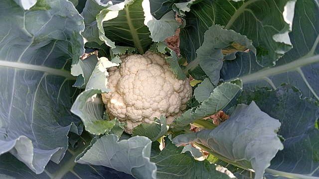

# Cauliflower

## General Information
**Generic name:** Cauliflower
**Sri Lankan name:** Mal Gowa (Sinhala) | Pūkkōcu (Tamil)
**Scientific name:** _Brassica oleracea var. botrytis_
**Plant family:** _Brassicaceae_
**Edible parts:** The partially developed flower structures (head/curd)
**Nutrition value:** High in vitamin C and K, and folate. A 100g serving provides approximately 25 calories
**Companion plants:**
- Beets
- Broccoli
- Brussels sprouts
- Chard
- Spinach
- Radish
**Non-companion plants:**
- Pepper
- Squash
- Strawberry
- Tomato

## Description
The plant consists of a thick stem surrounded by leaves on top of which the curd grows. They are annual plants that reach about 0.5 metres in height. Cauliflower plants develop a central main flower head (curd), which can weigh from 0.5 kg to over 2.5 kg. Commercially, white cauliflower is the most common, though orange, purple, green, and brown cultivars also exist. The plants produce cross-shaped yellow flowers and bear seeds in dry capsules known as siliques.

Ideally suited for cool weather and requires consistent temperatures of about 16 °C (60 °F) to produce heads. However, can be grown in all agro-climatic zones with certain varieties which can be grown in upland, lowland, and intermediate zones in Sri Lanka. Cauliflower is adaptable to all agro-ecological zones in Sri Lanka, including the upcountry, low country, and intermediate zones. The ideal temperature for growth ranges from 10°C to 20°C, making the cooler upcountry regions particularly suitable for this crop.

## Planting requirements

**Planting season:**
- Mid country wet zone – January to February and November to December
- Up country wet zone – January to March and October to December
- Up country intermediate zone – January to February and November to December

### Planting conditions
| Propagation | Propagation from root-shoot cuttings is recommended to be the most efficient method |
|----|----|
| Planting method | Plant seed shallowly, one-fourth to one-half inch deep, dropping a seed every 40 cm. There should be a distance of 40-50 cm between rows. When planting in a field, it is recommended to turn the soil 30-40 cm deep, then level the soil in preparation. Seedlings of 3-4 week maturity should then be replanted in raised beds or rows |
| Soil | Requires moist nitrogen-rich soil and will produce only small heads if stressed with drought. Well-drained yet moisture-retentive, fertile soil with a pH of 6 to 6.8 ideal. Soil with clay loam and slit is recommended for high yield |
| Water | Water daily until seedlings are established. After establishment, water every two days for two weeks, then adjust based on rainfall |
| Light | Cauliflower should be grown in a spot that gets good sun light (6 to 8 hours of sunlight per day). Lack of sunlight may produce thin, leggy plants and subpar heads. However, young plants shoud be provided with shade to protect from high temperatures |

### Growing conditions
| Temperatures | Shade should be provided to prevent wilting of young plants. Banana leaves can be used for coverage. When the inflorescences begin to form, the flower should be covered by the cauliflower leaves so as to block direct sunlight. A temperature of 10 to 21°C is required. Exposure to high temperatures produces poor-quality curds |
|----|----|
| Soil | Firm, heavy, and moist soil is best |
| Water | Once the seedlings have taken root, water twice a day for two weeks. Following which water is in consideration of rainfall. If the plants do not receive consistent rainfall or irrigation, they will have poor texture and may develop a strong “off” flavor.  If the planting does not receive one inch of rain each week, soak the soil thoroughly at least once a week |
| Pruning | No pruning required |
| Weed control | Hand weeding should be done at 2 and 4 weeks after planting |

## Harvesting
Can be harvested within 90-110 days after planting. Variations in this timeline can be experienced on the basis of climatic zones/plant variety. Harvest cauliflower when heads reach usable size before the flower buds open. Cut the head above ground level and remove the leaves wrapped around the head. If you leave curds on the plant for too long, they will become loose.

## Curing
Cauliflower does not require a curing stage.

## Storage
Refrigerate washed and dried cauliflower in an airtight freezer bag.

## Protecting your plants
### Pest control

**Pest type:** 
- **Cabbage looper / Looper caterpillar (_Chrysodexis eriosoma_):** are known to attack all cruciferous plants throughout their growth cycle. This pest can cause significant damage to cruciferous crops if left unchecked, potentially leading to reduced yield and crop quality. 

- **Diamond black moth (_Plutella xylostella_):** The larva is a small, green colour surface feeder. When disturbed, larvae quickly retreat by wriggling backward or dropping on silk threads, either suspending themselves or landing on lower leaves.

- **Black worm (_Agrotis spp_):** Habitually nocturnal. 

**Symptoms:** 
- **Cabbage looper / Looper caterpillar:** Presence of larval excrement at the base of leaves, Creation of large, irregular holes on the underside of leaves. In severe infestations, complete consumption of leaves. Skeletonization of leaves in extreme cases.

- **Diamond black moth:** It feeds on the leaves from the under surface leaving a papery epidermis intact. 

- **Black worm:** In early stages makes round holes in leaves. In adulthood, these pests chew the base of the plant stems and can drag parts of the sapling plants underground.
  
**Control method:**
- **Cabbage looper / Looper caterpillar:** Indian mustard (Brassica juncea) plants can be used as trap crops. Regular monitoring of plants and handpicking larvae from crops soon as it is identified.

- **Diamond black moth:** Lacewing insects feed on eggs and young larvae. Proper irrigation and rainfall can help eliminate larvae. Regular monitoring of plants is required.

- **Black worm:** Regular monitoring of plants and handpick larvae from crops soon as it is identified. Plough the soil deeply to bring the larvae and pupa to the surface of the soil. Encourage predatory birds during soil tillage.

### Disease Control

**Disease type:** 
- **Club root:** Swollen and distorted club-shaped galls form on main lateral roots. This can completely destroy the crop.

- **Damping-Off Diseases:** This includes Black rot, Bacterial soft rot, Downy mildew. These diseases mainly take hold after long humid rains when the plants cannot dry out properly.

**Symptoms:**
- **Club root:** Leaves turn pale yellow or pink while wilting.
  
- **Damping-Off Diseases:** Black rot: V-shaped yellow-brown patches on outer leaves, V-tip pointing to leaf vein. Soft rot: Outer leaves wilt; soft, cottony mold develops underneath. Downy mildew: Light green spots on leaves, quickly browning and multiplying.

**Management:**
- **Club root:** Use healthy seeds for propagation. Use clean planting materials. Add lime to increase soil pH levels. Weed control. Destroy infected plants by burning plants and soil.
  
- **Damping-Off Diseases:** Use healthy seeds for propagation. Use clean planting materials. Keep proper space between plants. Frequent monitoring and weed control. Destroy infected plants. 

## Difficulty Rating

### Low country wet zone (Difficulty: 7/10)
**Explanation:** Cauliflower can be challenging to grow in the low country wet zone due to high temperatures and humidity, which can lead to poor quality curds.
**Challenges/Adaptations:**
- Provide shade for young plants

### Low country dry zone (Difficulty: 5/10)
**Explanation:** The low country dry zone has suitable temperatures for cauliflower growth, but proper water management is crucial.
**Challenges/Adaptations:**
- Ensure consistent irrigation or rainfall
- Apply ash to adjust soil pH if necessary

### Mid country (Difficulty: 4/10)
**Explanation:** The midcountry has suitable conditions for cauliflower cultivation with moderate temperatures and adequate rainfall.
**Challenges/Adaptations:**
- Monitor plants for pests and diseases
- Provide shade for young plants if necessary

### Up country (Difficulty: 2/10)
**Explanation:** The upcountry can have the ideal cold climate for growing cabbages.
**Challenges/Adaptations:**
- Ensure proper soil preparation and fertilization

## References for this entry
### Content:
https://doa.gov.lk/hordi-crop-cauliflower/
https://www.epicgardening.com/growing-cauliflower/
https://www.harti.gov.lk/images/download/reasearch_report/new1/179.pdf
https://content.ces.ncsu.edu/weed-management-in-broccoli-cabbage-and-cauliflower
### Image Sources: (In order of appearance)
