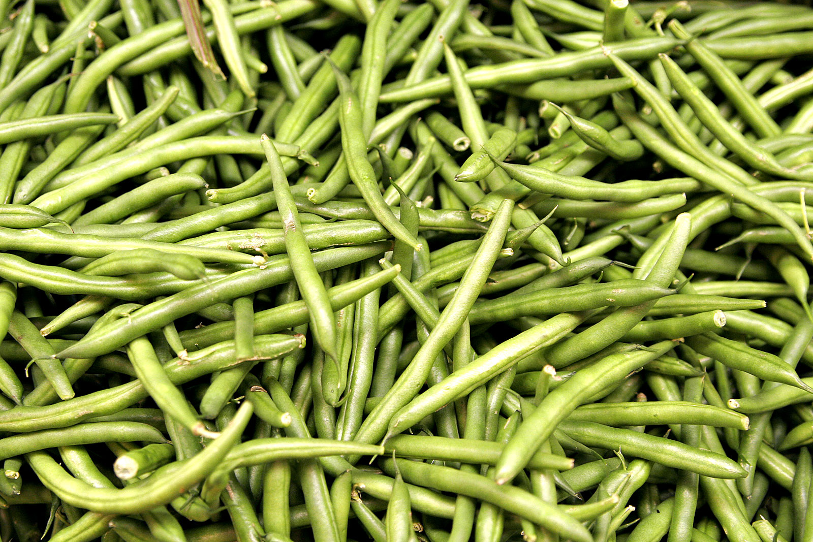

# Green Beans

## General Information
**Generic name:** Green Bean, common bean, french bean, snap bean, string bean
**Sri Lankan name:** Bonchi
**Scientific name:** _Phaseolus vulgaris L._
**Plant family:** Fabaceae
**Edible parts:** Immature pods
**Nutrition value:** High in fiber, vitamin C, and several B vitamins. They are also a good source of minerals like iron, magnesium, potassium, and zinc.
**Companion plants:**
- Broccoli
- Brussels sprouts
- Cabbage
- Carrots
- Cauliflower
- Celery
- kale
- Peas
- Squash
- Strawberries
- Swiss chard
- Tomatoes
  
**Non-companion plants:**
- Beets
- Onion family
- Peppers

## Description:
Green beans, also called "string beans" or "snap beans," are tender annuals. Though most green beans are indeed green, they also come in purple, red, yellow, and streaked varieties. Their growing style is classified as "bush" or "pole." Bush beans grow compactly while Pole beans grow as climbing vines. <update>In Sri Lanka, both types are cultivated, with pole beans being particularly popular in home gardens.</update>

## Planting requirements
- Grows in warm climates
  
**Planting season:** Year-round in most parts of Sri Lanka, with the best seasons being March-April (Yala) and November-December (Maha)

### Planting conditions:
| Propagation | Propagation through seeds|
|----|----|
| Planting method | Sow bush beans 1 inch deep and 2 inches apart in rows 18 inches apart. Sow pole beans 1 inch deep, placing them around supports |
| Soil | Need a well-drained loamy soil that has been improved by compost and a pH of about 6.5. Incorporating compost when digging the soil is better. Better to prepare the soil about a week before planting. Avoid using high nitrogen fertilizer. |
| Water | Need to keep the beans well watered otherwise they will stop flowering. |
| Light | Needs full sunshine for most part of the day. |

### Growing conditions:
| **Temperatures** | Thrives in temperatures between 18°C to 30°C, which is common in most parts of Sri Lanka |
|----|----|
| Soil | Keep the bed well-weeded and the soil loose. Mulch soil around bean plants to retain moisture but keep it well drained. Beans have shallow roots, so mulch keeps them cool. Better to use a drip irrigation system. |
| Water | Water regularly, about 2 inches per square foot per week. Better to water them on a sunny day so that foliage will not remain soaked, which could encourage disease. |
| Pruning | Pinching off the tips of plants after they have produced pods can encourage further production. |
| Weed control | Hand-pull weeds or use organic herbicides to keep weeds at bay. |

## Harvesting:
Days to harvest range from 50 to 70 days. Green beans are picked young and tender before the seeds inside have fully developed.

## Curing:
Green beans do not require a curing stage.

## Storage
Store green beans in a plastic bag in the refrigerator crisper drawer for up to 7 days (the plastic bag ensures moisture retention). For longer storage, blanch beans in boiling water for 3 minutes and cool in ice water for 3 minutes. Drain and package to keep in the freezer.

## Protecting your plants
### Pest control
**Pest type:** 
- Bean fly (_Ophiomyia phaseoli_)
- Mites (_Tetranychus urticae_)
- Thrips (_Thrips spp_)
- Whiteflies (_Bemisia tabaci_)
- Aphids (_Aphis spp_)
- Pod borers (_Maruka vitrata_)

**Symptoms:** Above pests can damage plants and pods during the growth period.

**Control method:** 
- Use row covers
- Destroy crop residue
- Crop rotation
- Use neem-based insecticides

### Disease Control
**Disease type:** 
- Anthracnose (_Coletotrichum lindemuthianum_)
- Rust (_Uromyces appendiculatus_)
- Angular leaf spot	(_Phaeoisariopsis griseola_)
- Root rot (_Fusarium oxysporum_, _Fusarium solani_)
- Bean Common Mosaic Virus (BCMV)
- Bean Yellow Mosaic Virus (BYMV)
- Bean Golden Mosaic Virus (BGMV)
- Horsegram Yellow Mosaic Virus (HYMV)

**Symptoms:** 
- Four virus diseases are common in bean cultivation (Bean Common Mosaic Virus, Bean Yellow Mosaic Virus, Bean Golden Mosaic Virus, Horsegram Yellow Mosaic Virus). Viral-infected leaves turn into yellow/golden color.

**Management:** 
- Fungal diseases are very common in the rainy season and difficult to manage without fungicides. Use recommended fungicides to control these diseases.
- Remove and destroy infected plants as soon as possible to prevent disease from spreading.
- Control vector insects to limit viral infections.

## Difficulty Rating
### Low country wet zone (Difficulty: 6/10)
**Explanation:** Green beans can be challenging in the wet zone due to high humidity and potential fungal diseases.
- **Challenges/Adaptations:**
  - Provide good air circulation around plants, use disease-resistant varieties, and avoid overhead watering.
  - Use raised beds to improve drainage and consider plastic mulch to reduce soil splash.
    
### Low country dry zone (Difficulty: 4/10)
**Explanation:** Green beans grow well in the dry zone with adequate irrigation.
- **Challenges/Adaptations:**
  - Ensure consistent moisture, protect from strong winds, and provide shade during peak heat hours.
  - Use mulch to conserve soil moisture and consider drip irrigation for efficient water use.

### Mid country (Difficulty: 5/10)
**Explanation:** Green beans can be moderately challenging in the mid-country due to varying temperatures and potential pests.
- **Challenges/Adaptations:**
  - Monitor for pests, maintain consistent moisture, and provide some shade during peak heat hours.

### Up country (Difficulty: 7/10)
**Explanation:** Green beans can be challenging in the up-country due to cooler temperatures and potential frost damage.
- **Challenges/Adaptations:**
  - Provide protection from frost, ensure adequate sunlight, and maintain consistent moisture.
  - Consider using row covers to extend the growing season and protect from unexpected cold snaps.

## References for this entry
### Content Sources:
### Image Sources: (In order of appearance)
