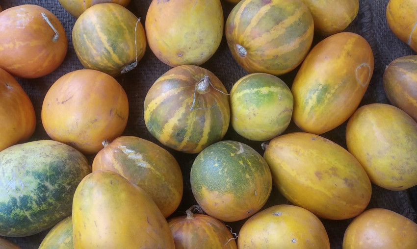

# Kekiri

## General Information
**Generic name:** Kekiri, Cooking Melon
**Sri Lankan name:** Kekiri, Gonkekiri (Sinhala) | Karkati, Madhuphala, Vrittakarkatii (Tamil)
**Scientific name:** _Cucumis melo_
**Plant family:** _Cucurbitaceae_
**Edible parts:** Fruit
**Nutrition value:** High in vitamin C, with very little else, making it great for a low-calorie diet.

**Companion plants:** 
- Nasturtiums
- Marigolds
- Beans
- Corn
- Radishes
- Sunflowers
- Oregano
- Borage

**Non-companion plants:** 
- Cucumbers
- Other Melons
- Potatoes
- Fennel
- Pumpkins
- Squash
- Honeysuckle

## Description:
Annual climbing plant with woody rootstock covered in stiff hair or bristles. Monoecious flowers, yellow petals approximately 2.5 cm (1 inch) in diameter. Leaves 3 to 6 inches across, rounded to egg-shaped or nearly kidney-shaped, often five-angled, sometimes shallowly three- to seven-lobed, wavy-toothed, hairy to somewhat rough. Kekiri draws bees, and therefore is helpful for attracting pollinators to the garden.

The fruit is a fleshy, edible berry (botanically known as a pepo), varying in shape from spherical to oblong, depending on the cultivar. The size, color, and flavor can vary significantly:

- Rind: May be green, yellow, tan, beige, or white, with a surface that can be smooth, rough, warty, scaly, or netted.
- Flesh: Ranges from pale green to orange, with a soft, juicy texture.
- Flavor: Often sweet and aromatic, with a characteristic musky scent when ripe.
- Seeds: cream-colored,embedded in the center of the fruit.

As a food, Kekiri is versatile. The flesh has a delicate, sometimes watery flavor: it can be eaten fresh, used in salads, or served as a dessert. Immature fruits can be used similarly to cucumbers.

## Planting requirements
**Planting season:** Can be grown year round

### Planting conditions:
| Propagation | Seeds |
|----|----|
| Planting method | Seeds are planted in 30cm³ holes filled with decomposed organic matter and topsoil, leaving 10cm unfilled. Plant 3-4 seeds per hole, with 1m spacing between rows and plants. After 2 weeks, thin to the two strongest seedlings per hole. One gram contains 90-100 seeds |
| Soil | Plough the soil to a depth of 20-30 cm and crush the larger particles to a slightly rougher texture |
| Water | It is necessary to irrigate daily until the seeds germinate |
| Light | Minimum 6 hours of sunlight daily |

### Growing conditions:
| Temperatures | 30 – 35°C |
|----|----|
| Soil | It can be grown  with a wide range of soil types and is best suited for well drained soils containing more organic matter. The pH value of the soil range should be between 5.5 – 7.5 |
| Water | Watering every 3-4 days is sufficient depending on the requirement and climatic conditions. Unnecessary irrigation can cause vines and seed rotting |
| Pruning | Remove excess vines to promote fruit development |
| Weed control | Control weeds in early stages |

## Harvesting:
Harvest mature fruit by cutting stalk with a sharp knife.

## Curing
Kekiri does not require a curing stage.

## Storage
For optimal quality and flavor, whole Kakiri should be consumed immediately after harvesting. If not eaten right away, they can be stored in the refrigerator.

## Protecting your plants
### Pest control
**Pest type:**
- Red Pumpkin Beetle (Raphidopalpa foveicollis)
- Melon Worm (Diaphania hyalinata)
- Leaf Miner Fly (Liriomyza trifolii)
- Melon Thrips (Thrips palmi)

**Symptoms:**
- **Red Pumpkin Beetle:** Severe damage on leaves and stems, primarily affecting young foliage; leaves become ragged with signs of feeding
- **Melon Worm:** Serpentine mines in leaves; wilting and reduced vigor in plants
- **Leaf Miner Fly:** Serpentine mines on leaves; affected leaves may turn yellow and drop prematurely
- **Melon Thrips:** Leaves exhibit yellowing, mottling, and bronzing due to sap-sucking activity

**Control method:**
- **Red Pumpkin Beetle:** Maintain field sanitation; apply recommended insecticides; hand-pick adult beetles when possible
- **Melon Worm:** Use insecticides targeting caterpillars; maintain crop rotation to disrupt the lifecycle
- **Leaf Miner Fly:** Implement insecticide applications; promote beneficial insects that prey on leaf miners
- **Melon Thrips:** Use insecticidal sprays; monitor for thrip populations regularly

### Disease Control

**Disease type:**
- Downy Mildew (Pseudoperonospara cubensis)
- Powdery Mildew (Erysiphe spp.)
- Charcoal Rot (Macrophomina phaseolina)
- Cucumber Mosaic Virus (CMV)

**Symptoms:**
- **Downy Mildew:** Initial yellow patches on leaves progress to brown lesions; white fluffy growth may appear on the undersides of affected leaves
- **Powdery Mildew:** White powdery spots develop on older leaves, leading to yellowing and eventual leaf drop
- **Charcoal Rot:** Yellowing leaves; water-soaked lesions at the soil line; amber gummy exudate from stems
- **Cucumber Mosaic Virus:** Mottling of leaves; stunted growth; distorted fruits; can lead to significant yield losses

**Management:**
- **Downy Mildew:** Apply fungicides such as Mancozeb or Metalaxyl; ensure good air circulation; practice crop rotation
- **Powdery Mildew:** Use fungicides like Mancozeb or Captan; remove infected plant debris; maintain proper spacing for airflow
- **Charcoal Rot:** Rotate crops every two years; remove infected plant debris promptly; apply appropriate fungicides
- **Cucumber Mosaic Virus:** Remove infected plants immediately; control aphid populations that spread the virus; use resistant varieties if available

## Difficulty Rating
### Low country wet zone (Difficulty: 5/10)
**Explanation:** The warm, humid conditions of the low country wet zone can support Kekiri growth, but excess moisture may pose challenges.
**Challenges/Adaptations:**
- Requires well-draining soil to prevent waterlogging
- Higher risk of fungal diseases due to humidity; regular monitoring needed
- Implement raised beds or mounds for better drainage
- Use disease-resistant varieties when possible

### Low country dry zone (Difficulty: 2/10)
**Explanation:** The warm climate of the low country dry zone is more suitable for Kekiri, as it prefers warm, sunny conditions.
**Challenges/Adaptations:**
- Requires consistent irrigation, especially during dry spells
- Mulching is essential to retain soil moisture
- Provide support structures like trellises for climbing

### Mid country (Difficulty: 3/10)
**Explanation:** The moderate climate of the mid country provides favorable conditions for Kekiri cultivation.
**Challenges/Adaptations:**
- May require some irrigation during dry periods
- Basic pest and disease monitoring
- Attention to proper spacing and pruning for optimal growth
- Ensure full sun exposure (6 or more hours daily)

### Up country (Difficulty: 6/10)
**Explanation:** Kekiri can be grown in the up country up to 1000m, but cooler temperatures and shorter growing seasons present challenges.
**Challenges/Adaptations:**
- Longer growing season due to cooler temperatures
- May require protection from frost in some areas during colder months
- Careful management of soil moisture to prevent waterlogging in higher rainfall areas
- Selection of varieties better suited to cooler climates may be necessary
- Consider using polytunnels or row covers to extend the growing season

## References for this entry
### Content Sources:
- https://doa.gov.lk/hordi-crop-kekiri/
- http://www.instituteofayurveda.org/plants/plants_detail.php?i=362
- https://plants.ces.ncsu.edu/plants/cucumis-melo/
- https://fdc.nal.usda.gov/fdc-app.html#/food-details/169092/nutrients
- https://greg.app/cantaloupe-companion-plants/
- https://specialtyproduce.com/produce/Sri_Lanka_Kakiri_Cucumbers_23831.php
