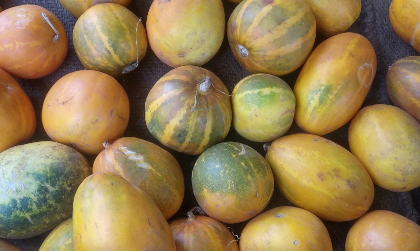

# Kekiri/Cooking Melon

## General Information
**Generic name:** Cantaloupe, Hondeydew melon
**Sri Lankan name:** Kekiri/Gonkekiri (Sinhala), Karkati/Madhuphala/Vrittakarkatii (Tamil)
**Scientific name:** Cucumis melo
**Plant family:** Cucurbitaceae
**Edible parts:** Fruit
**Nutrition value:** High in vitamin C, with very little else, making it great for a low-calorie diet.
**Other uses:** Kekiri draws bees, and therefore is helpful for attracting pollinators to the garden. In ayurveda, kekiri is often recommended for a variety of ailments, from headaches to jaundice to constipation.

**Companion plants:**
<update>Beans, peas, corn, and okra</update>
**Non-companion plants:**
<update>Potatoes and cucumbers</update>

## Description:

Annual climbing plant with woody rootstock covered in stiff hair or bristles. Monoecious flowers, yellow petals approximately 2.5 cm (1 inch) in diameter. Leaves 3 to 6 inches across, rounded to egg-shaped or nearly kidney-shaped, often five-angled, sometimes shallowly three- to seven-lobed, wavy-toothed, hairy to somewhat rough. 

The fruit is a fleshy, edible berry (botanically known as a pepo), varying in shape from spherical to oblong, depending on the cultivar. The size, color, and flavor can vary significantly:

- Rind: May be green, yellow, tan, beige, or white, with a surface that can be smooth, rough, warty, scaly, or netted.
- Flesh: Ranges from pale green to orange, with a soft, juicy texture.
- Flavor: Often sweet and aromatic, with a characteristic musky scent when ripe.
- Seeds: cream-colored,embedded in the center of the fruit.

As a food, Kekiri is versatile:
- The flesh has a delicate, sometimes watery flavor: it can be eaten fresh, used in salads, or served as a dessert.
- Immature fruits can be used similarly to cucumbers.

## Planting requirements
- Kekiri grows from seed successfully in a tropical climate. The crop can be easily grown up to 1000 m above sea level.
- The fruit in this species varies by cultivar in terms of shape, size, rind, texture, flavor, and flesh color.
- 
**Planting season:** Year round

### Planting conditions:
| **Propagation** | Seeds                                                                                                                                                                                                                                                                                                                                                                                                                                                                                                                      |
|-----------------|----------------------------------------------------------------------------------------------------------------------------------------------------------------------------------------------------------------------------------------------------------------------------------------------------------------------------------------------------------------------------------------------------------------------------------------------------------------------------------------------------------------------------|
| Planting method | One gram of seeds contains 90 – 100 seeds. When planting inter row spacing and the intra row spacing of 1.0m is recommended. The planting holes are prepared as 30cm3 (length, width and depth) and the holes are filled with a large amount of decomposed organic matter and mixed with the topsoil. It is filled up to a 10 cm height. Plant about 3-4 seeds in prepared pits. At 2 weeks of emerging, remove weak seedlings allowing two healthy seedlings to grow |
| Soil            | Plough the soil to a depth of 20-30 cm and crush the larger particles to a slightly rougher texture.                                                                                                                                                                                                                                                                                                                                                                                                                       |
| Water           | It is necessary to irrigate daily until the seeds germinate.                                                                                                                                                                                                                                                                                                                                                                                                                                                               |
| Light           | Minimum 6 hours of sunlight daily                                                                                                                                                                                                                                                                                                                                                                                                                                                                                          |

### Growing conditions:
| **Temperatures** | 30 – 35°C                                                                                                                                                                    |
|------------------|------------------------------------------------------------------------------------------------------------------------------------------------------------------------------|
| Soil             | It can be grown  with a wide range of soil types and is best suited for well drained soils containing more organic matter. The pH value of the soil range between 5.5 – 7.5. |
| Water            | Watering every 3-4 days is sufficient depending on the requirement and climatic conditions. Unnecessary irrigation can cause vines and seed rotting.                         |
| Pruning          | Remove excess vines to promote fruit development                                                                                                          |
| Weed control     | Control weeds in early stages                                                                                                                                                |

## Harvesting:
Harvest mature fruit by cutting stalk with a sharp knife. Yield figures from the Department of Agriculture suggest a lower bound of 8,000 kgs per acre; so roughly 2 kg per square meter. 

## Protecting your plants

### Pest control
**Pest type:** Cucumber beetles, melon fly, aphids, white fly
**Symptoms:** Damage to leaves, fruits, and vines; stunted growth
**Control method:** Maintain field sanitation, use good quality seeds, mulching recommended. Also consider using organic pesticides like neem oil or soap sprays for aphids and white flies. Use fruit fly traps and pheromone lures for melon fly control. Implement crop rotation to reduce pest buildup.

### Disease Control
**Disease type:** Powdery mildew, downy mildew, cucumber wilt, gummy stem blight, anthracnose
**Symptoms:** Powdery mildew: White powdery spots on leaves and stems. Downy mildew: Yellow spots on upper leaf surfaces, fuzzy gray growth on undersides. Wilt: Yellowing and wilting of leaves, stunted growth.
**Management:** Regularly monitor plants for signs of disease. For powdery and downy mildew, improve air circulation and avoid overhead watering. Apply fungicides if necessary. For wilt diseases, practice crop rotation, use disease-resistant varieties, and remove infected plants immediately. Maintain proper soil drainage and avoid overwatering to prevent all these diseases.

## Difficulty Rating

### Low country wet zone (Difficulty: 5/10)
**Explanation:** The warm, humid conditions of the low country wet zone can support Kekiri growth, but excess moisture may pose challenges.
**Challenges/Adaptations:**
- Requires well-draining soil to prevent waterlogging
- Higher risk of fungal diseases due to humidity; regular monitoring needed
- Implement raised beds or mounds for better drainage
- Use disease-resistant varieties when possible

### Low country dry zone (Difficulty: 4/10)
**Explanation:** The warm climate of the low country dry zone is suitable for Kekiri, as it prefers warm, sunny conditions.
**Challenges/Adaptations:**
- Requires consistent irrigation, especially during dry spells
- Mulching is essential to retain soil moisture
- Provide support structures like trellises for climbing

### Mid country (Difficulty: 3/10)
**Explanation:** The moderate climate of the mid country provides favorable conditions for Kekiri cultivation.
**Challenges/Adaptations:**
- May require some irrigation during dry periods
- Basic pest and disease monitoring
- Attention to proper spacing and pruning for optimal growth
- Ensure full sun exposure (6 or more hours daily)

### Up country (Difficulty: 6/10)
**Explanation:** Kekiri can be grown in the up country up to 1000m, but cooler temperatures and shorter growing seasons present challenges.
**Challenges/Adaptations:**
- Longer growing season due to cooler temperatures
- May require protection from frost in some areas during colder months
- Careful management of soil moisture to prevent waterlogging in higher rainfall areas
- Selection of varieties better suited to cooler climates may be necessary
- Consider using cloches or row covers to extend the growing season

## Sources:

- https://doa.gov.lk/hordi-crop-kekiri/
- http://www.instituteofayurveda.org/plants/plants_detail.php?i=362
- https://plants.ces.ncsu.edu/plants/cucumis-melo/
- https://fdc.nal.usda.gov/fdc-app.html#/food-details/169092/nutrients
