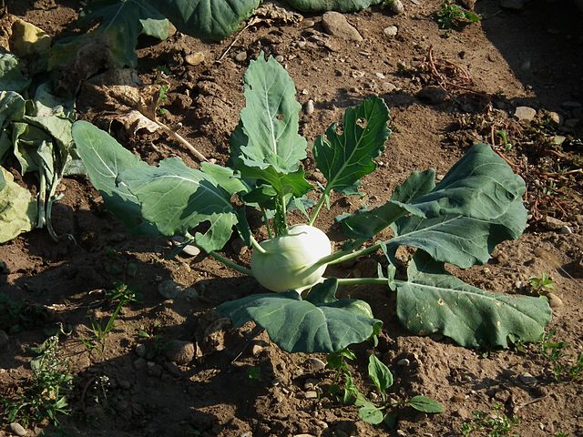

# Knol Khol

## General Information
**Generic name:** Knol Khol, Kohlrabi, German Turnip
**Sri Lankan name:** Nokol (Sinhala) | Nōkōl (Tamil)
**Scientific name:** _Brassica oleracea var. gongylodes_
**Plant family:** _Brassicaceae_
**Edible parts:** Bulbs, Leaves and Stem
**Nutrition value:** High in vitamin C, potassium, magnesium, phosphorous, calcium, iron, and folate

**Companion Plants:**
- [Marigolds](https://lanka.wiki/flowers/marigold.html)
- [Cabbage](https://lanka.wiki/leafy%20greens/cabbage.html)
- Curry Chili
- [Onions](https://lanka.wiki/herbs%20&%20spices/red-onion.html)
- Herbs (e.g., dill, cilantro)
- Legumes (e.g., [beans](https://lanka.wiki/vegetables/green-beans.html), peas)

**Non-Companion Plants:**
- Other Brassicaceae family members (e.g., broccoli, cauliflower)
- Strawberries
- [Tomatoes](https://lanka.wiki/fruit/tomatoes.html)
- [Eggplant](https://lanka.wiki/vegetables/egg-plant.html)
- [Sunflowers](https://lanka.wiki/flowers/sunflowers.html)

## Description:
Kohlrabi has been created by artificial selection for lateral meristem growth (a swollen, nearly spherical shape); its origin in nature is the same as that of cabbage, broccoli, cauliflower, kale, collard greens, and Brussels sprouts: they are all bred from, and are the same species as, the wild cabbage plant (Brassica oleracea).

The taste and texture of kohlrabi are similar to those of a broccoli stem or cabbage heart, but milder and sweeter, with a higher ratio of flesh to skin. They can be eaten in a variety of ways - raw in salads, roasted, added to soups and stews, pureed, boiled, or mashed with potatoes. 

## Planting requirements
**Planting season:** Begin seedling preparation in nurseries by mid-August, followed by transplanting to the field in September

### Planting conditions:
| Propagation | Direct seed or create transplants indoors |
|-----------------|-------------------------------------------|
| Planting method | Prepare beds and plant seeds at one inch spacing, and one-fourth to one-half inch deep. Maintain a 30 cm distance between each column. Planting after October in the mid and low country could lead to reduced yields due to high temperatures |
| Soil            | Soil should have plenty of organic matter and mulch to trap moisture. Recommended pH level is 5.5 |
| Water           | In the absence of rain apply one to one and a half inches of water per week |
| Light           | 6 hours of sunlight per day |

### Growing conditions:
| Temperatures | Optimal temperature range: 15-25°C |
|------------------|-------------------------------------|
| Soil | If humidity is low, help to keep the soil moist by spreading a thin layer of mulch around the base of the plant. Weed diligently but take care to not disturb the roots |
| Water | Water 1 inch per square foot per week, unless the soil seems to be drying out sooner |
| Pruning | Prune plants if they become too leggy or if you want to encourage bushier growth |
| Weed control | Hand-pull weeds regularly, and consider using organic herbicides like vinegar if the weed infestation is large |

## Harvesting:
Expect to harvest crop within 50-60 days of planting.

## Curing:
Cure Knol-Khol by storing them in a cool, humid place for about two weeks after harvesting. This helps to toughen the skin and improve storage life.

## Storage
Store cured Knol-Khol in the refrigerator for up to 3 months.

## Protecting your plants
### Pest control
**Pest types:**
- Looper Caterpillar (Chrysodeixis chalcites)
- Diamondback Moth (Plutella xylostella)
- Black Worm (Agrotis ipsilon)
- Root Knot Nematode (Meloidogyne spp.)
- Thrips (Frankliniella spp.)

**Symptoms:**
- Looper Caterpillar: Large holes in leaves, pale green caterpillars with white lines
- Diamondback Moth: Leaf distortion, coarse stippling, irregular holes on leaf undersides
- Black Worm: Wilting and yellowing, visible larvae feeding on roots and stems
- Root Knot Nematode: Galls on roots up to 3.3 cm in diameter, reduced plant vigor and yellowing
- Thrips: Silvery leaves, black fecal spots on leaves

**Control methods:**
- Looper Caterpillar:
  - Encourage natural predators
  - Hand-pick caterpillars
  - Use Bacillus thuringiensis (Bt)
- Diamondback Moth:
  - Rotate crops
  - Apply appropriate insecticides if necessary
- Black Worm:
  - Ensure good soil drainage
  - Avoid planting in areas with infestation history
  - Use nematodes or biological agents
- Root Knot Nematode:
  - Plant resistant cultivars
  - Use soil solarization techniques
- Thrips:
  - Utilize reflective mulches early in growing season
  - Apply targeted insecticides for severe infestations

### Disease Control
**Disease types:**
- Clubroot
- Blackleg
- Powdery mildew
- Downy mildew
- Damping off
- Root rot

**Symptoms:**
- Clubroot: Swelling or malformation on main lateral roots
- Powdery mildew: Small white patches on leaves, purple blotching, powdery layer on leaves
- Downy mildew: Irregular yellow patches on leaves turning brown, white fluffy growth on leaf undersides

**Management:**
- Rotate crops with non-Brassicaceae plants
- Maintain good soil drainage
- Avoid overhead watering
- Use disease-resistant varieties when available
- Apply lime to increase soil pH for clubroot (keep pH 7.1-7.2)
- Remove crop debris after harvest
- Control weeds
- Apply surface sprays, dusts, or vapors for powdery mildew
- Cover nursery to protect from rain
- Allow sunlight in the morning
- Apply fungicide containing tebuconazole if necessary for downy mildew

## Difficulty Rating
### Low country wet zone (Difficulty: 7/10)
**Explanation:** The high humidity and potential for excessive rainfall in this zone can create challenges for Knol Khol cultivation.

**Challenges/Adaptations:** 
- High risk of fungal diseases due to humidity.
- Potential for waterlogged soil, which can lead to root rot.
- The optimal temperature range (15-25°C) may be exceeded in this zone.
- Ensure excellent drainage in planting beds.
- Use raised beds to improve soil drainage.
- Implement strict disease monitoring and management practices.
- Consider using shade cloth during the hottest parts of the day to maintain optimal temperature range.

### Low country dry zone (Difficulty: 8/10)
**Explanation:** The hot, dry conditions of this zone are generally not ideal for Knol Khol, which prefers cooler temperatures and consistent moisture.

**Challenges/Adaptations:**
- Maintaining adequate soil moisture can be difficult.
- High temperatures may stress the plants and reduce yields.
- The short growing window (planting recommended from mid-August to September) limits cultivation opportunities.
- Implement efficient irrigation systems to maintain consistent soil moisture.
- Use mulch extensively to retain soil moisture and cool the soil.
- Consider growing during the cooler months only.
- Provide partial shade to protect plants from extreme heat.

### Mid country (Difficulty: 5/10)
**Explanation:** The mid country offers more favorable conditions for Knol Khol cultivation, with temperatures closer to the optimal range.

**Challenges/Adaptations:**
- Still needs careful water management, especially during dry spells.
- Pest and disease pressure may be significant due to favorable conditions for various crops.
- Monitor and adjust watering based on rainfall patterns.
- Implement companion planting with recommended plants like marigolds and onions to help with pest control.
- Rotate crops to prevent soil-borne diseases.

### Up country (Difficulty: 4/10)
**Explanation:** The cooler temperatures of the up country align well with Knol Khol's preferred growing conditions.

**Challenges/Adaptations:**
- Risk of frost in some areas, which can damage young plants.
- Slower growth due to cooler temperatures may extend the time to harvest.
- Use row covers or polytunnels to protect young plants from potential frost.
- Take advantage of the longer growing season in cooler areas to succession plant for extended harvests.
- Monitor for pests and diseases, which may be less prevalent but still present in cooler climates.

## References for this entry
### Sources:
- https://doa.gov.lk/hordi-crop-knol-khol/
- https://plants.usda.gov/home/plantProfile?symbol=BROLG2
- https://fdc.nal.usda.gov/fdc-app.html#/food-details/168424/nutrients
- Cha, S. S., Lee, M. Y., & Lee, J. J. (2013). Comparison of physicochemical composition of kohlrabi flesh and peel. Korean Journal of Food Preservation, 20(1), 88-96.
- https://timesofindia.indiatimes.com/life-style/food-news/what-is-kohlrabi-its-benefits-and-how-to-add-it-to-your-diet/photostory/80071558.cms?picid=80071564
- Jung, H. A., Karki, S., Ehom, N. Y., Yoon, M. H., Kim, E. J., & Choi, J. S. (2014). Anti-diabetic and anti-inflammatory effects of green and red kohlrabi cultivars (Brassica oleracea var. gongylodes). Preventive nutrition and food science, 19(4), 281.
