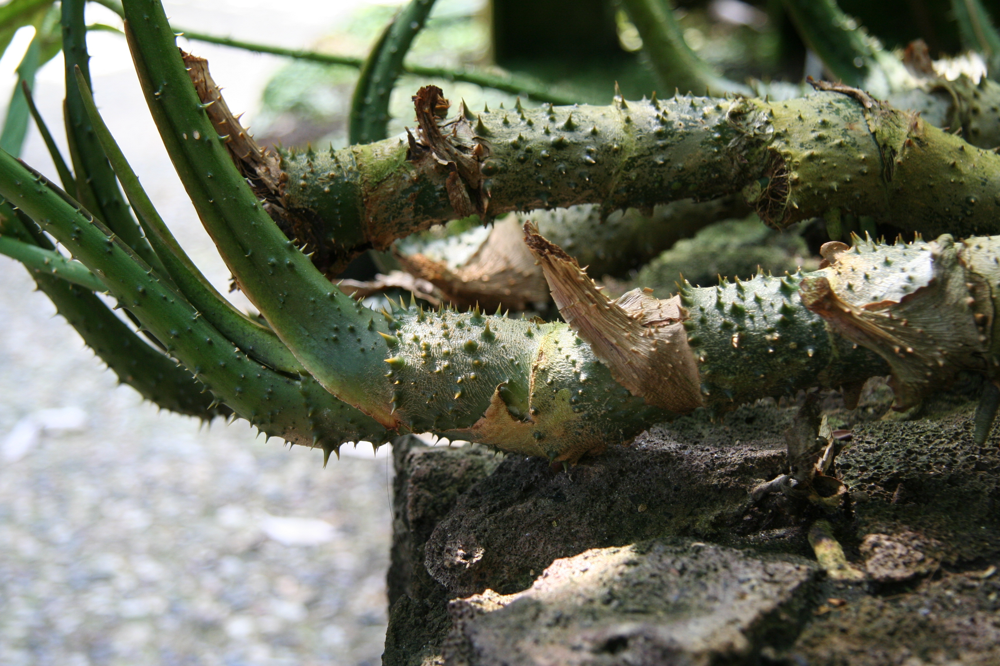

# Kohila

## General Information
**Generic name:** Lasia
**Sri Lankan name:** Kohila (Sinhala) | Kokilai (Tamil)
**Scientific name:** _Lasia Spinosa_
**Plant family:** _Araceae_
**Edible parts:** Young leaves, rhizomes (rootstalk)
**Nutrition value:** Dietary fiber, vitamin A and C

**Companion plants:**
- [Banana](https://lanka.wiki/fruit/bananas.html)
- Coconut

**Non-Companion Plants:**
Not applicable

## Description:
In Sri Lanka, kohila is commonly found growing wild in marshy areas, along stream banks, and in home gardens, particularly in the wet and intermediate zones of the country.

Young Leaves: The tender leaves, known as kohila dalu, are flavorful and can be used in various dishes such as curries or stir-fries. They are rich in dietary fiber, vitamins, and minerals, making them beneficial for digestion and overall health.

Rhizomes (Tubers): The tubers of the Kohila plant are also edible and are commonly prepared in local cuisine. They are known for their high fiber content, which aids in digestive health145. The tubers have medicinal properties as well, being used in traditional remedies for various ailments.

Note: this plant must not be eaten raw: all parts of the plant contain lethal hydrocyanic acid. This acid must be neutralized by cooking in some form before consumption.

## Planting requirements
**Planting season:** Can be grown throughout the year

### Planting conditions:
| Propagation | Apex cuttings of 20-25 cm (8-10 inches) are most commonly used for planting. Lateral shoots from mature kohila stems can also be used. For increased shoot production, shallow bury stems in shaded, muddy beds. This method quickly provides numerous shoots ready for planting |
|----|----|
| Planting method | Kohila is commonly planted in low-lying areas of home gardens or in dedicated paddy fields. Prepare the planting area by ploughing the soil to a depth of 20-25 cm (8-10 inches), removing weeds and draining excess water. Create beds approximately 5 feet wide, ensuring proper irrigation when needed. Plant rows of stalks at regular intervals in the soil |
| Soil | Kohila thrives in frequently waterlogged soils, making it ideal for wetlands. The crop benefits from shade, as full sun exposure results in smaller leaves. In Sri Lanka, kohila flourishes in the clay-loam soils typical of the wet zone |
| Water | In Sri Lanka's wet zone, natural rainfall is often sufficient, but supplemental irrigation may be necessary during dry periods |
| Light | Kohila grows best in areas with ample shade. It's easier to cultivate under the canopy of larger trees such as coconut or banana |

### Growing conditions:
| Temperatures | Kohila grows optimally in temperatures between 20-30°C (68-86°F), which is ideal for most parts of Sri Lanka, especially in the low and mid-country regions |
|----|----|
| Soil | After planting shoots or buds, apply a mulch layer (such as straw) to cover the ground. Reapply mulch at various growth stages to maintain weed suppression. Paddy straw is commonly used as mulch |
| Water | While kohila requires consistent moisture, avoid prolonged water exposure as it can impair growth. Implement proper irrigation practices as needed. In Sri Lanka's wet zone, natural rainfall often provides sufficient moisture, but drainage should be carefully managed during heavy monsoon rains |
| Pruning | Prune plants annually after harvesting to encourage new growth |
| Weed control | Weed control is a primary challenge in kohila cultivation. Weeds can be suppressed with regular mulch; manual weeding is common in Sri Lankan home gardens |

## Harvesting:
Leaves can be harvested about 8-12 months after planting. Once the plants are thriving, kohila can be harvested continuously.

## Curing:
After harvesting, cure kohila by washing the leaves and rhizomes thoroughly and allowing them to dry in the shade for a few days before storage. 

## Storage
Store dried kohila leaves in an airtight container in a cool, dry place. Rhizomes can be stored in a humid, cool place for up to 6 months. In Sri Lankan households, fresh kohila is often kept in a cool, shaded area and used within a few days.

## Protecting your plants
### Pest control
We could not find robust information about pests specific to this plant. This may be because of the high toxicity of the plant itself.

### Disease control
**Disease:** Tuber rotting causes Fusarium oxysporum (Fungus) or Ralstonia solanacearum (bacteria) 
**Symptoms:** Yellowing leaves, wilting, and root rot for fungus; rotten tubers with brown insides, and oozing in water for bacteria
**Control method:** For fungus, remove water and add 40 grams of lime per square foot. If roots are infected by bacteria, remove the infected roots and add lime after removing water. In Sri Lanka, traditional remedies like wood ash are sometimes used instead of lime.

## Difficulty Rating
### Low country wet zone (Difficulty: 3/10)

**Explanation:** The low country wet zone provides ideal conditions for kohila cultivation in Sri Lanka. Kohila thrives in wet, shaded areas with temperatures between 20-30°C, which are common in this zone.

**Challenges/Adaptations:**
- Regular weed control is necessary, as it's a primary challenge in kohila cultivation
- Manage excess water during heavy monsoon rains to prevent prolonged water exposure
- Ensure adequate shade, possibly by intercropping with banana or coconut trees

### Low country dry zone (Difficulty: 6/10)

**Explanation:** While kohila can grow in drier conditions, it requires consistent moisture and may struggle in this zone without careful management.

**Challenges/Adaptations:**
- Requires frequent irrigation to maintain consistent moisture
- Needs protection from excessive heat and strong winds
- Implement extensive mulching (e.g., with paddy straw) to retain soil moisture
- Create artificial shade structures or intercrop with taller plants like banana or coconut

### Mid country (Difficulty: 5/10)

**Explanation:** The mid-country provides generally favorable conditions for kohila cultivation, with temperatures likely falling within the optimal range of 20-30°C.

**Challenges/Adaptations:**
- Regular weed control is necessary
- May need additional irrigation during dry periods
- Ensure adequate shade is provided, possibly through intercropping
- Adapt to potential temperature fluctuations by monitoring plant health and adjusting care as needed

### Up country (Difficulty: 7/10)

**Explanation:** Kohila cultivation in the up country faces challenges due to cooler temperatures and potentially less suitable soil conditions.

**Challenges/Adaptations:**
- Temperatures may often fall below the optimal range of 20-30°C
- Ensure protection from frost in colder areas
- Create artificially warm and humid environments, possibly through greenhouse cultivation in very high altitudes
- Pay extra attention to soil preparation, as naturally waterlogged areas may be less common
- Implement careful water management to maintain consistent moisture without waterlogging

## References for this entry
### Sources:
- https://doa.gov.lk/hordi-crop-kohila/
- https://powo.science.kew.org/taxon/urn:lsid:ipni.org:names:87418-1/general-information
- Hossain, R., Quispe, C., Herrera-Bravo, J., Islam, M. S., Sarkar, C., Islam, M. T., ... & Cho, W. C. (2021). Lasia spinosa chemical composition and therapeutic potential: A literature‐based review. Oxidative Medicine and Cellular Longevity, 2021(1), 1602437.
- Jemziya, M. B. F., Sujirtha, N. V., & Madushani, H. K. L. (2013). Value Added Kohila (Lasia spinosa) Based Food Products and Its Therapeutic And Nutritional Properties: A Review.
- https://www.nparks.gov.sg/florafaunaweb/flora/2/1/2186
- http://www.b4fn.org/resources/species-database/detail/lasia-spinosa/
- https://www.youtube.com/watch?v=-4-OmTkbU5Y
- https://www.jircas.go.jp/en/database/thaivege/063
