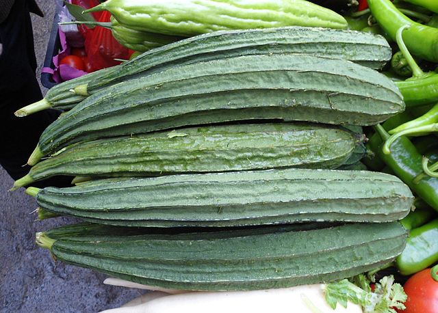

# Luffa/Chinese Okra

## General Information
**Generic name:** Chinese Okra, Sponge Gourd, Angled luffa, Ridge gourd
**Sri Lankan name:** Wetakolu (Sinhala)
**Scientific name:** Luffa acutangula
**Plant family:** Cucurbitaceae
**Edible parts:** Fruit
**Companion plants:**
- Corn: Provides natural support for luffa vines and doesn't compete for nutrients.
- Sorghum: Acts as a windbreak and can help support luffa vines.
- Legumes: Fix nitrogen in the soil, benefiting luffa's growth.
- Marigolds: Repel pests and attract beneficial insects.
**Non-companion plants:**
- Other Cucurbitaceae family plants (e.g., cucumbers, squash, pumpkins, melons): Can share pests and diseases with luffa, increasing the risk of infestations.
- Heavy feeders (e.g., tomatoes, eggplants): Compete aggressively for nutrients, potentially starving the luffa plants.

## Description:
Luffa acutangula is a cucurbitaceous vine that is commercially grown for its unripe fruits as a vegetable. Luffa is related to cucumbers, squash, pumpkins, and melons. Its fruit slightly resembles a cucumber or zucchini with ridges, and can be steamed, stewed or curried. Raw luffa tastes somewhere between cucumber and zucchini.

In Sri Lanka, three main varieties are cultivated in home gardens and commercial farms across different agro-ecological zones.
- LA33
- Asiri
- Gannoruwa Ari

Many fruits grow on a single vine. Mature fruits are used as natural cleaning sponges.

## Planting requirements
Luffa can  be grown successfully in hot weather. Can be cultivated up to 500m from sea level.

- Wet zone: Can be cultivated throughout the year
- Dry Zone: Mainly cultivated in Maha Season (October to January), can be cultivated successfully under irrigation in Yala season (May to August)

### Planting conditions:
| Aspect | Recommendation |
|--------|----------------|
| Propagation | Soak the seeds in water for about 24 hours. Plant about 3-4 seeds per pit, fairly away from each other. Keep the seeds well watered. |
| Planting method | Harrow the soil and break it finely. Mark pits to recommended spacing. Make several deep drains to avoid excess water retention in field. |
| Soil | Well-draining, sandy loam soil with organic matter. Soil pH should be around 5.5-7.5 for optimal growth. |
| Water | Irrigate twice a day until seeds are germinated. After that, irrigation should be practiced according to soil moisture conditions. |
| Light | Requires full sunlight |
| Spacing | 1.5 m x 1.5 m (between rows and between plants) |

### Growing conditions:
| Aspect | Recommendation |
|--------|----------------|
| Temperatures | Thrives in hot weather. In Sri Lanka, temperatures between 25-30°C are ideal for growth. |
| Soil | Well-draining, sandy loam soil with organic matter. Maintain pH between 5.5-7.5. |
| Water | After germination, water according to soil moisture conditions. Avoid waterlogging. |
| Fertilizer | Add 10 t/ha of well-decomposed organic matter. Apply chemical fertilizers as follows: |

Set up trellises about 2m high using strong poles spaced about 3m apart. Train vines vertically or horizontally on ropes or wire. Remove side vines/water sprouts from the main stem. |

## Harvesting:
Irrigate the evening before harvesting. Harvest around 14 days after flowering. Harvest with the stalk to avoid damaging the fruit. First harvesting can be done around 60-70 days after planting. 10-15 harvestings can be done over a period of 1½ – 2 months with 4-day intervals.

## Processing and Storage:
Avoid direct sunlight on harvested fruits. Pack in baskets to ensure good ventilation to prevent fruit damage. For sponge use, cure the fruits in the sun for about 3-5 days to harden them. Store cured luffa sponges in a dry, well-ventilated area away from direct sunlight.

## Protecting your plants
### Pest control
**Pest types:** Specific pests not mentioned in the PDF.

### Disease Control
**Disease types:** 
1. Powdery mildew
2. Downy mildew
3. Collar rot/Root rot
4. Gummy Stem Blight
5. Bacterial wilt
6. Viral diseases (Leaf Curl Virus, Papaya Ring Spot Virus, Cucumber Mosaic Virus, Zucchini Yellow Mosaic Virus)
7. Phytoplasma Disease

**Management:**
- Use fungicides (natural or artificial)
- Destroy infected plant debris after harvest
- Improve drainage
- Implement crop rotation with non-susceptible crops (e.g., okra, maize)
- Control insect vectors (whiteflies, aphids) to prevent viral diseases
- Remove and destroy severely infected plants

## Difficulty Rating

### Low country wet zone (Difficulty: 4/10)
**Explanation:** Luffa can be cultivated throughout the year in the wet zone, including areas like Colombo, Galle, and Ratnapura.

**Challenges/Adaptations:**
- Monitor and manage fungal diseases due to high humidity
- Ensure proper drainage to prevent waterlogging

### Low country dry zone (Difficulty: 6/10)
**Explanation:** Luffa cultivation in the dry zone requires some irrigation management, especially during the Yala season. This zone includes areas like Anuradhapura, Polonnaruwa, and Hambantota.

**Challenges/Adaptations:**
- Implement efficient irrigation systems, especially during dry periods
- Use mulching to conserve soil moisture
- Provide shade during peak hours to prevent excessive heat stress

### Mid country (Difficulty: 5/10)
**Explanation:** Luffa cultivation in the mid country requires some water balancing, but is otherwise quite doable. This zone includes areas like Kandy, Matale, and Badulla.

**Challenges/Adaptations:**
- Balance water requirements to avoid both drought and waterlogging
- Monitor for pests and diseases regularly

### Up country (Difficulty: 6/10)
**Explanation:** Luffa cultivation in the upcountry is challenging due to cooler temperatures, which are less ideal for this heat-loving crop. This zone includes areas like Nuwara Eliya and parts of Badulla.

**Challenges/Adaptations:**
- Select warmer, sheltered locations for cultivation
- Use protective structures or greenhouses to maintain higher temperatures
- Provide additional support for vines to protect against strong winds
- Adjust planting times to coincide with warmer months

## Sources:
- https://doa.gov.lk/hordi-crop-luffa/
- https://www.epicgardening.com/growing-luffa/
- https://plants.usda.gov/home/plantProfile?symbol=LUAC2

