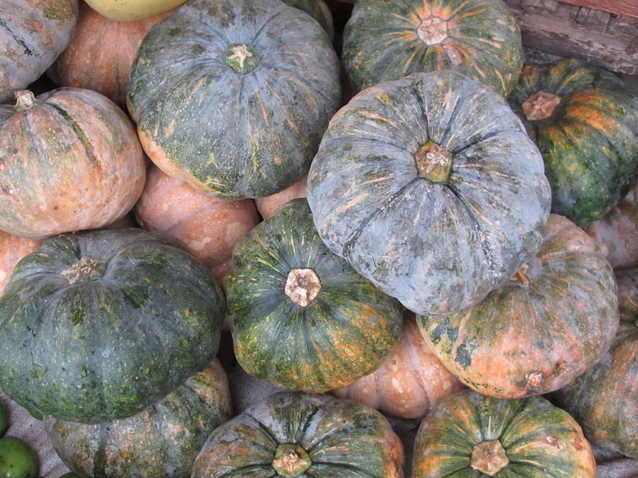

# Pumpkin

## General Information
**Generic name:** Pumpkin, Winter Squash
**Sri Lankan name:** Wattakka (Sinhala) Sorakka (Tamil)
**Scientific name:** Cucurbita Maxima
**Plant family:** Cucurbitaceae
**Edible parts:** Most parts of the pumpkin are edible, including the fleshy shell, the seeds, and the leaves
**Companion plants:**
- Sweet corn: Provides shade and stops the squash vine borer beetle
- Green Beans: Fix nitrogen and add nutrients that improve the soil, benefiting the plants that are growing beside them.
- Radishes: Protect all squash family members from the squash borer
- Marigold: help deter beetles

**Non-companion plants**
- Potatoes: Deplete the soil nutrients starving squash plants nearby
- Sweet potatoes: Competes with squash plants for space
- Fennel: Most plants dislike fennel, which has an inhibiting effect on them.

## Description:
A large trailing plant with yellow, bell-shaped flowers. Most varieties will take up a lot of room. Better to grow them at the edge of a garden patch as they need lots of space to spread. There are several varieties of pumpkin. Amongst the different varieties, Butternut produces small to medium pear-shaped fruit with deep orange flesh while Buttercup are small to medium round pumpkins with dark green skin. There are a number of large pumpkins, some round and flattish, and others that will produce the "Cinderella coach" type giant round fruit which is not such good eating.

## Planting requirements
**Planting season:** Can be grown in dry and intermediate zones. Pumpkin is grown as a Yala Crop, while squash can be grown in either Maha or Yala.

### Planting conditions:
| Propagation | Seeds |
|----|----|
| Planting method | Prepare the land to a depth of about 20-30 cm and harrow for fine tilth. Make planting holes 30 x 30 x 30 cm and then add organic matter per planting hole, mix with soil, and heap to about 10 cm above ground level. |
| Soil | Soil should be rich in humus with a pH range of 5.5 – 7.5. Ideally a moist, loamy soil. Pumpkins are heavy feeders and hence add aged manure or compost mixed with water to the side of the plant. |
| Water | Water deeply, in the morning and on very hot afternoons, especially during fruit set. Avoid watering foliage and fruit unless it's a sunny day. Dampness invites rot and disease. Planting in raised beds promote drainage ensuring that the root has ideal moisture levels. |
| Light | Full sunlight (at least six hours of light per day) to produce and mature their fruits). |

### Growing conditions:

| Temperatures | Needs a temperature between 65° and 95°F (18° to 35°C) |
|----|----|
| Soil | Add mulch around your pumpkins to retain moisture, suppress weeds, and discourage pests.|
| Water | Irrigate daily until germination is complete and every 7 days thereafter. Give your plants at least 1 to 2 inches of water per week, especially when they're blooming and setting fruit. Drip irrigation or ground-level soaking rather than from overhead. |

## Harvesting:
Harvest when the fruit develops a powdery film. Each variety has different developing periods.
1. A.N.K: Harvest 40 days after flowering
2. Local Variety: Harvest 60 days after flowering
3. Butternut: Harvest 20 days after flowering

## Curing:
Once harvested, the rind needs to harden. Place the pumpkin on its side in a sunny spot and turn every few days. Cure for at least a week and longer if possible.

## Storage
Pumpkins can be stored for 6-8 months and butternut can be kept for about 1 month under ambient conditions.

## Protecting your plants
### Pest control
**Pest type:**
- Whitefly (Bemisia tabaci)
- Aphids

**Symptoms:**
- **Whitefly:** Transmits Leaf Curl Virus (LCV). Causes upward curling, shortening, and distortion of leaves. Plants become stunted and fruits deformed.
- **Aphids:** Transmit Papaya Ring Spot Virus (PRSV). Causes mosaic and mottling of leaves, leaf distortion, malformation of fruits, and reduction in fruit size. In severe infections, oily patches appear on the fruit surface.

**Control method:**
- Use recommended insecticides to control vectors (whiteflies and aphids)
- Remove infected plants
- Implement proper crop rotation
- Use resistant varieties when available

### Disease Control

**Disease type:**
- Powdery mildew (_Podosphaera xanthii_)
- Downy mildew (_Pseudoperonospora cubensis_)
- Collar rot/Root rot (_Sclerotium spp._, _Fusarium spp._)
- Gummy Stem Blight (_Didymella bryoniae_)
- Bacterial wilt (_Ralstonia solanacearum_)
- Viral diseases:
  - Leaf Curl Virus (LCV)
  - Papaya Ring Spot Virus (PRSV)
  - Cucumber Mosaic Virus (CMV)
  - Zucchini Yellow Mosaic Virus (ZYMV)
- Phytoplasma disease

**Symptoms:**
- **Powdery mildew:** Pale yellow spots on older leaves, white fluffy mycelium growth, leaves become brown and shriveled.
- **Downy mildew:** Angular yellow spots on the upper leaf surface, leaves become chlorotic and necrotic.
- **Collar rot/Root rot:** Temporary wilting, yellowing leaves, drooping, plant death, vascular bundles in collar region become yellow or brown.
- **Gummy Stem Blight:** Water-soaked areas on leaves and fruit, dark cracked sunken lesions on fruit, plant collapse, gummy exudates from cracks.
- **Bacterial wilt:** Sudden drooping of leaves, whole plant wilts, leaves become brown and dry, vascular discoloration.
- **Viral diseases:** Various symptoms including leaf curling, mosaic patterns, mottling, stunting, fruit deformation, and discoloration.
- **Phytoplasma disease:** Smaller thickened yellowish-green leaves, shortened internodes, stunting, witch's broom symptom, greening of flowers.

**Management:**
- Use recommended fungicides at the initial stage of disease development
- Destroy infected plant debris after harvest
- Improve drainage for root rot control
- Plough crop debris deeply immediately after harvest
- Implement crop rotation with non-susceptible crops
- Avoid movement of equipment from infected fields to non-infected fields
- Remove infected plants, especially for viral and bacterial diseases
- Control insect vectors using recommended insecticides
- Use disease-resistant varieties when available
- Implement proper sanitation practices in the field

## Difficulty Rating
### Low country wet zone (Difficulty: 3/10)
**Explanation:** The low country wet zone provides excellent conditions for pumpkin growth. Abundant rainfall meets water requirements, and temperatures are suitable.
**Challenges/Adaptations:**
- Monitor drainage to prevent waterlogging
- Implement disease control measures due to high humidity

### Low country dry zone (Difficulty: 5/10)
**Explanation:** Pumpkins can be grown as a Yala crop in this zone. Temperature and sunlight conditions are favorable, but water management is crucial.
**Challenges/Adaptations:**
- Implement efficient irrigation systems
- Use mulch to retain soil moisture

### Mid country (Difficulty: 4/10)
**Explanation:** The mid-country zone offers a good balance of conditions for pumpkin growth. Moderate temperatures and rainfall are generally suitable.
**Challenges/Adaptations:**
- Ensure adequate sunlight exposure in areas with more cloud cover
- Adapt planting schedules based on local rainfall patterns

### Up country (Difficulty: 6/10)
**Explanation:** While pumpkins can be grown here, cooler temperatures in some areas increase difficulty.
**Challenges/Adaptations:**
- Choose cold-tolerant pumpkin varieties
- Use row covers or greenhouses to extend the growing season
- Carefully manage water to prevent fungal diseases in cooler, damper conditions
