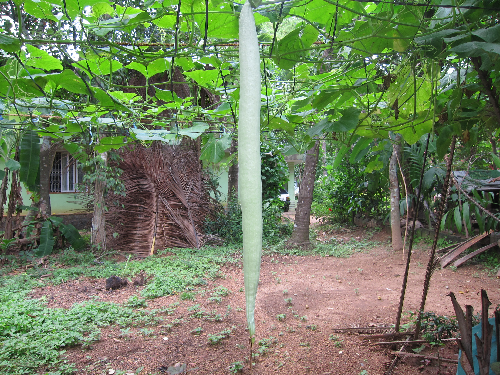

# Snake Gourd

## General Information
**Generic name:** Snake Gourd, Serpent Gourd
**Sri Lankan name:** Pathola (Sinhala) | Podivilangi (Tamil)
**Scientific name:** _Trichosanthes cucumerina L_
**Plant family:** _Cucurbitaceae_
**Edible parts:** Fruit is eaten as a vegetable. Leaves and shoots are also edible, and the pulp of mature fruits is sometimes eaten as a tomato substitute
**Nutrition value:** Low in calories and rich in essential nutrients

**Companion plants:**
- Radishes
- Catnip
- Broccoli
- Dill
- French marigolds

**Non-companion plants:**
Not applicable

## Description:
The snake gourd, a member of the pumpkin family, is a climbing plant that uses tendrils for support. It can grow up to 6 meters in height and spread between 1.5 to 3 meters wide. The vine’s stem is furrowed, and its broad leaves are divided into 3 to 7 lobes with toothed edges. The plant produces white flowers, with female blossoms growing singly on long stalks. Its distinctive fruits are typically curved and can reach lengths of 1 to 2 meters. When young, the fruits are greyish-green but turn orange or red as they mature.

Snake gourds thrive at elevations up to 500 meters and are commonly found in regions such as Mathale, Kandy, Hambantota, Kurunegala, and Ratnapura.

## Planting requirements
**Planting season:** Best planting seasons are in the months of July and in January

### Planting conditions:
| Propagation | Direct planting of seeds in the field |
|----|----|
| Planting method | Plough the land 20-30 cm depth. Prepare 30 x 30 x 30 cm holes with 1.5 m x 1.5 m recommended spacing. Add organic matter and fill the holes. Plant 2 seeds in one hole, with 2-3 cm depth. Seed germination starts within 5 – 8 days |
| Soil | Soil with high organic matter and good drainage is needed. pH should be 5.5-7.5 |
| Water | Daily irrigation is needed until seeds germinate |
| Light | Minimum 6-8 hours of sunlight |

### Growing conditions:
| Temperatures | High temperature is preferred. Warm-season crop and its ideal temperature range is between 80°F and 95°F (27°C to 35°C) |
|----|----|
| Soil | It is recommended to train each vine along a 2m height trellis. Remove side branches. Add mulch to the plants' base to retain soil moisture |
| Water | Water regularly, and avoid letting the soil become dry or waterlogged, killing the plants |
| Pruning | Prune lateral branches to increase fruit set and production |
| Weed control | Control weeds at the early stages of the crop |

## Harvesting:
Harvest the crop 60-75 days after planting with a 4-day interval.

## Curing:
Snake Gourd does not require a curing stage.

## Storage
Snake gourd should be stored at 12-13°C with 85-90% humidity to extend its shelf life up to 2-3 weeks. Avoid temperatures below 10°C to prevent chilling damage. Keep the fruits away from ethylene-producing fruits like bananas and apples, and remove any damaged or deformed fruits.

## Protecting your plants
### Pest control
**Pest type:**
- Whitefly (_Bemisia tabaci_)
- Aphids

**Symptoms:**
- **Whitefly:** Transmits Leaf Curl Virus (LCV). Symptoms include upward curling, shortening, and distortion of leaves. Plants become stunted and fruits deformed.
- **Aphids:** Transmit Papaya Ring Spot Virus (PRSV). Symptoms include mosaic and mottling of leaves, leaf distortion, malformation of fruits, reduction in fruit size, and in severe infections, oily patches on the fruit surface.

**Control method:**
- Remove infected plants
- Implement crop rotation with non-susceptible crops (okra, maize)
- Practice mixed cropping with Cruciferae crops
- Avoid movement of equipment from infected fields to non-infected fields
- Use recommended insecticides to control vectors (whiteflies and aphids) if needed.

### Disease Control
**Disease type:**
- Fungal diseases: Powdery mildew, Downy mildew, Collar rot/Root rot, Gummy Stem Blight
- Bacterial diseases: Bacterial wilt
- Viral diseases: Leaf Curl Virus (LCV), Papaya Ring Spot Virus (PRSV), Cucumber Mosaic Virus (CMV), Zucchini Yellow Mosaic Virus (ZYMV)
- Phytoplasma disease

**Symptoms:**
- **Powdery mildew:** Pale yellow spots on older leaves, the white fluffy mycelium grows over leaf surfaces, severely attacked leaves become brown and shriveled, and defoliation may occur.
- **Downy mildew:** Angular yellow spots are limited by leaf veins on the upper leaf surface, and leaves become chlorotic and necrotic.
- **Collar rot/Root rot:** Temporary wilting, yellowing leaves, drooping, plant death, and vascular bundles in the collar region becoming yellow or brown.
- **Gummy Stem Blight:** Water-soaked areas on leaves and fruit, light brown irregular lesions, dark cracked sunken lesions on fruit, plant collapse, gummy exudates from stem cracks.
- **Bacterial wilt:** Sudden drooping of leaves, whole plant wilting, leaves become brown and dry, vascular discoloration (brown), permanent wilting.
- **CMV:** Green mottle, leaf deformation, green spots on fruits turning bright yellow, fruit malformation and decay.
- **ZYMV:** Stunting, yellowing, necrosis, mosaic, leaf deformations (blisters, shoe stringing), fruit discolorations and deformations.
- **Phytoplasma disease:** Smaller, thickened, and yellowish green leaves, shortened internodes, plant stunting, witch's broom symptom, greening of flowers.

**Management:**
- Destroy infected plants with soil
- Improve drainage
- Plough crop debris deeply immediately after harvest
- Implement crop rotation with non-susceptible crops
- Practice mixed cropping with Cruciferae crops
- Avoid movement of equipment from infected fields to non-infected fields
- Control vectors using recommended insecticides
- Remove infected plants
- For viral diseases, control insect vectors and remove infected plants promptly
- Use recommended fungicides at the initial stages of disease development

## Difficulty Rating
### Low country wet zone (Difficulty: 4/10)
**Explanation:** Snake gourd is relatively easy to grow in the low country wet zone, but proper irrigation and pest management are crucial.

**Challenges/Adaptations:**
- High rainfall can cause fungal diseases. Regularly monitor plants for signs of disease.
- Ensure consistent moisture throughout the growing season.

### Low country dry zone (Difficulty: 5/10)
**Explanation:** In the low country dry zone, snake gourd requires careful water management and protection from high temperatures.

**Challenges/Adaptations:**
- High temperatures can cause flower drop. Provide shade during peak hours if possible.
- Ensure consistent moisture throughout the growing season.

### Mid country (Difficulty: 7/10)
**Explanation:** In the midcountry, snake gourd faces challenges due to varying temperature and rainfall patterns.

**Challenges/Adaptations:**
- Temperature fluctuations can affect fruit set. Provide protection during cold nights if necessary.
- Monitor plants for signs of disease, as high humidity can encourage fungal growth.

### Up country (Difficulty: 9/10)
**Explanation:** In the upcountry, snake gourd is more challenging to grow due to cooler temperatures and potential frost.

**Challenges/Adaptations:**
- Cooler temperatures can slow plant growth. Provide additional warmth with row covers or plastic mulch if possible.
- Protect plants from potential frost using row covers or other protective measures.
- Ensure consistent moisture throughout the growing season.

## Sources
- https://agritech.tnau.ac.in/horticulture/horti_vegetables_snake%20gourd.html
- http://celkau.in/Crops/Vegetables/Snakegourd/snakegourd.aspx
- https://www.gardeningknowhow.com/edible/vegetables/gourd/snake-gourd-plant-growing.htm