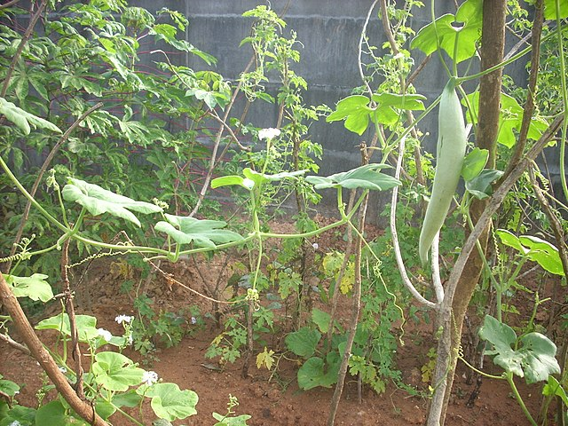

# Snake Gourd

## General Information
**Generic name:** Snake Gourd, Serpent Gourd
**Sri Lankan name:** Pathola (Sinhala), Podivilangi (Tamil)
**Scientific name:** _Trichosanthes cucumerina L_
**Plant family:** _Cucurbitaceae_
**Edible parts:** Fruit is eaten as a vegetable. Leaves and shoots are also edible, and the pulp of mature fruits is sometimes eaten as a tomato substitute.
**Nutrition value:** 

**Companion plants:**
- Radishes
- Catnip
- Broccoli
- Dill
- French marigolds
**Non-companion plants:**
- N/A

## Description:
The snake gourd belongs to the pumpkin family and is a climbing plant with tendrils. It can grow up to 6 meters tall and spread 1.5 to 3 meters wide. The vine's stem features furrows, and its leaves have 3 to 7 lobes with a toothed margin. The flowers are white, and the female blooms grow individually on long stalks. Its fruits are typically curved, reaching lengths of 1 to 2 meters. When young, the fruits are grey and green, turning orange or red as they mature.

## Planting requirements
**Planting season:** In the dry zone snake gourd is cultivated in the Yala season, while in the wet zone, the crop is cultivated throughout the year.

### Planting conditions:
| Propagation | Direct planting of seeds in the field. |
|----|----|
| Planting method | Plough the land 20-30 cm depth. Prepare 30 x 30 x 30 cm holes with 1.5 m x 1.5 m recommended spacing. Add organic matter and fill the holes. Plant 2 seeds in one hole, with 2-3 cm depth. Seed germination starts within 5 – 8 days. |
| Soil | Soil with high organic matter and good drainage is needed. pH should be 5.5 -7.5. |
| Water | Daily irrigate needed until seeds germinate |
| Light | Minimum 6-8 hours of sunlight |

### Growing conditions:
| **Temperatures** | High temperature is preferred. Warm-season crop and its ideal temperature range is between 80°F and 95°F (27°C to 35°C) |
|----|----|
| Soil | It is recommended to train each vine along a 2m height trellis. Remove side branches.<update>Apply organic fertilizer such as compost or manure at the rate of 5-10 kg per plant, 4 and 8 weeks after the emergence of seedlings.</update> |
| Water | Water regularly, and avoid letting the soil become dry or waterlogged, killing the plants. Add mulch to the plants' base to retain soil moisture |

## Harvesting:
Harvest the crop 60-75 days after planting with a 4-day interval.

## Curing:
Snake Gourd does not require a curing stage

## Storage
<update>Store in a cool place away from direct sunlight and heat sources. The fruit can be stored for up to two weeks at room temperature or up to six months if refrigerated. For long-term storage, consider freezing the fruits after blanching.</update>

## Protecting your plants
### Pest control
**Pest type:**
- Fungal diseases: Powdery mildew, Downy mildew, Collar rot/Root rot, Gummy Stem Blight
- Bacterial diseases: Bacterial wilt
- Viral diseases: Leaf Curl Virus, Papaya Ring Spot Virus, Cucumber Mosaic Virus, Zucchini Yellow Mosaic Virus
- Pytoplasma Disease: Phytoplasma disease of cucurbits

**Symptoms:** Varies depending on the pest/disease. Common symptoms include yellowing leaves, wilting, spots or lesions on leaves and fruits, and abnormal growth.

**Control method:**
- Distraction of infected plant debris
- Destroy infected plants with soil
- Improve drainage
- Crop debris should be ploughed deeply immediately after harvest to reduce fungus survival
- Crop rotation with non-susceptible crops (okra , maize)
- Mixed cropping with cruciferae crops
- Avoid movement of equipment from infected fields to non-infected fields

Powdery mildew is sometimes a problem. This can be treated with a combination of 1 T baking soda, 1 tsp Neem oil, and 1 tsp liquid soap (not detergent) in one gallon of water.<update>Alternatively, use a fungicide containing triadimefon or triflumizole.</update>

Control weeds at the early stages of the crop

### Disease Control
N/A

## Difficulty Rating
### Low country wet zone (Difficulty: 6/10)
**Explanation:** Snake gourd is relatively easy to grow in the low country wet zone, but proper irrigation and pest management are crucial.

**Challenges/Adaptations:**
- High rainfall can cause fungal diseases. Regularly monitor plants for signs of disease.
- Ensure consistent moisture throughout the growing season.

### Low country dry zone (Difficulty: 5/10)
**Explanation:** In the low country dry zone, snake gourd requires careful water management and protection from high temperatures.

**Challenges/Adaptations:**
- High temperatures can cause flower drop. Provide shade during peak hours if possible.
- Ensure consistent moisture throughout the growing season.

### Mid country (Difficulty: 7/10)
**Explanation:** In the mid country, snake gourd faces challenges due to varying temperature and rainfall patterns.

**Challenges/Adaptations:**
- Temperature fluctuations can affect fruit set. Provide protection during cold nights if necessary.
- Monitor plants for signs of disease, as high humidity can encourage fungal growth.

### Up country (Difficulty: 8/10)
**Explanation:** In the up country, snake gourd is more challenging to grow due to cooler temperatures and potential frost.

**Challenges/Adaptations:**
- Cooler temperatures can slow plant growth. Provide additional warmth with row covers or plastic mulch if possible.
- Protect plants from frost using row covers or other protective measures.
- Ensure consistent moisture throughout the growing season.

## References for this entry
### Content Sources:
- <https://www.gardeningknowhow.com/edible/vegetables/snake-gourd/growing-snake-gourds.htm>
- <https://www.hort.purdue.edu/newcrop/Cucurbitaceae/Trichosanthes_cucumerina.html>
