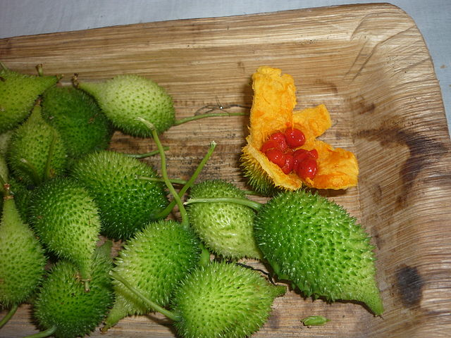

# Thumba Karawila/Spiny Gourd

## General Information
**Generic name:** Spiny Gourd, Spine Gourd, Bristly Balsam Pear
**Sri Lankan name:** Thumba Karawila (Sinhala), Erumpaval (Tamil)
**Scientific name:** _Momordica dioica_
**Plant family:** _Cucurbitaceae_/gourd family
**Edible parts:** Fruit

**Companion plants:**
Not applicable

**Non-companion plants**
Not applicable

## Description:
Thumba Karawila is a species of flowering plant in the Cucurbitaceae/gourd family. It is widely consumed as a vegetable in Sri Lanka. Different types of plants provide differently shaped fruit: oval, cylindrical, and spherical. Below are the plant varieties listed by the Department of Agriculture, Sri Lanka.

- Female plant varieties – Thumbika / Golika / Wisal / Kesara / Chandu
- Male plant Varieties – Parakum, wishma
- Hybrid: Female -Chandu, male – Wishma

## Planting requirements
**Planting season:** Sow seeds during the Maha season (September-October) and Yala season (March-April). If additional water is available, planting can occur in mid-December after the Maha season's heavy rains. In areas with irrigation, planting can be done year-round.

### Planting conditions:
| Propagation | Propagated by seeds and tubers |
|----|----|
| Planting method | Seedlings can be easily obtained using stem cuttings. Stem Cuttings with 2-4 inter-nodes are suitable for planting. When propagated by tubers, obtain tubers with a few eyes after the dormancy period of about 4 months from the previous season. Cut those tubers into about 40g pieces and plant them in a sand nursery. If the seeds are sown, store the seeds obtained from the previous season under normal conditions for about 9 months plant 4 seeds in one place, and remove the other seedlings at a ratio of 6:1 – 10: 1 |
| Soil | Grows well in non-loamy reddish-brown soils, it can thrive in well-drained soils rich in organic matter. |
| Water | Regular irrigation is required |
| Light | Plentiful sunshine |

### Growing conditions:

| Temperatures | Lowland dry zone temperatures are suitable |
|----|----|
| Soil | Grows well in non-loamy reddish-brown soils, it can thrive in well-drained soils rich in organic matter. |
| Water | Provide adequate water to ensure plants do not wilt. In dry zone areas, regular irrigation is crucial, especially during prolonged dry spells. |
| Weed Control | When seedlings are young, carefully uproot the weeds around them and then use a shovel to remove them without harming the base of the seedlings. |

## Harvesting:
When plants are initiated with seeds flowering begins at about 3 months after seeding.
Flowers were obtained 2 months after crop establishment using plant-lets obtained from stem cuttings.

## Curing:
Spiny gourd does not require a curing stage.

## Storage
Refrigerate for up to 2 weeks in a plastic bag in the crisper drawer.

## Protecting your plants
### Pest control
**Pest type:**
- Epilacna larvae

**Symptoms:**
- **Epilacna larvae:**
  - The larvae are pale yellow and covered with branched spines. The larvae and adult beetles feed on the leaf tissue.
  - Infestation can stunt the growth of seedlings and mature plants.

**Control method:**
- **Epilacna larvae:**
  - Spray neem oil
  - Introduce natural parasitoid ladybird beetles.

### Disease Control
**Disease type:**
- Root rot
- Downy mildew

**Symptoms:**
- **Root rot:** This is a disease caused by fungi or bacteria. Wilting, yellow, or sparse foliage can be seen.
- **Downy mildew:** Discoloured blotches on the upper leaf surface. These may be pale green, yellow, purple, or brown, depending on the plant affected.

**Management:**
- Maintaining good drainage in the field
- Removing diseased vines to avoid infection spreading
- If necessary apply fungicides recommended by the Department of Agriculture

## Difficulty Rating
### Low country wet zone (Difficulty: 6/10)
**Explanation:** Thumba Karawila can grow in wet zones but requires well-drained soil to prevent root rot. Regular monitoring of pests and diseases is necessary.
**Challenges/Adaptations:**
- **Root rot:** Ensure good drainage, and maintain soil health with organic matter
- **Pests and diseases:** Regular monitoring and control measures

### Low country dry zone (Difficulty: 5/10)
**Explanation:** Thumba Karawila thrives in dry zones but requires adequate watering to prevent wilting.
**Challenges/Adaptations:**
- **Drought:** Provide adequate water, consider drip irrigation
- **Pests and diseases:** Regular monitoring and control measures

### Mid country (Difficulty: 6/10)
**Explanation:** Thumba Karawila can grow in mid-country regions but requires careful management of soil moisture.
**Challenges/Adaptations:**
- **Soil moisture:** Ensure well-drained soil, maintain consistent watering
- **Pests and diseases:** Regular monitoring and control measures

### Up country (Difficulty: 7/10)
**Explanation:** Thumba Karawila can grow in up-country regions but requires careful management of temperature and humidity.
**Challenges/Adaptations:**
- **Temperature:** Provide adequate sunlight
- **Humidity:** Maintain good air circulation to prevent fungal diseases
- **Pests and diseases:** Regular monitoring and control measures
