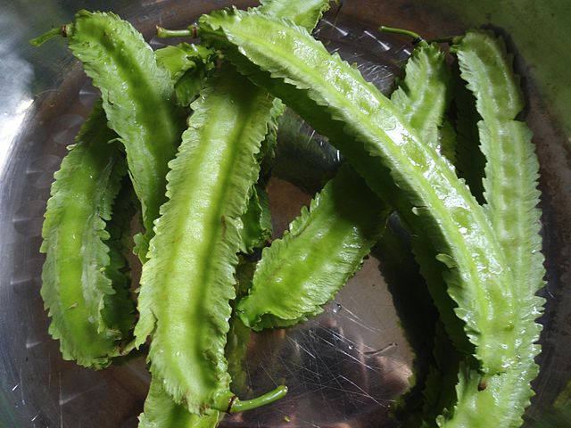

# Winged Bean

## General Information
**Generic name:** Winged Bean
**Sri Lankan name:** Dambala (Sinhala),
**Scientific name:** Psophocarpus tetragonolobus
**Plant family:** Fabaceae
**Edible parts:** The young pods and leaves, flowers, root tubers, ripe seeds are edible. The seeds are also used to extract an edible oil.
**Nutrition value:** Winged beans are high in protein (around 20% by weight) and fiber. They are also a good source of vitamins A, C, and several B vitamins.
**Companion plants:**
Beans act as nitrogen-fixers and can support a variety of plants by improving the soil, including, but not limited to:
- Corn: Provides natural support for climbing winged beans and occupies a different soil layer, reducing competition for nutrients.
- Cucumber: Encourages strong bean growth while benefiting from the nitrogen fixed by winged beans.
- Eggplant: Benefits from the nitrogen fixed by winged beans and can provide partial shade.
- Radish: Quick-growing crop that can be harvested before winged beans mature, maximizing space utilization.
- Marigold: Deters bean beetles and other insect pests, also suppresses nematodes in the soil.
- Nasturtium: Repels bean beetles and acts as a trap crop for aphids.
- Summer savory: Repels bean beetles and is said to improve the flavor and overall growth of bean plants.
- Rosemary: Deters bean beetles and other pests with its strong aroma.
- Potato: Potatoes grown with garden beans may be larger, as it benefits from nitrogen fixing activity.
- Chilies: see above
- Tomatoes: see above
- Eggplants: see above
- Squash: see above
- Lettuce: see above

**Non-companion plants:**
- Onion family plants (chives, leeks, garlic, and onions): These inhibit the growth of bean plants by exuding a substance that kills beneficial bacteria on bean roots.
- Sunflowers: Give off a chemical compound that inhibits the growth of beans.

## Description:
Winged bean is a short day plant that requires less than 12 hours of day length. It can be grown in areas up to 2000m above sea level in Sri Lanka. There are two main types of winged bean; short podded ones which are used for tubers and have poor seeds, and long podded ones which have good seeds but poor tubers.

1. **SLS 44**
   - Produces yield throughout the year
   - White flowers
   - Green pods, weighing around 15g each
   - Cream-colored seeds

2. **Krishna**
   - High yield throughout the year
   - Purple flowers and pods
   - Dark purple seeds
   - Pods about 27 cm long

## Planting requirements
**Planting season:** Rainy Season

### Planting conditions:
| **Propagation** | Seeds that are planted during rainy season germinate and grow slowly for the first 3 or 5 weeks. For tubers, vines are pruned off at about 1 m high or left unstaked and some flowers are removed. |
|----|----|
| Planting method | Plant seeds in rows that are 60 cm apart with a spacing of 25 cm between plants. Soak seeds in water for about 24 hours before planting for better germination. |
| Soil | Grow on a wide variety of soils. Well-draining sandy loam or clay loam soil with organic matter is ideal. Soil should not retain too much water and should have a pH between 5.5 and 7. |
| Water | Intolerant of water logging (saturation of water in soil) |
| Light | Partial sunlight as shading improves pod length and seed number but excessive shade can reduce yield. |

### Growing conditions:

| **Temperatures** | For maximum seed production winged beans requires temperatures between 23°C and 27°C and for tubers the temperatures should be between 18°C and 25°C. |
|----|----|
| Soil | Winged beans have been grown on soils with pH from 3.6 to 8.0. They are sensitive to very acidic soils and prefer well-drained soil with a high organic matter content. |
| Water | Water them in the morning before the heat of the day absorbs the moisture. As they grow in warm and wet tropics, they need moisture with regular watering, about 1 inch per week. |
| Pruning | Prune plants to encourage bushier growth and more pods. |
| Weed control | Keep the area around winged bean plants weed-free to prevent competition for nutrients and water. |
| Support | Provide trellises or poles (about 7 ft tall) for vine support. |

## Harvesting:
First harvest of recommended varieties can be taken in 70-75 days for improved varieties, 90-100 days for local varieties. Harvest pods every 3-4 days. Tubers can be harvested 4-5 months after planting.

## Curing:
After harvesting, cure pods at room temperature for a week before storing.

## Storage
Store pods in the refrigerator for up to two weeks. Tubers can be stored in a cool, dry place for several months.

## Protecting your plants
### Pest control
**Pest type:** Aphids are the most common issues for winged beans and bean vines.
**Symptoms:** Curling leaves, yellowing leaves, and stunted growth
**Control method:** If this goes unchecked, it may increase the threat of aphid-borne viruses, such as bean mosaic virus. Some beneficial insects such as ladybugs and lacewings will happily consume aphids but if aphids appear at a rapid rate, use a blast of water to knock them off the plant or apply insecticidal soap.

### Disease Control
**Disease type:** Bacterial Wilt, Anthracnose, Angular leaf spot, and Rust
**Symptoms:** Instant wilting, brown spots on leaves that enlarge and turn black, yellow spots with dark edges on leaves, and orange-brown pustules on leaves
**Management:** Remove infected plants with soil, improve water drainage system, avoid overhead watering, remove infected plant material, and apply fungicides if necessary

## Difficulty Rating

## Difficulty Rating
### Low country wet zone (Difficulty: 5/10)
**Explanation:** Winged beans thrive in warm, humid conditions typical of Sri Lanka's low country wet zone. The consistent rainfall reduces the need for irrigation.
**Challenges/Adaptations:**
- Monitor for fungal diseases due to high humidity. Ensure good air circulation and consider using fungicides preventatively.
- Implement proper drainage to prevent waterlogging during heavy rains.

### Low country dry zone (Difficulty: 6/10)
**Explanation:** The dry conditions can be challenging, but winged beans are relatively drought-tolerant once established.
**Challenges/Adaptations:**
- Implement efficient irrigation systems, such as drip irrigation, to conserve water.
- Use mulching to retain soil moisture and suppress weeds.
- Choose drought-resistant varieties like 'SLS 44' for better results.

### Mid country (Difficulty: 6/10)
**Explanation:** The moderate climate of the mid country is generally favorable for winged beans.
**Challenges/Adaptations:**
- Protect plants from strong winds that may damage climbing vines.
- Monitor temperature fluctuations and provide shade during exceptionally hot periods.
- Implement proper trellising to support vine growth.

### Up country (Difficulty: 7/10)
**Explanation:** Cooler temperatures and potential frost in higher elevations can be challenging for this tropical plant.
**Challenges/Adaptations:**
- Choose sheltered locations with good sun exposure.
- Use row covers or polytunnels to protect plants from cold and extend the growing season.
- Plant after the last frost date and harvest before the first frost in autumn.
- Consider focusing on tuber production, which may be more successful in cooler climates.

## Sources:
- https://doa.gov.lk/hordi-crop-winged-bean/
- https://doa.gov.lk/hordi-variety3-winged-bean/
- https://www.epicgardening.com/winged-bean/
- https://www.thespruce.com/companion-plants-for-beans-2540036
