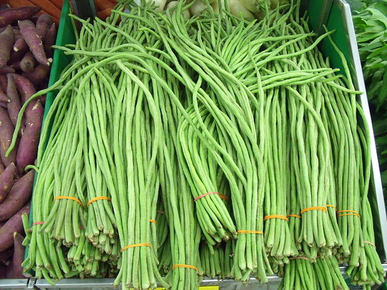

# Yard Long Bean

## General Information
**Generic name:** Yardlong bean, Asapargus bean, pea bean, long-podded cowpea, Chinese long bean, snake bean, long bean
**Sri Lankan name:** Mae (Sinhala) | Payaṟṟai (tamil)
**Scientific name:** _Vigna unguiculata subsp. sesquipedalis_
**Plant family:** _Fabaceae_
**Edible parts:** Beans
**Nutrition value:** It contains calcium, iron, magnesium, phosphorus, and potassium, and is also rich in vitamin C

**Companion plants:** 
- [Corn](https://lanka.wiki/vegetables/corn.html)
- [Cucumbers](https://lanka.wiki/vegetables/cucumber.html)
- [Eggplant](https://lanka.wiki/vegetables/egg-plant.html)
- [Radish](https://lanka.wiki/roots/radish.html)
- [Marigolds](https://lanka.wiki/flowers/marigold.html)
- Nasturtium
- Summer savory
- Rosemary
- [Potato](https://lanka.wiki/roots/potato.html)
- Chilies
- [Tomatoes](https://lanka.wiki/fruit/tomatoes.html)
- Squash
- [Lettuce](https://lanka.wiki/leafy%20greens/lettuce.html)

**Non-companion plants:**
- Onion family plants (chives, [leeks](https://lanka.wiki/leafy%20greens/leeks.html), garlic, and onions)
- [Sunflowers](https://lanka.wiki/flowers/sunflowers.html)

## Description:
A variety of the cowpea, the yard long bean is grown primarily for its strikingly long 35 to 75 centimetres (1.15 to 2.46 ft) immature green pods and has uses very similar to those of the green bean. This plant is in a different genus from the common bean. The different colors of seeds usually distinguish the many varieties. It is a vigorous climbing annual vine. The plant is subtropical/tropical and most widely grown in the warmer parts of South Asia, Southeast Asia, and southern China. In Sri Lanka, yard long beans are commonly cultivated in home gardens and commercial farms across various climatic zones.

Yard long beans are very popular in Sri Lanka and can be grown in the Low Country Wet Zone, Intermediate Zone, and Dry Zone. They are available in both bush and vine types, with vine types generally producing higher yields.

Several varieties have been released by the Department of Agriculture in Sri Lanka:

1. Gannoruwa Hawari: Released in 2011, vine type with light green colored long pods and reddish-brown seeds. Yields 20-24 t/ha.
2. Gannoruwa A9 mae: Released in 2015, this is the first collar rot resistant variety. It has high yield (21-24 t/ha), long fleshy green pods, and good keeping quality.
3. Hawari Mae: Vine type with light green colored long pods with purple colored ends and black seeds.
4. Sena: Bush type with fleshy green colored pods and cream colored seeds with reddish-brown hilum.
5. Polon Mae: Vine type with dark green colored pods with purple colored stains and cream colored seeds with black hilum.
6. Bushita (Local): Bush type with light green colored medium-sized pods and cream colored seeds with brown colored hilum.
7. BS1: Bush type with light green pods and cream colored seeds with brown colored patches.
8. Bush Polon Mae: Bush type with medium-sized green pods with purple colored patches and cream colored seeds with black hilum.

Culinary uses of yard long beans in Sri Lanka include various curries, stir-fries, and salads. The tender pods are often used in traditional Sri Lankan dishes, providing both nutrition and flavor to meals.

## Planting requirements
**Planting season:** April to May in the dry zone and November to December in the wet and intermediate zone

### Planting conditions:
| Propagation | Direct seeding |
|----|----|
| Planting method | Harrow soil to a depth of 15-20 cm and break the soil. If water retains in soil, or irrigation is done, prepare beds or ridges. Plant 3-4 Seeds per pit after soaking them for 24 hours. Irrigate the seeds well. After 2 weeks of seedling emergence, Keep two healthy Seedlings and remove the rest carefully. Set up about 7 ft. long poles for vine support. Train the vines to poles. Can place single pole per pit or set intermittent support poles and draw ropes horizontally and train the vines to the ropes |
| Soil | Well-draining sandy loam soil is ideal. Soil pH around 5.6 -7 is optimal. Heavy clay soils with poor drainage is not good for cultivation. Soil should be well-fertilized with organic matter. Adding compost or well-rotted cow manure is recommended |
| Water | At initial stages apply water every 4 days per week. Later add water once a week. If soil moisture is high, root rot disease may occur. In dry zones, mulching can help retain soil moisture |
| Light | Requires plentiful sunlight. Partial shade during the hottest part of the day can be beneficial, especially in the dry zone |

### Growing conditions:
| Temperatures | The ideal temperature range for yard long beans is between 21-30°C (70-86°F), which is common in many parts of Sri Lanka. However, they can tolerate higher temperatures with proper care |
|----|----|
| Soil | Well-drained sandy loam is the ideal soil type for yard-long beans, as it provides excellent drainage and aeration. Additionally, a fertile loamy texture is favorable, as it retains moisture while effectively allowing excess water to drain away |
| Water | Ensure consistent moisture but avoid overwatering to prevent root rot. In dry zones, mulching can help retain soil moisture |
| Pruning | Pruning is not required for yardlong bean |
| Weed control | Regular weeding is essential, especially in the wet zone where weed growth can be rapid. Manual weeding or mulching can be effective |

## Harvesting:
Harvest both bush and vine types every 2 days. For optimal yield and continuous production, harvest regularly when pods are about 15-20 cm long. In Sri Lanka, harvesting is typically done in the early morning or late evening to avoid heat stress on the plants. Bush types can give 7-12 harvests, while vine types can give about 15-16 harvests.

## Curing:
Yardlong bean does not require a curing stage.

## Storage
In Sri Lanka's humid climate, yard long beans are best consumed fresh. If storage is necessary, keep them in a cool, dry place or refrigerate for up to 3-4 days.

## Protecting your plants

### Pest control

**Pest type:**
- Bean Shoot Fly (Melanagromyza sojae)
- Bean Pod Fly (Melanagromyza spp.)
- Black Bean Aphid (Aphis fabae)
- Thrips (Frankliniella spp.)
- Common Cutworm (Spodoptera litura)

**Symptoms:**
- **Bean Shoot Fly:** Leaves may appear wilted or stunted; larvae create holes in shoots.
- **Bean Pod Fly:** Pods develop holes and may rot, leading to reduced quality and yield.
- **Black Bean Aphid:** Leaves may curl, yellow, or become sticky due to honeydew excretion; can lead to virus transmission.
- **Thrips:** Causes silvery streaks on leaves and can lead to leaf drop.
- **Common Cutworm:** Visible holes in leaves and pods; plants may appear ragged or damaged.

**Control method:**
- Cultural Practices:
  - Rotate crops to disrupt pest life cycles.
  - Remove and destroy infested plant debris to prevent overwintering of pests.
- Physical Controls:
  - Use row covers to protect young plants from pests.
  - Hand-pick larger pests like cutworms.
- Biological Controls:
  - Introduce natural predators such as ladybugs for aphid control.
  - Use beneficial nematodes against cutworms.
- Chemical Controls:
  - Apply insecticidal soaps or neem oil for soft-bodied insects like aphids and thrips.
  - Use targeted insecticides for severe infestations, following local guidelines for safe application.

### Disease Control
**Disease type:**
- Collar Rot/Root Rot 
- Ashy stem blight

**Symptoms:**
- **Root rot:** Wilting, yellowing leaves, and eventual plant death.
- **Ashy stem blight:** Ash-colored spots on stems, which eventually turn black.

**Management:**
- **Root rot:**
  - Improve drainage
  - Application of fungicides to the basement
  - Crop rotation
  - Removal of infected plant parts from the field and destruction

- **Ashy stem blight:** 
  - Department of Agriculture recommends using Tebuconazole 250g /lEW fungicide after about 04 weeks of planting. 
  - Apply fungicide every two weeks until symptoms disappear. 
  - In organic farming, neem-based solutions can be used as an alternative.

## Difficulty Rating
### Low country wet zone (Difficulty: 4/10)
**Explanation:** Yard long beans are well-suited to the wet zone climate and are a popular crop in this region. The consistent moisture and warm temperatures provide favorable growing conditions.

**Challenges/Adaptations:**
- High humidity can increase the risk of fungal diseases, particularly collar rot and ashy stem blight. Use resistant varieties like Gannoruwa A9 mae and implement good drainage practices.
- Regular weeding is necessary due to rapid weed growth in this zone. Mulching can help control weeds and retain soil moisture.
- Train vines on support structures (coconut fronds or bamboo poles) to maximize space and improve air circulation.

### Low country dry zone (Difficulty: 6/10)
**Explanation:** Yard long beans can be successfully grown in the dry zone with proper irrigation and management. The warm temperatures are favorable for growth, but water management is critical.

**Challenges/Adaptations:**
- Consistent irrigation is essential, especially during dry periods. Implement efficient watering systems like drip irrigation.
- High temperatures can stress plants. Provide partial shade during the hottest part of the day, possibly by intercropping with taller plants.
- Mulching is crucial to conserve soil moisture and regulate soil temperature.
- Choose drought-tolerant varieties for rain-fed cultivations.

### Mid country (Difficulty: 4/10)
**Explanation:** The moderate climate of the mid country is generally favorable for yard long beans. Good soil management is key to success in this zone.

**Challenges/Adaptations:**
- Soil fertility may vary. Regularly incorporate organic matter and follow recommended fertilization practices.
- The varied topography may require terracing or contour planting in some areas.
- Both bush and vine types can be grown successfully in this zone. Choose varieties based on available space and market preferences.

### Up country (Difficulty: 7/10)
**Explanation:** While yard long beans can be grown in the up country, the cooler temperatures present challenges.

**Challenges/Adaptations:**
- Cooler temperatures can slow growth and delay harvests. Choose faster-maturing varieties like Sena or Bushita for shorter growing seasons.
- Frost protection is crucial. Use row covers or other protective measures during cold periods.
- Focus on bush varieties which may be easier to protect from cold and wind.

## References for this entry
### Sources:
- https://doa.gov.lk/hordi-crop-yard-long-bean/
- https://doa.gov.lk/hordi-variety-mae/
- https://www.thespruce.com/companion-plants-for-beans-2540036
- https://edis.ifas.ufl.edu/publication/HS1268
- https://fdc.nal.usda.gov/fdc-app.html#/food-details/169222/nutrients
- https://drive.google.com/file/d/1YDtk-7rmJPslzhOveljLL8K0wVwwB042/view
